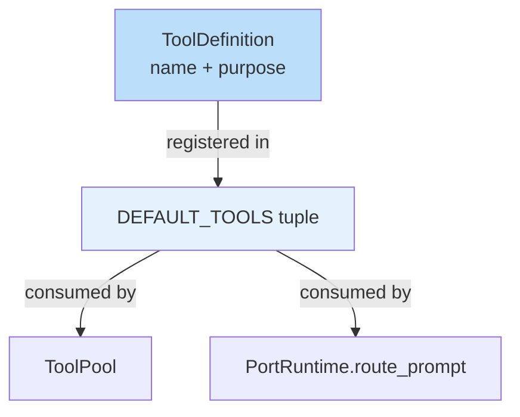

# Tool 實作參考

> **對應概念**：[[36 工具系統總覽]]
> **claw-code 路徑**：`src/Tool.py`（15 行）
> **Claude Code 對應**：`src/tools/`（36 個工具定義目錄）

## 完整程式碼

```python
from __future__ import annotations

from dataclasses import dataclass


@dataclass(frozen=True)
class ToolDefinition:
    name: str
    purpose: str


DEFAULT_TOOLS = (
    ToolDefinition('port_manifest', 'Summarize the active Python workspace'),
    ToolDefinition('query_engine', 'Render a Python-first porting summary'),
)
```
^code-full

### 核心抽象段

```python
@dataclass(frozen=True)
class ToolDefinition:
    name: str
    purpose: str
```
^code-core

## 白話解釋（逐段）

### 資料結構：ToolDefinition
`ToolDefinition` 是工具系統的**最小原子**——一個不可變的二元組，只有 `name`（工具名稱）和 `purpose`（工具用途）。在 Claude Code 中，每個工具的定義包含名稱、描述、JSON Schema 參數定義、權限需求、執行函式等十餘個欄位。claw-code 將其精煉為最本質的兩個屬性，揭示了一個核心設計：**工具首先是一個「名稱 + 意圖」的配對**。 #skeleton/frozen-dataclass
^explanation-structure

### 資料結構：DEFAULT_TOOLS
`DEFAULT_TOOLS` 是一個 tuple，包含兩個預設工具。這對應 Claude Code 中 36 個工具的完整註冊表。使用 `tuple`（而非 `list`）強調工具集合的不可變性——工具定義在啟動時確定，運行時不會動態增減。
^explanation-defaults

### 設計意圖
這 15 行程式碼是整個工具系統的**起點抽象**。它回答了最基本的問題：「一個工具是什麼？」——不是一堆程式碼，而是一個名字和它要做的事。所有更複雜的工具概念（權限、參數、執行策略）都建築在這個簡單的基礎上。Claude Code 中 `src/tools/` 目錄下每個工具子目錄的 `definition.ts` 本質上就是這個 dataclass 的豐富版。
^explanation-intent

## 關鍵設計抉擇

| 設計元素 | claw-code 表現 | 對應的完整實作 |
|---------|---------------|---------------|
| 工具定義 | 2 欄位（name, purpose） | 10+ 欄位（含 schema、permissions、handler） → [[36 工具系統總覽]] |
| 不可變性 | `frozen=True` dataclass | TypeScript readonly interfaces → [[36 工具完整索引表]] |
| 工具集合 | 2 個預設工具（tuple） | 36 個工具 + MCP 動態工具 → [[36 工具完整索引表#核心工具（8 個）]] |
| 註冊機制 | 模組層級常數 | 動態載入 + 條件啟用 + Feature Flags → [[Beta Features 與 Feature Flags 系統]] |

^design-choices

## 精簡 vs 完整：差距分析

**這個 stub 捕捉了**（教學重點）：
- 工具的**最小定義**：name + purpose 二元組 #teaching-point/essential
- **不可變性原則**：frozen dataclass 確保工具定義不被篡改 #teaching-point/essential
- **工具集合是 tuple**：啟動時固定，運行時不變 #teaching-point/simplification

**這個 stub 省略了**（完整實作必需）：
- **JSON Schema 參數定義**：每個工具的輸入格式驗證 → 見 [[36 工具系統總覽]]
- **權限需求宣告**：哪些工具需要用戶授權 → 見 [[工具執行多層防護管道]]
- **執行函式綁定**：工具邏輯的實際實作 → 見 [[Tool Orchestration 調度系統]]
- **條件啟用**：根據 Feature Flags、mode、provider 動態決定可用工具 → 見 [[Beta Features 與 Feature Flags 系統]]
- **MCP 動態工具**：運行時從 MCP server 載入的外部工具

^gap-analysis

## Mermaid 視覺化



## 關聯筆記

- [[36 工具系統總覽]] — 完整工具系統架構（36 個工具的分類與設計）
- [[36 工具完整索引表]] — 所有工具的完整索引
- [[tools-implementation]] — 工具查詢與過濾的完整函式庫
- [[tool-pool-implementation]] — 工具池組裝
- [[工具執行多層防護管道]] — 工具執行的 7 層安全管道

---

> [!tip] 導航
> 返回 [[Implementation Reference MOC]] · [[claw-code 模組對照表]] · [[Tool System MOC]]
