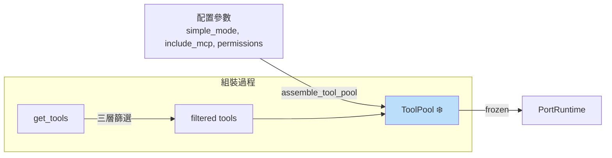

# Tool Pool 實作參考

> **對應概念**：[[Tool Orchestration 調度系統]]
> **claw-code 路徑**：`src/tool_pool.py`（38 行）
> **Claude Code 對應**：`src/services/tools/toolOrchestration.ts`

## 完整程式碼

```python
from __future__ import annotations

from dataclasses import dataclass

from .models import PortingModule
from .permissions import ToolPermissionContext
from .tools import get_tools


@dataclass(frozen=True)
class ToolPool:
    tools: tuple[PortingModule, ...]
    simple_mode: bool
    include_mcp: bool

    def as_markdown(self) -> str:
        lines = [
            '# Tool Pool',
            '',
            f'Simple mode: {self.simple_mode}',
            f'Include MCP: {self.include_mcp}',
            f'Tool count: {len(self.tools)}',
        ]
        lines.extend(f'- {tool.name} — {tool.source_hint}' for tool in self.tools[:15])
        return '\n'.join(lines)


def assemble_tool_pool(
    simple_mode: bool = False,
    include_mcp: bool = True,
    permission_context: ToolPermissionContext | None = None,
) -> ToolPool:
    return ToolPool(
        tools=get_tools(simple_mode=simple_mode, include_mcp=include_mcp, permission_context=permission_context),
        simple_mode=simple_mode,
        include_mcp=include_mcp,
    )
```
^code-full

### 核心抽象段

```python
@dataclass(frozen=True)
class ToolPool:
    tools: tuple[PortingModule, ...]
    simple_mode: bool
    include_mcp: bool

def assemble_tool_pool(
    simple_mode: bool = False,
    include_mcp: bool = True,
    permission_context: ToolPermissionContext | None = None,
) -> ToolPool:
    return ToolPool(
        tools=get_tools(simple_mode=simple_mode, include_mcp=include_mcp, permission_context=permission_context),
        simple_mode=simple_mode,
        include_mcp=include_mcp,
    )
```
^code-core

## 白話解釋（逐段）

### 資料結構：ToolPool
`ToolPool` 是一個**已篩選、已凍結的工具集合**。它不是工具的定義（那是 `ToolDefinition`），也不是工具的註冊表（那是 `tools.py`），而是「這次對話可以用哪些工具」的**快照**。`frozen=True` 確保工具池一旦組裝就不可變——對話中途不會突然多出或少掉工具。 #skeleton/frozen-dataclass
^explanation-structure

### 關鍵方法：assemble_tool_pool
`assemble_tool_pool` 是一個**工廠函式**，根據配置參數組裝工具池。它將 `get_tools()` 的結果封裝進 `ToolPool`，並記錄組裝時的配置（simple_mode、include_mcp）。這體現了「配置 → 組裝 → 凍結」的設計模式：先決定參數，再一次性組裝，之後不再修改。
^explanation-method

### 設計意圖
`ToolPool` 將 Claude Code 中分散的「工具可用性判斷」邏輯集中為一個不可變容器。在 Claude Code 的 `toolOrchestration.ts` 中，工具池的組裝牽涉 Feature Flags、provider 支援、mode 設定、權限狀態等多個條件。claw-code 將這些壓縮為 `assemble_tool_pool()` 一個函式呼叫，清晰展示了核心抽象：**工具池 = 篩選後的凍結集合**。
^explanation-intent

## 關鍵設計抉擇

| 設計元素 | claw-code 表現 | 對應的完整實作 |
|---------|---------------|---------------|
| 工具池類型 | frozen dataclass（不可變） | 動態管理（支援 MCP 熱載入） → [[Tool Orchestration 調度系統]] |
| 組裝方式 | 單一工廠函式 | 多階段管道（Feature Flags → provider → mode → permissions） |
| 配置記錄 | `simple_mode`、`include_mcp` | 完整配置物件（含 tool whitelist、MCP servers 等） |
| 渲染 | `as_markdown()` 自描述 | CLI/UI 呈現 + API schema 匯出 |

^design-choices

## 精簡 vs 完整：差距分析

**這個 stub 捕捉了**（教學重點）：
- **工具池是不可變快照**：組裝後凍結，對話期間穩定 #teaching-point/essential
- **工廠模式**：`assemble_tool_pool()` 集中組裝邏輯 #teaching-point/essential
- **配置透明**：工具池記錄自己是如何被組裝的（simple_mode, include_mcp） #teaching-point/simplification

**這個 stub 省略了**（完整實作必需）：
- **並行/串行執行策略**：工具池不只是「有哪些工具」，還決定「怎麼執行」→ 見 [[Tool Orchestration 調度系統]]
- **動態 MCP 工具**：MCP server 連線、schema 探測、工具動態註冊
- **工具偏好金字塔**：專用工具優先、BashTool 最後 → 見 [[Tool System MOC#工具偏好金字塔]]
- **執行 Hook**：Pre/Post Hook 擴展機制 → 見 [[Hook 系統擴展模式]]
- **工具依賴解析**：某些工具依賴其他工具的輸出

^gap-analysis

## Mermaid 視覺化



## 關聯筆記

- [[Tool Orchestration 調度系統]] — 完整的工具編排與執行策略
- [[tools-implementation]] — 工具註冊表與篩選函式（ToolPool 的資料來源）
- [[tool-implementation]] — ToolDefinition 基礎定義
- [[permissions-implementation]] — 權限過濾邏輯
- [[runtime-implementation]] — PortRuntime 消費 ToolPool

---

> [!tip] 導航
> 返回 [[Implementation Reference MOC]] · [[claw-code 模組對照表]] · [[Tool System MOC]]
