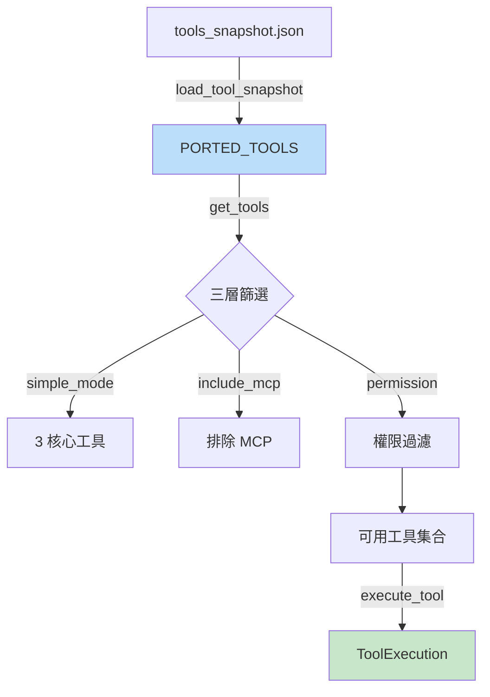

# Tools Registry 實作參考

> **對應概念**：[[36 工具系統總覽]]
> **claw-code 路徑**：`src/tools.py`（90 行）
> **Claude Code 對應**：`src/services/tools/toolExecution.ts`（1745 行）

## 完整程式碼

```python
from __future__ import annotations

import json
from dataclasses import dataclass
from functools import lru_cache
from pathlib import Path

from .models import PortingBacklog, PortingModule
from .permissions import ToolPermissionContext

SNAPSHOT_PATH = Path(__file__).resolve().parent / 'reference_data' / 'tools_snapshot.json'


@dataclass(frozen=True)
class ToolExecution:
    name: str
    source_hint: str
    payload: str
    handled: bool
    message: str


@lru_cache(maxsize=1)
def load_tool_snapshot() -> tuple[PortingModule, ...]:
    raw_entries = json.loads(SNAPSHOT_PATH.read_text())
    return tuple(
        PortingModule(
            name=entry['name'],
            responsibility=entry['responsibility'],
            source_hint=entry['source_hint'],
            status='mirrored',
        )
        for entry in raw_entries
    )


PORTED_TOOLS = load_tool_snapshot()


def build_tool_backlog() -> PortingBacklog:
    return PortingBacklog(title='Tool surface', modules=list(PORTED_TOOLS))


def tool_names() -> list[str]:
    return [module.name for module in PORTED_TOOLS]


def get_tool(name: str) -> PortingModule | None:
    needle = name.lower()
    for module in PORTED_TOOLS:
        if module.name.lower() == needle:
            return module
    return None


def filter_tools_by_permission_context(
    tools: tuple[PortingModule, ...],
    permission_context: ToolPermissionContext | None = None,
) -> tuple[PortingModule, ...]:
    if permission_context is None:
        return tools
    return tuple(module for module in tools if not permission_context.blocks(module.name))


def get_tools(
    simple_mode: bool = False,
    include_mcp: bool = True,
    permission_context: ToolPermissionContext | None = None,
) -> tuple[PortingModule, ...]:
    tools = list(PORTED_TOOLS)
    if simple_mode:
        tools = [module for module in tools if module.name in {'BashTool', 'FileReadTool', 'FileEditTool'}]
    if not include_mcp:
        tools = [module for module in tools if 'mcp' not in module.name.lower() and 'mcp' not in module.source_hint.lower()]
    return filter_tools_by_permission_context(tuple(tools), permission_context)


def find_tools(query: str, limit: int = 20) -> list[PortingModule]:
    needle = query.lower()
    matches = [module for module in PORTED_TOOLS if needle in module.name.lower() or needle in module.source_hint.lower()]
    return matches[:limit]


def execute_tool(name: str, payload: str = '') -> ToolExecution:
    module = get_tool(name)
    if module is None:
        return ToolExecution(name=name, source_hint='', payload=payload, handled=False, message=f'Unknown mirrored tool: {name}')
    action = f"Mirrored tool '{module.name}' from {module.source_hint} would handle payload {payload!r}."
    return ToolExecution(name=module.name, source_hint=module.source_hint, payload=payload, handled=True, message=action)


def render_tool_index(limit: int = 20, query: str | None = None) -> str:
    modules = find_tools(query, limit) if query else list(PORTED_TOOLS[:limit])
    lines = [f'Tool entries: {len(PORTED_TOOLS)}', '']
    if query:
        lines.append(f'Filtered by: {query}')
        lines.append('')
    lines.extend(f'- {module.name} — {module.source_hint}' for module in modules)
    return '\n'.join(lines)
```
^code-full

### 核心抽象段

```python
def get_tools(
    simple_mode: bool = False,
    include_mcp: bool = True,
    permission_context: ToolPermissionContext | None = None,
) -> tuple[PortingModule, ...]:
    tools = list(PORTED_TOOLS)
    if simple_mode:
        tools = [m for m in tools if m.name in {'BashTool', 'FileReadTool', 'FileEditTool'}]
    if not include_mcp:
        tools = [m for m in tools if 'mcp' not in m.name.lower()]
    return filter_tools_by_permission_context(tuple(tools), permission_context)

def execute_tool(name: str, payload: str = '') -> ToolExecution:
    module = get_tool(name)
    if module is None:
        return ToolExecution(name=name, source_hint='', payload=payload, handled=False, message=f'Unknown mirrored tool: {name}')
    return ToolExecution(name=module.name, source_hint=module.source_hint, payload=payload, handled=True, message=...)
```
^code-core

## 白話解釋（逐段）

### 資料結構：ToolExecution
`ToolExecution` 記錄一次工具呼叫的結果，包含名稱、來源、payload、是否成功處理（`handled`）、和回傳訊息。這對應 Claude Code 中 `toolExecution.ts` 的工具執行回傳值——一個完整的執行紀錄物件。claw-code 只模擬了結構，未實際執行工具邏輯。 #skeleton/frozen-dataclass
^explanation-structure

### 關鍵方法：get_tools
`get_tools` 是工具系統的**組裝入口**——根據三個參數篩選可用工具：
1. **simple_mode**：精簡模式只保留 Bash、Read、Edit 三個核心工具
2. **include_mcp**：是否包含 MCP 外部工具
3. **permission_context**：權限過濾（透過 `ToolPermissionContext.blocks()` 排除被禁止的工具）

這個三層篩選完美對應了 Claude Code 中工具集合的動態組裝邏輯——不是所有 36 個工具都會在每次對話中啟用。
^explanation-method

### 關鍵方法：execute_tool
`execute_tool` 模擬了工具的「查找 → 執行 → 回傳」三步流程。若工具不存在回傳 `handled=False`，存在則產生一條描述性訊息。在 Claude Code 中，這一步會真正呼叫工具函式（如讀檔、執行 bash、搜尋等）並等待結果。
^explanation-execute

### 設計意圖
`tools.py` 展示了工具系統的**兩大核心職責**：**註冊表管理**（載入、查詢、篩選工具定義）和**執行入口**（找到工具並觸發執行）。使用 `@lru_cache` 確保 snapshot 只載入一次，體現了啟動時載入、運行時查詢的模式。`PORTED_TOOLS` 作為模組層級常數，是整個工具系統的 single source of truth。
^explanation-intent

## 關鍵設計抉擇

| 設計元素 | claw-code 表現 | 對應的完整實作 |
|---------|---------------|---------------|
| 工具載入 | JSON snapshot + `@lru_cache` | 動態模組載入 + Feature Flag 條件 → [[36 工具系統總覽]] |
| Simple mode | 硬編碼 3 工具白名單 | 依 use case 動態配置 → [[36 工具完整索引表#核心工具（8 個）]] |
| MCP 過濾 | 名稱字串匹配 | MCP server 動態探測 + schema 驗證 |
| 權限過濾 | `ToolPermissionContext.blocks()` | 多層權限引擎 → [[權限規則引擎]] |
| 工具執行 | 模擬（回傳描述字串） | 真實函式呼叫 + 並行策略 → [[Tool Orchestration 調度系統]] |
| 工具搜尋 | 簡單子字串匹配 | 模型 API tool_use 決策（非搜尋） |

^design-choices

## 精簡 vs 完整：差距分析

**這個 stub 捕捉了**（教學重點）：
- 工具系統的**三層篩選**：mode → MCP → permission #teaching-point/essential
- **ToolExecution 回傳結構**：handled/not-handled 的二元結果 #teaching-point/essential
- **snapshot 模式**：啟動時載入一次，運行時只查詢 #teaching-point/simplification
- `find_tools` 的**搜尋功能**：子字串匹配，提供工具發現能力 #teaching-point/simplification

**這個 stub 省略了**（完整實作必需）：
- **真正的工具執行**：每個工具的具體邏輯（Bash 命令、檔案操作等）→ 見 [[BashTool 深度剖析]]
- **並行/串行策略**：工具編排的執行順序決策 → 見 [[Tool Orchestration 調度系統]]
- **7 層執行防護管道**：安全檢查、權限驗證、沙箱隔離 → 見 [[工具執行多層防護管道]]
- **Pre/Post Hooks**：工具執行前後的擴展點 → 見 [[Hook 系統擴展模式]]
- **工具結果回注**：tool_result 作為 user message 回到 Agent Loop → 見 [[Agent Loop 核心執行機制#Feedback Loop 機制]]

^gap-analysis

## Mermaid 視覺化



## 關聯筆記

- [[36 工具系統總覽]] — 完整工具系統架構
- [[36 工具完整索引表]] — 所有 36 個工具的索引
- [[tool-implementation]] — ToolDefinition 基礎定義
- [[tool-pool-implementation]] — 工具池的上層封裝
- [[permissions-implementation]] — ToolPermissionContext 權限過濾
- [[Tool Orchestration 調度系統]] — 工具編排與執行策略
- [[工具執行多層防護管道]] — 7 層安全管道

---

> [!tip] 導航
> 返回 [[Implementation Reference MOC]] · [[claw-code 模組對照表]] · [[Tool System MOC]]
