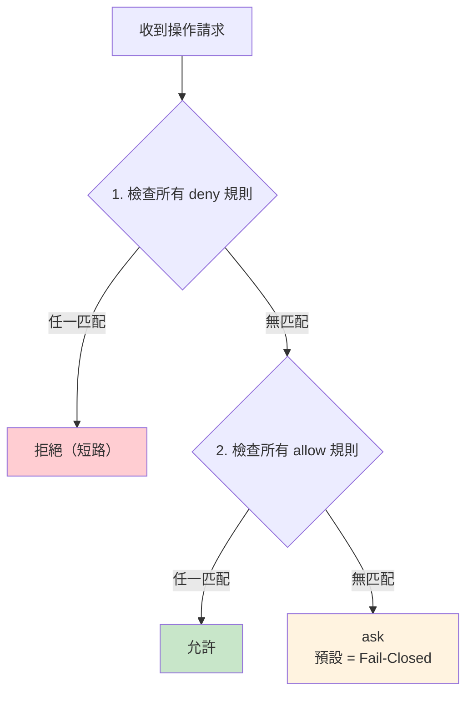

# Fail-Closed 與 Deny-First 原則

> 跨領域的核心安全原則

## Fail-Closed 原則

### 定義

**不確定性本身是安全訊號**。當系統無法確定某操作是否安全時，拒絕（而非允許）。

### 在 Claude Code 中的應用

| 場景 | Fail-Closed 行為 |
|------|-----------------|
| AST 解析失敗 | → ask（不是 allow）|
| 子命令數超限 | → ask |
| 未知旗標 | → 拒絕（不在白名單）|
| 路徑可疑 | → 要求確認 |

### 反模式（Fail-Open）

```
// 危險！
if (parseError) {
  return 'allow'  // ← 解析失敗就允許 = Fail-Open
}
```

### 正確做法

```
// 安全
if (parseError) {
  return 'ask'  // ← 不確定 → 詢問用戶
}
```

## Deny-First 原則

### 定義

deny 規則永遠在 allow 規則之前評估。即使存在匹配的 allow 規則，只要有 deny 規則也匹配，deny 勝出。

### 評估順序



### 為什麼 Deny-First 很重要

```
// 假設有這些規則：
allow: Bash(npm:*)      // 允許所有 npm 命令
deny:  Bash(npm audit)  // 但禁止 npm audit

// Deny-First → npm audit 被拒絕 ✓
// Allow-First → npm audit 被允許 ✗（因為先匹配 npm:*）
```

## 跨領域應用

| 領域 | Fail-Closed 應用 |
|------|-----------------|
| **安全** | AST 解析、權限規則 |
| **記憶** | 記憶提取失敗 → 不寫入（不寫錯誤記憶）|
| **工具** | Schema 驗證失敗 → 回傳錯誤（不執行）|
| **API** | 未知 response → 不假設成功 |

## 與其他原則的關係

- **縱深防禦** × **Fail-Closed**：每層都獨立 Fail-Closed
- **最小權限** × **Deny-First**：預設無權限，逐步授權
- **Sticky Latch** × **Fail-Closed**：計費狀態不確定時保持限制

## 關聯筆記

- [[七層縱深防禦模型]] — 每層的 Fail-Closed 設計
- [[權限規則引擎]] — Deny-First 的具體實現
- [[Bash 命令安全過濾與 AST 解析]] — 解析失敗的 Fail-Closed
- [[Harness Engineering 12 原則]] — 原則 6
- [[Security 設計模式集]] — 模式 2、3

---

> [!tip] 導航
> 返回 [[Security & Permissions MOC]] · [[Harness Engineering MOC]] · [[Claude Code 逆向工程知識庫]]
