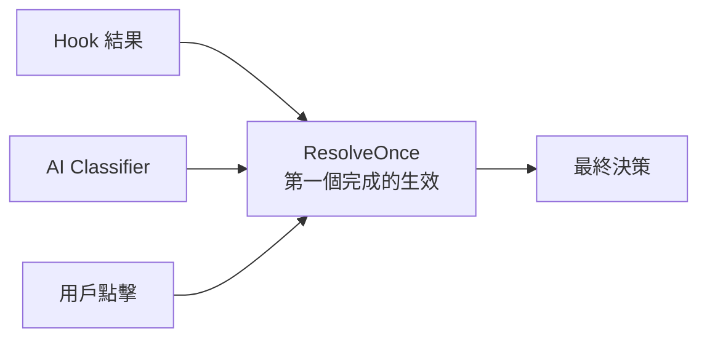

# Hook 系統擴展模式

> 透過 Hook（Pre/Post）擴展系統行為，而非修改核心邏輯

## 設計動機

用戶需要自訂工具執行前/後的行為（如自動 lint、安全檢查），但不應修改 Claude Code 核心程式碼。Hook 系統提供了一個安全的擴展點。

## Hook 類型

| Hook | 時機 | 能力 |
|------|------|------|
| **PreToolUse** | 工具執行前（權限檢查前）| approve / reject / 修改輸入 |
| **PostToolUse** | 工具執行後 | 檢查結果、觸發後續動作 |

## 設定格式

```json
{
  "hooks": {
    "PreToolUse": [
      {
        "matcher": "Bash",
        "hooks": [
          {
            "type": "command",
            "command": "./scripts/validate-bash.sh $INPUT"
          }
        ]
      }
    ],
    "PostToolUse": [
      {
        "matcher": "Edit",
        "hooks": [
          {
            "type": "command",
            "command": "./scripts/auto-lint.sh $FILE"
          }
        ]
      }
    ]
  }
}
```

## Matcher 機制

| Matcher | 匹配 |
|---------|------|
| `"Bash"` | 精確匹配 BashTool |
| `"*"` | 匹配所有工具 |
| `"Edit"` | 精確匹配 FileEditTool |

## Hook 回傳值（PreToolUse）

| 回傳 | 效果 |
|------|------|
| exit 0 | approve — 自動允許 |
| exit 2 | reject — 自動拒絕 |
| stdout JSON | 修改工具輸入 |
| exit 其他 | 忽略（不影響決策）|

## 與權限系統的整合

Hook 結果參與 [[權限規則引擎]] 的 Race 模式：



## 設計原則

> [!info] 擴展而非修改
> - Hook 不能修改核心邏輯流程
> - Hook 的 reject 仍被 deny rule 覆蓋
> - Hook 超時有上限（不能無限等待）
> - Hook 失敗不阻塞工具執行（graceful degradation）

## 使用場景

| 場景 | Hook 類型 | 範例 |
|------|----------|------|
| 自訂安全檢查 | PreToolUse | 檢查 bash 命令是否符合團隊規範 |
| 自動格式化 | PostToolUse | 編輯後自動 prettier/eslint |
| 審計日誌 | Pre + Post | 記錄所有工具呼叫 |
| CI 整合 | PostToolUse | 編輯後自動執行測試 |

## 關聯筆記

- [[工具執行多層防護管道]] — Hook 是 Layer 4
- [[權限規則引擎]] — Hook 與 Race 模式的整合
- [[Harness Engineering 12 原則]] — 原則 12
- [[Tool Orchestration 調度系統]] — Hook 在執行管道中的位置

---

> [!tip] 導航
> 返回 [[Harness Engineering MOC]] · [[Tool System MOC]] · [[Claude Code 逆向工程知識庫]]
