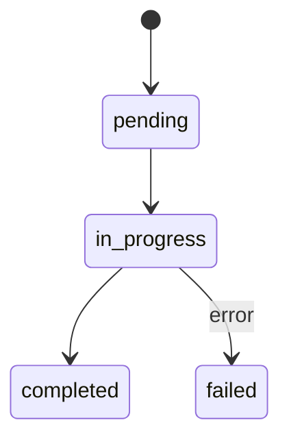

# Tool Prompt 設計模式集

> 從 36 個工具的 prompt 提煉的 12 個工具設計模式

## 模式 1：工具偏好金字塔（Tool Preference Hierarchy）

**問題**：模型傾向用 BashTool 做所有事
**解法**：在每個工具 prompt 中明確建立偏好金字塔

```
專用工具 > 通用工具 > BashTool
- 檔案搜尋：Glob（不用 find）
- 內容搜尋：Grep（不用 grep/rg）
- 讀取檔案：Read（不用 cat/head/tail）
```

**應用**：[[36 工具系統總覽]]、[[BashTool 深度剖析]]

## 模式 2：強制前置操作（Mandatory Pre-operation）

**問題**：跳過前置步驟可能導致資料遺失
**解法**：系統層級強制 — 非 prompt 層級建議

```
FileEdit → 必須先 FileRead 同一檔案
FileWrite → 必須先確認檔案不存在
```

## 模式 3：二元觸發規則（Binary Trigger Rules）

**問題**：模型不確定何時該用某工具
**解法**：提供明確的 If-Then 觸發條件

```
If task requires independent subtask → use AgentTool
If user says /simplify → use SkillTool(simplify)
```

## 模式 4：用戶角色分支（User Persona Branching）

**問題**：不同用戶需要不同指引
**解法**：根據用戶類型切換 prompt 段落

```typescript
if (USER_TYPE === 'ant') {
  // Anthropic 員工 → 額外的內部功能指引
} else {
  // 外部用戶 → 標準指引
}
```

## 模式 5：Feature Flag 動態切換

**問題**：功能啟用狀態影響 prompt 內容
**解法**：Feature flag 控制 prompt 段落的注入/移除

```typescript
if (feature('FORK_SUBAGENT')) {
  prompt += forkSubagentSection  // 包含 fork 語義說明
}
```

**應用**：[[Beta Features 與 Feature Flags 系統]]

## 模式 6：狀態機說明（State Machine Documentation）

**問題**：工具有多個狀態和轉移規則
**解法**：在 prompt 中明確描述狀態機



**應用**：[[Task 系統與狀態機]]（TodoWriteTool、TaskUpdateTool）

## 模式 7：安全等級宣告（Safety Level Declaration）

**問題**：工具不同操作有不同風險
**解法**：明確標註每個操作的安全等級

```
git status → 安全（唯讀）
git commit → 需確認（有副作用但可逆）
git push --force → 危險（不可逆）
```

**應用**：[[七層縱深防禦模型]]

## 模式 8：並行性指引（Parallelism Guidance）

**問題**：模型不知道何時可以並行
**解法**：明確列出並行/串行條件

```
獨立操作 → 多個 tool_use（並行）
依賴操作 → 單一呼叫 + &&（串行）
```

**應用**：[[Tool Orchestration 調度系統]]

## 模式 9：反模式列舉（Anti-pattern Enumeration）

**問題**：模型重複犯同樣的錯誤
**解法**：列出常見錯誤及其原因

```
NEVER: git add -A（可能包含 .env）
NEVER: skip hooks（安全風險）
```

## 模式 10：預算感知設計（Budget-aware Design）

**問題**：工具 prompt 太長消耗 context
**解法**：精簡 prompt、延遲載入

**數據**：最長的 BashTool prompt 369 行，最短的 TodoReadTool 3 行

## 模式 11：版本感知指引（Version-aware Guidance）

**問題**：環境工具版本不同
**解法**：偵測版本，切換對應指引

## 模式 12：通訊可見性契約（Communication Visibility Contract）

**問題**：Agent 不知道自己的輸出對誰可見
**解法**：明確聲明可見性範圍

```
Your plain text output is NOT visible to other agents.
To communicate, you MUST call SendMessageTool.
```

**應用**：[[Agent 間通訊機制]]

---

> [!tip] 導航
> 返回 [[Tool System MOC]] · [[Claude Code 逆向工程知識庫]]
