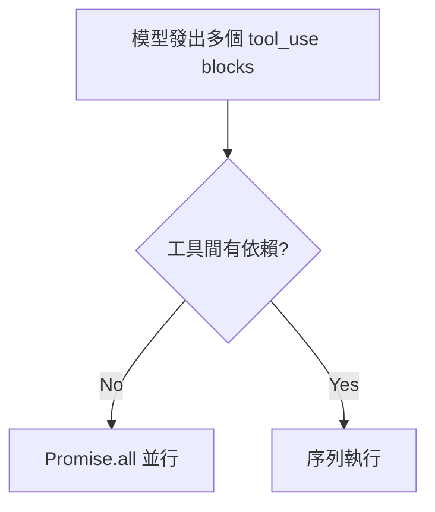
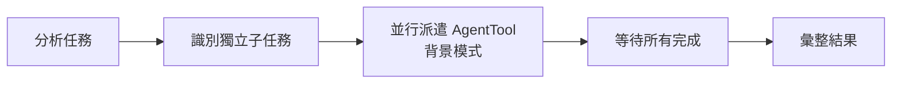

# 並行與 Async Generator 模式

> 跨領域的並行執行和非同步設計模式

## Async Generator 模式

### Agent Loop 的 Async Generator

Claude Code 的 Agent Loop 使用 async generator（`async function*`）實現逐步 yield：

```typescript
async function* agentLoop(messages) {
  while (true) {
    // 逐步 yield 中間狀態
    yield { type: 'streaming', delta: partialText }
    
    const response = await queryModel(messages)
    
    if (response.stopReason === 'end_turn') {
      yield { type: 'complete', result: response }
      return
    }
    
    // 工具執行
    const toolResults = await runTools(response.toolCalls)
    yield { type: 'tool_results', results: toolResults }
    
    // 回注結果，繼續迴圈
    messages.push(...toolResults)
  }
}
```

**優點**：
- 中間狀態即時傳遞給 UI（streaming 體驗）
- 可在任意 yield 點中斷（優雅取消）
- 記憶體效率（不需一次產生完整結果）

## 工具並行執行模式

### 判斷條件



### 並行安全性聲明

工具在 prompt 中明確聲明並行安全性：

```
BashTool:
  獨立命令 → 多個 tool call（並行）
  依賴命令 → 單一 call + &&（串行）
```

### Agent 並行（Coordinator Mode）



→ 詳見 [[Coordinator Mode 多 Agent 協調]]

## 記憶子系統的並行

ExtractMemories prompt 指導模型並行讀寫：

```
Turn 1: 並行 Read 所有相關文件
Turn 2: 並行 Write/Edit 所有需要更新的文件
```

## Promise.race 模式（權限系統）

```typescript
// 三個決策源賽跑
const decision = await Promise.race([
  hookResult(),
  classifierResult(),
  userClickResult(),
])
// 第一個完成的生效
```

→ 詳見 [[權限規則引擎]]

## 關聯筆記

- [[Agent Loop 核心執行機制]] — Async Generator 的主要應用
- [[Tool Orchestration 調度系統]] — 工具並行策略
- [[Coordinator Mode 多 Agent 協調]] — Agent 級別的並行
- [[Security 設計模式集]] — 模式 9（Race 許可模式）

---

> [!tip] 導航
> 返回 [[Harness Engineering MOC]] · [[Claude Code 逆向工程知識庫]]
