# Codebase 結構對照表

> Claude Code v2.1.88 — 1,884 檔案 / ~92,500 行 TypeScript/TSX

## 核心目錄結構

```mermaid
flowchart TD
    ROOT["claude-code-source/"] --> SRC["src/"]
    ROOT --> VENDOR["vendor/\n原生模組原始碼"]

    SRC --> CONST["constants/\n系統常數、prompts、API limits、beta flags"]
    SRC --> TOOLS["tools/ — 36 個工具定義"]
    TOOLS --> AT["AgentTool/ — 6 built-in agents"]
    TOOLS --> BT["BashTool/ — bashSecurity + bashPermissions"]
    TOOLS --> SKT["SkillTool/ — Skills 系統入口"]

    SRC --> SERVICES["services/ — 核心服務層"]
    SERVICES --> API["api/ — Claude API 呼叫層"]
    SERVICES --> CMP["compact/ — Context compaction"]
    SERVICES --> EM["extractMemories/"]
    SERVICES --> SMEM["SessionMemory/"]
    SERVICES --> MDOCS["MagicDocs/"]
    SERVICES --> STOOL["tools/ — 工具執行 &amp; 編排"]
    SERVICES --> PL["policyLimits/"]
    SERVICES --> ANA["analytics/ — 遙測分析"]
    SERVICES --> AD["autoDream/ — 夢境整合"]

    SRC --> COORD["coordinator/ — 多 agent 協調"]
    SRC --> SKILLS["skills/bundled/ — 16 個內建 skills"]
    SRC --> MEMDIR["memdir/ — 記憶目錄系統"]
    SRC --> TASKS["tasks/ — 任務系統"]
    SRC --> HOOKS["hooks/ — 權限、建議"]

    SRC --> UTILS["utils/"]
    UTILS --> UMOD["model/ — 模型配置 16 檔"]
    UTILS --> UPERM["permissions/ — 權限系統"]
    UTILS --> USAND["sandbox/ — 沙箱機制"]
    UTILS --> USWARM["swarm/ — Swarm 多 agent"]
    UTILS --> UCU["computerUse/"]
    UTILS --> UUP["ultraplan/"]
    UTILS --> UMEM["memory/ — 記憶工具"]
    UTILS --> UBASH["bash/ — Bash 解析器"]

    SRC --> BUDDY["buddy/ — AI 寵物系統"]
    SRC --> VOICE["voice/ — 語音功能"]
    SRC --> REMOTE["remote/ — 遠端執行"]
    SRC --> SCREENS["screens/ — REPL.tsx 5005 行"]
    SRC --> MAIN["main.tsx — 主入口 4683 行"]
    SRC --> BOOT["bootstrap/ — state.ts 1758 行"]
```

## 目錄 → 概念對照

| 目錄 | 對應概念筆記 | 說明 |
|------|------------|------|
| `src/main.tsx` | [[Agent Loop 核心執行機制]] | Agent Loop 主迴圈入口 |
| `src/screens/REPL.tsx` | [[Bootstrap 啟動流程與生命週期]] | REPL 互動層 |
| `src/services/api/claude.ts` | [[API 呼叫層架構]] | 3419 行核心 API 層 |
| `src/services/tools/` | [[Tool Orchestration 調度系統]] | 工具執行 & 編排 |
| `src/constants/prompts.ts` | [[System Prompt 動態組裝邏輯]] | 914 行主系統提示詞 |
| `src/coordinator/` | [[Coordinator Mode 多 Agent 協調]] | 多 agent 協調系統 |
| `src/tools/AgentTool/` | [[AgentTool 與 Subagent 派遣]] | Agent 派遣 + 6 built-in agents |
| `src/tools/BashTool/` | [[BashTool 深度剖析]] | Bash 安全 + 權限（5000+ 行） |
| `src/tools/SkillTool/` | [[SkillTool 與 Skills 系統]] | Skills 系統入口 |
| `src/memdir/` | [[Memdir 核心與 MEMORY.md]] | 記憶目錄核心 |
| `src/services/compact/` | [[Context Compaction 壓縮策略]] | 對話壓縮 |
| `src/services/extractMemories/` | [[ExtractMemories 自動記憶提取]] | 背景記憶提取 |
| `src/services/SessionMemory/` | [[Session Memory 即時快照]] | Session 記憶 |
| `src/services/autoDream/` | [[AutoDream 夢境記憶整合]] | 跨 session 記憶鞏固 |
| `src/services/teamMemorySync/` | [[Team Memory 跨用戶共享]] | 團隊記憶同步 |
| `src/services/MagicDocs/` | [[MagicDocs 動態文件系統]] | 動態文件更新 |
| `src/utils/permissions/` | [[權限規則引擎]] | 權限系統 |
| `src/utils/sandbox/` | [[Sandbox 沙箱隔離機制]] | 沙箱隔離 |
| `src/utils/swarm/` | [[Swarm 與 Teammate 多 Agent 協作]] | Swarm 系統 |
| `src/utils/model/` | [[模型配置與 Provider 支援]] | 模型配置 16 檔 |
| `src/bootstrap/state.ts` | [[Bootstrap 啟動流程與生命週期]] | 全域 session 狀態 |
| `src/cost-tracker.ts` | [[成本追蹤架構]] | 成本追蹤核心 |
| `src/buddy/` | [[Buddy AI 寵物系統]] | AI 伴侶 |
| `src/voice/` | [[Voice 語音系統與 Plugin 架構]] | 語音模式 |
| `src/utils/computerUse/` | [[Computer Use 電腦控制整合]] | 電腦控制 |
| `src/utils/ultraplan/` | [[UltraPlan 遠端規劃機制]] | 遠端規劃 |

## 關鍵檔案行數統計

| 檔案 | 行數 | 功能 |
|------|------|------|
| `screens/REPL.tsx` | 5005 | UI 主畫面 |
| `main.tsx` | 4683 | 主入口 |
| `utils/messages.ts` | 5512 | 訊息處理 |
| `services/api/claude.ts` | 3419 | API 呼叫 |
| `tools/BashTool/bashPermissions.ts` | 2621 | Bash 權限 |
| `tools/BashTool/bashSecurity.ts` | 2592 | Bash 安全 |
| `tools/BashTool/readOnlyValidation.ts` | 1990 | 唯讀驗證 |
| `bootstrap/state.ts` | 1758 | 啟動狀態 |
| `services/tools/toolExecution.ts` | 1745 | 工具執行 |

---

> [!tip] 導航
> 返回 [[Claude Code 逆向工程知識庫]]
