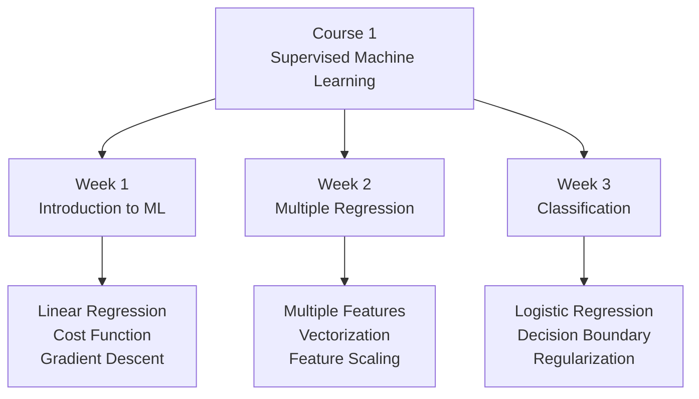

# Course 1 - Supervised ML MOC

> 監督學習基礎：線性回歸、Logistic 回歸、梯度下降、正則化

## 核心筆記

- [[C1-W1 - Introduction to Machine Learning]] — ML 定義、線性回歸、成本函數、梯度下降
- [[C1-W2 - Regression with Multiple Input Variables]] — 多特徵回歸、向量化、Feature Scaling、多項式回歸
- [[C1-W3 - Classification]] — Logistic Regression、決策邊界、Logistic Loss、正則化

## 課程索引

- [[Course 1 - Index]] — 課程總覽、公式速查、延伸知識點

## 核心公式

$$f_{w,b}(x) = wx + b \quad \text{(Linear Regression)}$$

$$f_{\vec{w},b}(\vec{x}) = \frac{1}{1+e^{-(\vec{w}\cdot\vec{x}+b)}} \quad \text{(Logistic Regression)}$$

$$J(\vec{w},b) = \frac{1}{2m}\sum_{i=1}^{m}\left(f_{\vec{w},b}(\vec{x}^{(i)}) - y^{(i)}\right)^2 \quad \text{(MSE Cost)}$$

## 課程架構

## 延伸知識點（Post-2020）

| 課程主題 | 延伸知識點 |
|---------|-----------|
| 梯度下降 / 學習率 | [[KP-01 - 超參數與學習率]] — Warmup、Cosine Annealing、WSD |
| 梯度下降 → Adam | [[KP-02 - 現代優化器]] — AdamW、Lion、Sophia、Muon |
| 正則化 | [[KP-04 - 正則化技術]] — Dropout、LayerNorm、RMSNorm、DyT |
| Logistic Loss | [[KP-03 - 損失函數]] — Label Smoothing、Focal Loss、InfoNCE |

## 關聯 MOC

- [[Course 2 - Advanced Learning MOC]] — 進階學習算法（神經網路）
- [[Knowledge Points MOC]] — 完整前沿知識點

---

> [!tip] 導航
> 返回 [[ML Specialization 知識庫]]
