# Course 2 - Advanced Learning MOC

> 神經網路、反向傳播、模型評估、決策樹與集成方法

## 核心筆記

- [[C2-W1 - Neural Networks]] — 神經網路直覺、前向傳播、TensorFlow、矩陣乘法
- [[C2-W2 - Neural Network Training]] — ReLU、Softmax、Adam Optimizer、反向傳播
- [[C2-W3 - Advice for Applying ML]] — Train/CV/Test、Bias-Variance、Error Analysis、Transfer Learning
- [[C2-W4 - Decision Trees]] — 信息增益、Entropy、Random Forest、XGBoost

## 課程索引

- [[Course 2 - Index]] — 課程總覽、架構圖、延伸知識點

## 課程架構

```mermaid
graph TD
    C2["Course 2<br/>Advanced Learning Algorithms"] --> W1["Week 1<br/>Neural Networks"]
    C2 --> W2["Week 2<br/>NN Training"]
    C2 --> W3["Week 3<br/>Advice for ML"]
    C2 --> W4["Week 4<br/>Decision Trees"]

    W1 --> W1A["Architecture<br/>Forward Prop<br/>TensorFlow"]
    W2 --> W2A["ReLU / Softmax<br/>Adam<br/>Backprop"]
    W3 --> W3A["Bias-Variance<br/>Error Analysis<br/>Transfer Learning"]
    W4 --> W4A["Entropy<br/>Random Forest<br/>XGBoost"]
```

## 延伸知識點（Post-2020）

| 課程主題 | 延伸知識點 |
|---------|-----------|
| 神經網路架構 | [[KP-06 - Attention 機制與 Transformer]] — Transformer、MHA、MLA、NSA |
| 激活函數 | [[KP-05 - 激活函數]] — GELU、SwiGLU、Mish |
| Adam → 現代優化器 | [[KP-02 - 現代優化器]] — AdamW、Lion、Sophia |
| Bias-Variance / 縮放 | [[KP-07 - 縮放法則與湧現能力]] — Scaling Laws、Test-time Scaling |
| 正則化 | [[KP-04 - 正則化技術]] — Pre-LN、DropPath、DyT |
| 決策樹 → 表格資料 | [[KP-11 - 表格資料與現代決策樹]] — LightGBM、CatBoost、SHAP |

## 關聯 MOC

- [[Course 1 - Supervised ML MOC]] — 監督學習基礎（前置知識）
- [[Course 3 - Unsupervised & RL MOC]] — 非監督與強化學習
- [[Knowledge Points MOC]] — 完整前沿知識點

---

> [!tip] 導航
> 返回 [[ML Specialization 知識庫]]
