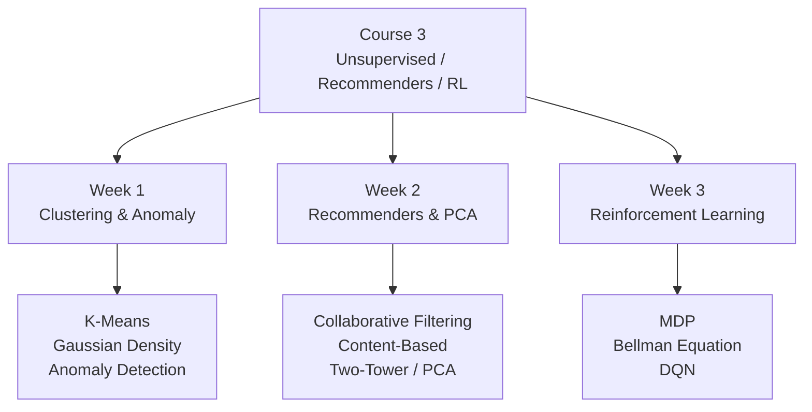

# Course 3 - Unsupervised & RL MOC

> K-Means 聚類、異常偵測、推薦系統、PCA 降維、強化學習

## 核心筆記

- [[C3-W1 - Clustering & Anomaly Detection]] — K-Means、高斯密度估計、異常偵測演算法
- [[C3-W2 - Recommender Systems & PCA]] — 協同過濾、內容過濾、雙塔網路、PCA
- [[C3-W3 - Reinforcement Learning]] — MDP、Bellman 方程、Q-function、DQN

## 課程索引

- [[Course 3 - Index]] — 課程總覽、架構圖、延伸知識點

## 課程架構

## 延伸知識點（Post-2020）

| 課程主題 | 延伸知識點 |
|---------|-----------|
| 聚類 / 自監督 | [[KP-08 - 自監督與對比學習]] — SimCLR、CLIP、DINO、MAE、SigLIP 2 |
| 推薦系統 | [[KP-10 - 現代推薦系統]] — 序列推薦、DLRM、LLM 推薦 |
| 推薦 Loss | [[KP-03 - 損失函數]] — InfoNCE Loss |
| 強化學習 → RLHF | [[KP-09 - RLHF 與現代強化學習]] — PPO、DPO、GRPO、DeepSeek-R1 |

## 關聯 MOC

- [[Course 2 - Advanced Learning MOC]] — 進階學習算法（前置知識）
- [[Knowledge Points MOC]] — 完整前沿知識點

---

> [!tip] 導航
> 返回 [[ML Specialization 知識庫]]
