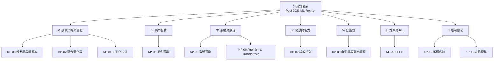

# Knowledge Points MOC

> Post-2020 學術前沿補充：11 篇知識點筆記，橋接課程內容與 2020–2025 前沿研究

## 知識點索引

### ⚙️ 訓練策略與優化

- [[KP-01 - 超參數與學習率]] — LR 排程、Cosine Annealing、Warmup、μP
- [[KP-02 - 現代優化器]] — AdamW、Lion、SAM、**Sophia**、**Muon**、**SPAM**
- [[KP-04 - 正則化技術]] — LayerNorm、RMSNorm、Mixup、**DyT**

### 📉 損失函數

- [[KP-03 - 損失函數]] — Label Smoothing、Focal Loss、InfoNCE

### 🏗️ 架構與激活函數

- [[KP-05 - 激活函數]] — GELU、SwiGLU、Mish
- [[KP-06 - Attention 機制與 Transformer]] — MHA、RoPE、Flash Attention、**MLA**、**NSA**

### 📈 縮放與能力

- [[KP-07 - 縮放法則與湧現能力]] — Chinchilla、CoT、**Test-time Scaling**、**Latent Reasoning**

### 🔍 自監督與對比學習

- [[KP-08 - 自監督與對比學習]] — SimCLR、CLIP、DINO、MAE、**SigLIP 2**

### 🤝 對齊與強化學習

- [[KP-09 - RLHF 與現代強化學習]] — PPO、DPO、**GRPO**、**DeepSeek-R1**

### 🛒 應用領域

- [[KP-10 - 現代推薦系統]] — 序列推薦、DLRM、LLM 推薦
- [[KP-11 - 表格資料與現代決策樹]] — LightGBM、CatBoost、TabNet、SHAP

## 知識點體系架構

## 2024–2025 重要更新

| 知識點 | 新增內容 |
|--------|---------|
| KP-02 | Sophia、Schedule-Free、Muon、SPAM |
| KP-04 | DyT（Dynamic Tanh 取代 Normalization）|
| KP-06 | MLA、NSA、DeepSeek-V3 |
| KP-07 | Test-time Scaling、s1、Latent Reasoning |
| KP-08 | SigLIP 2（統一視覺語言訓練配方）|
| KP-09 | GRPO、DeepSeek-R1（純 RL 推理）|

## 參考索引

- [[KP-Index - 知識點總索引]] — 完整體系架構、課程對應、arxiv 論文索引

## 關聯 MOC

- [[Course 1 - Supervised ML MOC]] — 梯度下降、正則化延伸
- [[Course 2 - Advanced Learning MOC]] — 神經網路、Transformer 延伸
- [[Course 3 - Unsupervised & RL MOC]] — 推薦系統、RLHF 延伸

---

> [!tip] 導航
> 返回 [[ML Specialization 知識庫]]
