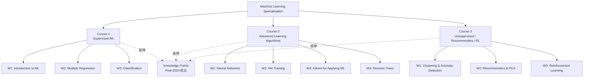

# ML Specialization 知識庫

> Stanford Machine Learning Specialization（Andrew Ng / DeepLearning.AI）完整課程筆記
> 3 門課程 | 10 週 | 10 份週次筆記 + 11 篇 Post-2020 前沿知識點

---

## 🗺️ 領域導航

| MOC | 筆記數 | 核心主題 |
|-----|--------|---------|
| [[Course 1 - Supervised ML MOC]] | 3 週 + 4 KP | 線性回歸、Logistic 回歸、梯度下降、正則化 |
| [[Course 2 - Advanced Learning MOC]] | 4 週 + 5 KP | 神經網路、反向傳播、Bias-Variance、決策樹 |
| [[Course 3 - Unsupervised & RL MOC]] | 3 週 + 3 KP | K-Means、推薦系統、PCA、強化學習 |
| [[Knowledge Points MOC]] | 11 篇 + 索引 | Post-2020 前沿研究（Transformer、RLHF、Scaling Laws…）|

---

## 🔑 核心學習路徑

---

## 📊 演算法總覽

| 演算法 | 類型 | 主要用途 |
|--------|------|---------|
| Linear Regression | 監督/回歸 | 連續值預測 |
| Logistic Regression | 監督/分類 | 二元分類 |
| Neural Network | 監督 | 圖像、文字、複雜任務 |
| Decision Tree / XGBoost | 監督/集成 | 表格資料 |
| K-Means | 無監督/聚類 | 市場分群 |
| Anomaly Detection | 無監督 | 詐欺/故障偵測 |
| Collaborative Filtering | 推薦 | 推薦系統 |
| PCA | 無監督/降維 | 視覺化、壓縮 |
| Deep Q-Network | 強化學習 | 遊戲 AI、機器人 |

---

## 📎 Post-2020 前沿補充摘要

| 知識點 | 2024–2025 新增 |
|--------|---------------|
| [[KP-02 - 現代優化器]] | Sophia、Schedule-Free、Muon、SPAM |
| [[KP-04 - 正則化技術]] | DyT（取代 Normalization）|
| [[KP-06 - Attention 機制與 Transformer]] | MLA、NSA、DeepSeek-V3 |
| [[KP-07 - 縮放法則與湧現能力]] | Test-time Scaling、s1、Latent Reasoning |
| [[KP-08 - 自監督與對比學習]] | SigLIP 2 |
| [[KP-09 - RLHF 與現代強化學習]] | GRPO、DeepSeek-R1 |

---

## 📚 參考索引

- [[ML Specialization - Master Index]] — 完整課程地圖（含 Mermaid 知識圖譜）
- [[KP-Index - 知識點總索引]] — 知識點體系架構與 arxiv 論文索引

---

## 筆記統計

| 類別 | 數量 |
|------|------|
| MOC（導航頁）| 5 |
| 課程週次筆記 | 10 |
| 課程索引 | 4 |
| 知識點筆記 | 11 |
| 知識點索引 | 1 |
| 主索引 | 1 |
| **總計** | **32** |
