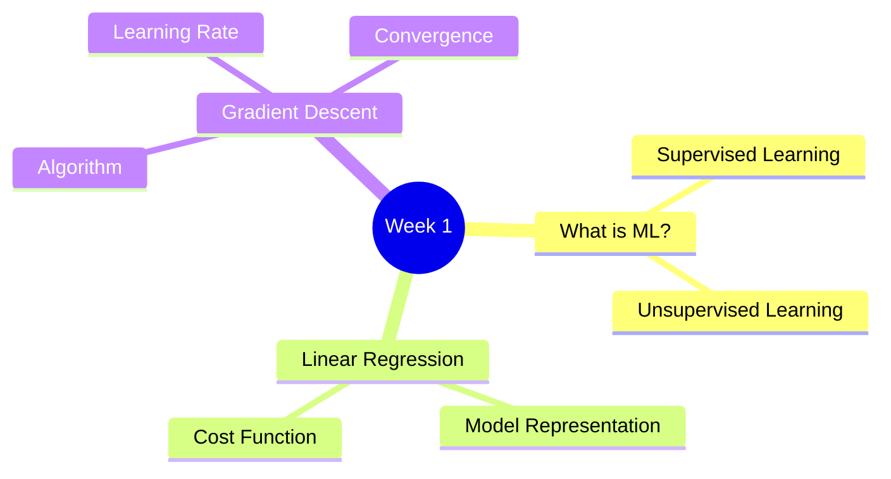
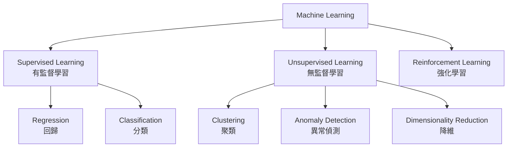
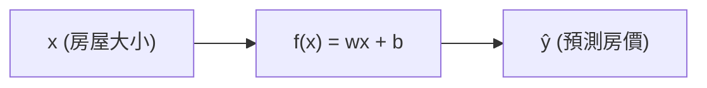
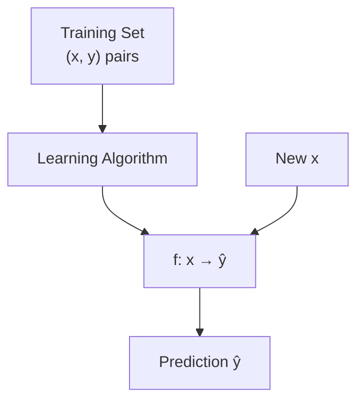
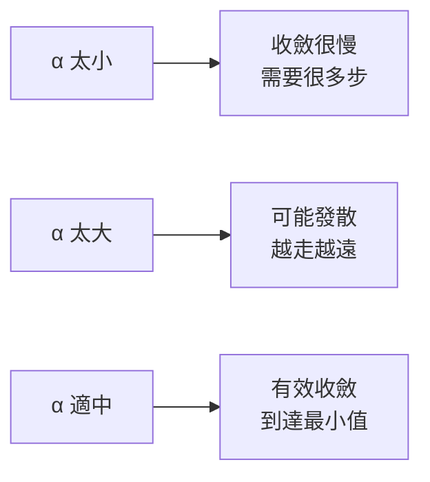

# Course 1 - Week 1: Introduction to Machine Learning

## 🗺️ Week Overview

---

## 1. What is Machine Learning?

> **Arthur Samuel (1959):** "Machine learning is the field of study that gives computers the ability to learn without being explicitly programmed."

### 1.1 機器學習的本質

**白話解釋：** 傳統程式設計是人告訴電腦「如果 A 就做 B」。機器學習則是讓電腦從大量例子中自己找規律——就像小孩學習辨認貓咪，不是靠規則書，而是靠看過幾千張貓的照片。

**技術定義：** 一個程式被說是「從經驗 $E$ 學習，針對任務 $T$，以效能指標 $P$ 衡量」，如果隨著經驗 $E$ 增加，在任務 $T$ 上的效能 $P$ 也隨之提升。

### 1.2 機器學習的主要類型

---

## 2. Supervised Learning（有監督學習）

### 2.1 核心概念

**白話解釋：** 監督學習就像「有答案的練習題」——訓練資料裡每個例子都有正確答案（標籤），模型學習從輸入預測輸出。

| 術語 | 符號 | 說明 |
|------|------|------|
| Training example | $(x^{(i)}, y^{(i)})$ | 第 $i$ 筆訓練資料 |
| Input feature | $x$ | 輸入特徵 |
| Output / Target | $y$ | 預測目標 |
| Training set size | $m$ | 訓練資料筆數 |
| Prediction | $\hat{y}$ | 模型預測值 |

### 2.2 兩大任務

#### Regression（回歸）
- **目標：** 預測**連續數值**
- **例子：** 根據房子坪數預測房價 → 輸出是 $500,000、$320,000 等連續值

#### Classification（分類）
- **目標：** 預測**離散類別**
- **例子：** 根據腫瘤大小判斷良性/惡性 → 輸出是 0 或 1

---

## 3. Unsupervised Learning（無監督學習）

**白話解釋：** 沒有答案的資料，讓電腦自己從中找結構、找規律。就像給你一堆食譜，讓你自己分類——你可能分出「甜點」、「主菜」、「飲料」等群組，沒有人預先告訴你要怎麼分。

### 主要應用
- **Clustering（聚類）：** 將相似資料點分組 → Google News 自動將同主題新聞聚在一起
- **Anomaly Detection（異常偵測）：** 找出不正常的資料點 → 信用卡詐欺偵測
- **Dimensionality Reduction（降維）：** 用更少特徵表達資料 → 壓縮資料同時保留重要資訊

---

## 4. Linear Regression（線性回歸）

### 4.1 模型表示

**白話解釋：** 線性回歸試圖用一條直線來描述 $x$（輸入）與 $y$（輸出）的關係。

$$f_{w,b}(x) = wx + b$$

其中：
- $w$：**weight（權重）**，決定直線斜率
- $b$：**bias（偏差/截距）**，決定直線截距
- $\hat{y} = f_{w,b}(x)$：模型對 $y$ 的預測值

### 4.2 訓練流程

---

## 5. Cost Function（成本函數）

### 5.1 為什麼需要成本函數？

**白話解釋：** 成本函數是衡量模型「有多不準」的分數。我們的目標是最小化這個分數，也就是讓模型盡量準確。

### 5.2 Squared Error Cost Function

$$J(w, b) = \frac{1}{2m} \sum_{i=1}^{m} \left( \hat{y}^{(i)} - y^{(i)} \right)^2 = \frac{1}{2m} \sum_{i=1}^{m} \left( f_{w,b}(x^{(i)}) - y^{(i)} \right)^2$$

- $m$：訓練資料筆數
- $\frac{1}{2m}$：加上 $\frac{1}{2}$ 是為了讓後續微分計算更整齊（2 會消掉）
- 每項 $(\hat{y}^{(i)} - y^{(i)})^2$：預測值與真實值差距的平方

### 5.3 視覺化理解

| $w$ 值 | $b=0$ 時的直線 | $J(w,0)$ 的值 |
|--------|---------------|--------------|
| 1 | 完美擬合（若資料在 $y=x$ 上）| 0（最小值） |
| 0.5 | 斜率偏小 | 大於 0 |
| 0 | 水平線 | 更大 |

> **目標：** 找到使 $J(w, b)$ 最小的 $w$ 和 $b$
> $$\min_{w,b} J(w,b)$$

> [!info] 📖 延伸閱讀：損失函數的現代發展
> MSE 是最基礎的損失函數，但在不同任務中有更適合的選擇（如 Huber Loss 對異常值更魯棒、Cross-Entropy 用於分類）。詳見 [[KP-03 - 損失函數]]。

---

## 6. Gradient Descent（梯度下降）

### 6.1 核心直覺

**白話解釋：** 想像你在山上閉著眼睛，想走到最低點。每次你感受一下腳下的坡度，往最陡的下坡方向踏一步。重複這個動作，最終你會到達谷底——這就是梯度下降。

### 6.2 演算法

同步更新 $w$ 和 $b$：

$$w \leftarrow w - \alpha \frac{\partial}{\partial w} J(w, b)$$

$$b \leftarrow b - \alpha \frac{\partial}{\partial b} J(w, b)$$

其中 $\alpha$（alpha）是 **learning rate（學習率）**，控制每次「踏步」的大小。

### 6.3 偏微分展開（對線性回歸）

$$\frac{\partial}{\partial w} J(w,b) = \frac{1}{m} \sum_{i=1}^{m} \left( f_{w,b}(x^{(i)}) - y^{(i)} \right) x^{(i)}$$

$$\frac{\partial}{\partial b} J(w,b) = \frac{1}{m} \sum_{i=1}^{m} \left( f_{w,b}(x^{(i)}) - y^{(i)} \right)$$

### 6.4 學習率的影響

| 學習率 | 效果 |
|--------|------|
| $\alpha$ 太小 | 收斂慢，但穩定 |
| $\alpha$ 太大 | 可能 overshoot，甚至發散 |
| $\alpha$ 恰當 | 有效、穩定地收斂 |

> [!info] 📖 延伸閱讀：學習率排程與現代優化器
> 課程中學習率 $\alpha$ 是固定值，但現代訓練通常使用**動態學習率排程**（如 Cosine Annealing、Warmup）來加速收斂並提升泛化性能。此外，Adam、AdamW 等優化器自動調整每個參數的步長，大幅減少手動調參需求。
> - 學習率排程 → [[KP-01 - 超參數與學習率]]
> - 現代優化器 → [[KP-02 - 現代優化器]]

### 6.5 收斂條件

- 當梯度接近 0 時（$\frac{\partial J}{\partial w} \approx 0$，$\frac{\partial J}{\partial b} \approx 0$），$w$ 和 $b$ 幾乎不再變動
- 線性回歸的成本函數是**凸函數（convex）**，只有**一個全局最小值**，梯度下降保證找到它

### 6.6 Batch Gradient Descent

每次更新都使用**全部** $m$ 筆訓練資料計算梯度。這就是標準的「Batch Gradient Descent」。在 [[C2-W2 - Neural Network Training#4. Advanced Optimization（Adam Optimizer）]] 中，會介紹更高效的 **Adam Optimizer**，它為每個參數自適應調整學習率。

$$\text{每次 iteration 計算所有 } (x^{(i)}, y^{(i)}), \quad i = 1 \ldots m$$

---

## 7. 重點總結

| 概念 | 核心公式 / 說明 |
|------|----------------|
| 線性回歸模型 | $f_{w,b}(x) = wx + b$ |
| 成本函數 | $J(w,b) = \frac{1}{2m}\sum(\hat{y}^{(i)} - y^{(i)})^2$ |
| 梯度下降更新 | $w \leftarrow w - \alpha \frac{\partial J}{\partial w}$ |
| 訓練目標 | $\min_{w,b} J(w,b)$ |

---

## 🔗 Related Notes

- [[C1-W2 - Regression with Multiple Input Variables]] — 延伸至多特徵線性回歸
- [[C1-W3 - Classification]] — 分類問題與 Logistic Regression
- [[C2-W1 - Neural Networks]] — 神經網路：更強大的非線性模型
- [[KP-01 - 超參數與學習率]] — 學習率排程（Cosine Annealing、Warmup）與進階調參策略
- [[KP-03 - 損失函數]] — MSE 之外的損失函數：Huber Loss、Cross-Entropy 等
