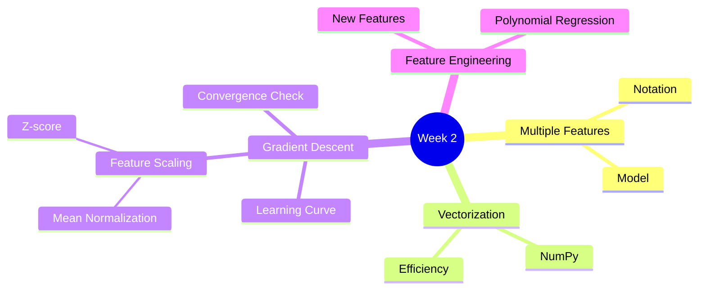
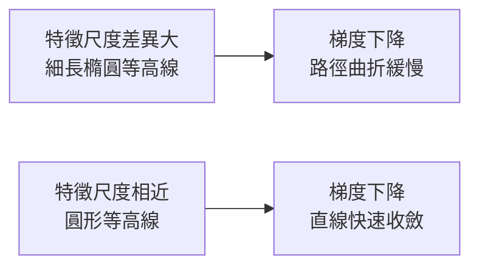

# Course 1 - Week 2: Regression with Multiple Input Variables

## 🗺️ Week Overview



---

## 1. Multiple Features（多特徵）

### 1.1 符號定義

**白話解釋：** 現實中預測房價不可能只看坪數，還要看臥室數、樓層、屋齡……多特徵線性回歸就是同時考慮多個因素做預測。

| 符號 | 意義 |
|------|------|
| $n$ | 特徵數量（feature count） |
| $x_j$ | 第 $j$ 個特徵，$j = 1, \ldots, n$ |
| $\vec{x}^{(i)}$ | 第 $i$ 筆訓練資料的特徵向量（row vector） |
| $x_j^{(i)}$ | 第 $i$ 筆資料的第 $j$ 個特徵值 |
| $m$ | 訓練資料筆數 |

**例子：** 預測房價，$n=4$ 個特徵
$$\vec{x}^{(1)} = [2104, 5, 1, 45] \quad \text{（坪數, 臥室數, 樓層, 屋齡）}$$

### 1.2 多特徵模型

$$f_{\vec{w},b}(\vec{x}) = w_1 x_1 + w_2 x_2 + \cdots + w_n x_n + b$$

向量形式（更簡潔）：

$$f_{\vec{w},b}(\vec{x}) = \vec{w} \cdot \vec{x} + b$$

其中 $\vec{w} = [w_1, w_2, \ldots, w_n]$ 為權重向量，$\vec{x} = [x_1, x_2, \ldots, x_n]$ 為特徵向量，$\cdot$ 為**點積（dot product）**。

**直覺解讀（房價例子）：**
$$\hat{y} = 0.1 \times \text{坪數} + 4 \times \text{臥室數} + 10 \times \text{樓層} - 2 \times \text{屋齡} + 80$$

---

## 2. Vectorization（向量化）

### 2.1 為什麼要向量化？

**白話解釋：** 如果特徵有 100 個，用 for loop 一個一個算很慢。向量化讓電腦一次並行計算所有特徵，速度提升數倍到數十倍。

### 2.2 程式碼比較

**未向量化（慢）：**
```python
f = 0
for j in range(n):
    f = f + w[j] * x[j]
f = f + b
```

**向量化（快）：**
```python
f = np.dot(w, x) + b
```

### 2.3 向量化原理

$$\vec{w} \cdot \vec{x} = \sum_{j=1}^{n} w_j x_j$$

NumPy 利用 CPU/GPU 的**平行運算（SIMD）**，同時計算所有乘積再加總，比 Python for loop 快上百倍。

---

## 3. Gradient Descent for Multiple Regression（多特徵梯度下降）

### 3.1 成本函數（不變形式）

$$J(\vec{w}, b) = \frac{1}{2m} \sum_{i=1}^{m} \left( f_{\vec{w},b}(\vec{x}^{(i)}) - y^{(i)} \right)^2$$

### 3.2 更新規則

對每個特徵 $j = 1, \ldots, n$：

$$w_j \leftarrow w_j - \alpha \frac{\partial J}{\partial w_j}$$

$$b \leftarrow b - \alpha \frac{\partial J}{\partial b}$$

展開偏微分：

$$\frac{\partial J}{\partial w_j} = \frac{1}{m} \sum_{i=1}^{m} \left( f_{\vec{w},b}(\vec{x}^{(i)}) - y^{(i)} \right) x_j^{(i)}$$

$$\frac{\partial J}{\partial b} = \frac{1}{m} \sum_{i=1}^{m} \left( f_{\vec{w},b}(\vec{x}^{(i)}) - y^{(i)} \right)$$

> ⚠️ 所有參數必須**同步更新**（simultaneous update），不能先更新 $w_1$，再用新的 $w_1$ 計算 $w_2$ 的梯度。

> [!info] 📖 延伸閱讀：現代優化器與學習率排程
> 多特徵梯度下降在實務中常配合自適應學習率優化器（如 Adam）來加速收斂，並使用 Warmup + Cosine Decay 等排程策略。
> - 優化器進化 → [[KP-02 - 現代優化器]]
> - 學習率調整策略 → [[KP-01 - 超參數與學習率]]

---

## 4. Feature Scaling（特徵縮放）

### 4.1 問題：特徵尺度不一

**白話解釋：** 若「坪數」的值域是 300–2000，「臥室數」是 1–5，梯度下降會在「坪數」方向走得非常慢，因為它的尺度差異太大，導致成本函數等高線呈現細長橢圓，需要很多步才能收斂。



### 4.2 方法一：Simple Rescaling（簡單縮放）

$$x_j^{\text{scaled}} = \frac{x_j}{\max(x_j)}$$

將特徵縮放到大約 $[0, 1]$ 的範圍。

### 4.3 方法二：Mean Normalization（均值歸一化）

$$x_j^{\text{norm}} = \frac{x_j - \mu_j}{\max(x_j) - \min(x_j)}$$

結果範圍大約在 $[-1, 1]$，且**以 0 為中心**。

### 4.4 方法三：Z-score Normalization（標準化）

$$x_j^{\text{z}} = \frac{x_j - \mu_j}{\sigma_j}$$

- $\mu_j$：特徵 $j$ 的**均值**
- $\sigma_j$：特徵 $j$ 的**標準差**

結果均值為 0，標準差為 1（標準常態分布）。

> **建議目標範圍：** $-1 \leq x_j \leq 1$，大致上 $-3 \leq x_j \leq 3$ 也可接受。特徵值域太大（如 $-100 \sim 100$）或太小（如 $0.0001 \sim 0.001$）都應該縮放。

> [!info] 📖 延伸閱讀：特徵縮放的現代擴展
> 在神經網路中，特徵縮放的思想被擴展為 **Batch Normalization**、**Layer Normalization** 和 **RMSNorm** 等技術，這些方法在訓練過程中動態正規化中間層的輸出，顯著提升訓練穩定性。
> 詳見 [[KP-04 - 正則化技術#2. 現代正規化技術（Normalization）]]。

---

## 5. Checking Gradient Descent Convergence（收斂檢查）

### 5.1 Learning Curve（學習曲線）

繪製**每次迭代的 $J$ 值**：

```
J │ ╲
  │  ╲
  │   ╲___
  │       ‾‾‾___________
  └──────────────────── iterations
```

- 如果曲線**單調遞減**並趨於平坦 → 梯度下降正在收斂
- 如果曲線**上升**或**震盪** → 學習率 $\alpha$ 可能太大

### 5.2 自動收斂判斷

設置閾值 $\epsilon$（如 $10^{-3}$），若某次迭代後 $J$ 的降幅 $< \epsilon$，則宣告收斂。

### 5.3 選擇學習率

嘗試不同 $\alpha$：$0.001, 0.003, 0.01, 0.03, 0.1, 0.3, 1, \ldots$（每次約 3 倍）

---

## 6. Feature Engineering（特徵工程）

### 6.1 概念

**白話解釋：** 利用對問題的理解，創造新特徵，讓模型更容易學習。

**例子（土地面積）：**
- 原始特徵：$x_1$ = 正面寬度（frontage）, $x_2$ = 縱深（depth）
- **工程特徵：** $x_3 = x_1 \times x_2$（面積），更直接相關

$$f_{\vec{w},b}(\vec{x}) = w_1 x_1 + w_2 x_2 + w_3 x_3 + b$$

---

## 7. Polynomial Regression（多項式回歸）

### 7.1 動機

**白話解釋：** 有時資料的關係不是直線，而是曲線。用多項式讓線性回歸也能擬合非線性資料。

### 7.2 模型形式

**二次多項式（拋物線）：**
$$f(x) = w_1 x + w_2 x^2 + b$$

**三次多項式：**
$$f(x) = w_1 x + w_2 x^2 + w_3 x^3 + b$$

**平方根形式（更平滑）：**
$$f(x) = w_1 x + w_2 \sqrt{x} + b$$

> ⚠️ **重要：** 使用多項式特徵時，**Feature Scaling 更為關鍵**。若 $x$ 的範圍是 $1 \sim 1000$，則 $x^2$ 的範圍是 $1 \sim 10^6$，$x^3$ 的範圍是 $1 \sim 10^9$，尺度差異極大。

### 7.3 關鍵洞察

多項式回歸的本質仍然是**多特徵線性回歸**，只是把 $x^2, x^3, \sqrt{x}$ 視為新特徵。

> 💡 多項式次數越高越容易**過擬合（overfitting）**，需要配合**正則化**（詳見 [[C1-W3 - Classification#7. Regularization（正則化）]]）。如何系統性判斷模型是過擬合還是欠擬合，請參考 [[C2-W3 - Advice for Applying ML#3. Diagnosing Bias and Variance（診斷偏差與方差）]]。

---

## 8. Normal Equation（正規方程）—— 選讀

不用梯度下降，直接一步求解最優 $\vec{w}, b$：

$$\vec{w} = (X^T X)^{-1} X^T \vec{y}$$

| | Gradient Descent | Normal Equation |
|--|--|--|
| 是否需要選 $\alpha$ | 需要 | 不需要 |
| 迭代 | 需要多次 | 一次直接求解 |
| 特徵數 $n$ 很大時 | 仍然可行 | 計算 $(X^T X)^{-1}$ 很慢 |
| 通用性 | 適用各種模型 | 僅限線性回歸 |

> **實務上：** 特徵數超過 10,000 時，正規方程很慢，通常選梯度下降。

---

## 9. 重點總結

| 概念 | 核心公式 |
|------|---------|
| 多特徵模型 | $f_{\vec{w},b}(\vec{x}) = \vec{w} \cdot \vec{x} + b$ |
| 成本函數 | $J(\vec{w},b) = \frac{1}{2m}\sum(\hat{y}^{(i)}-y^{(i)})^2$ |
| 梯度下降更新 | $w_j \leftarrow w_j - \alpha \frac{\partial J}{\partial w_j}$ |
| Z-score 標準化 | $x_j^{\text{norm}} = \frac{x_j - \mu_j}{\sigma_j}$ |

---

## 🔗 Related Notes

- [[C1-W1 - Introduction to Machine Learning]] — 單特徵線性回歸基礎
- [[C1-W3 - Classification]] — 分類問題
- [[C2-W1 - Neural Networks]] — 神經網路也用類似的梯度下降訓練
- [[KP-01 - 超參數與學習率]] — Feature Scaling 與 Batch Size 的關係；進階學習率調整策略
- [[KP-04 - 正則化技術]] — L1/L2 正則化的數學原理與現代擴展（Dropout、BatchNorm）
