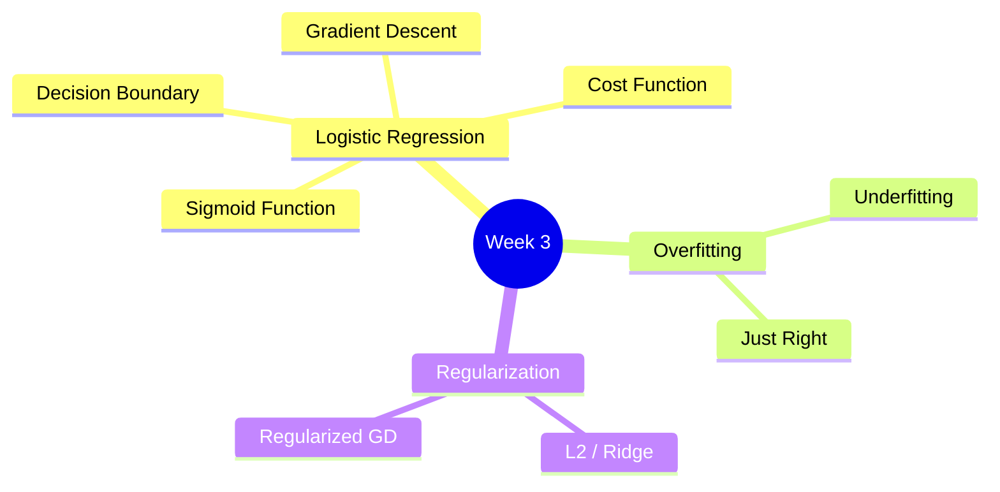

# Course 1 - Week 3: Classification

## 🗺️ Week Overview



---

## 1. Classification Problem（分類問題）

### 1.1 為什麼不用線性回歸做分類？

**白話解釋：** 用線性回歸預測腫瘤是否惡性（0/1），理論上可以用 0.5 作為門檻。但問題在於，若有一個極端值（非常大的腫瘤），線性回歸的直線會被拉偏，使原本正確的門檻位置改變，導致分類錯誤。

**技術原因：** 線性回歸的輸出可以是任意實數（如 $-100$ 或 $100$），但分類的目標標籤只有 $\{0, 1\}$，輸出範圍不匹配。

### 1.2 分類任務類型

| 類型 | 說明 | 例子 |
|------|------|------|
| Binary Classification | 兩個類別 | 垃圾郵件 (0/1) |
| Multiclass Classification | 多個類別 | 手寫數字 (0–9) |
| Multi-label Classification | 每個例子可有多個標籤 | 圖片包含{貓, 狗, 車} |

---

## 2. Logistic Regression（邏輯回歸）

> ⚠️ 名字有「回歸」，但其實是**分類**演算法！

### 2.1 Sigmoid Function（S 型函數）

**白話解釋：** Sigmoid 函數把任何實數壓縮到 $(0, 1)$ 之間，可以解讀為「機率」。

$$g(z) = \frac{1}{1 + e^{-z}}$$

```
g(z)
 1 │          ─────────
   │        /
0.5│       /
   │      /
 0 │─────
   └──────────────── z
       0
```

性質：
- $g(z) \to 1$ 當 $z \to +\infty$
- $g(z) \to 0$ 當 $z \to -\infty$
- $g(0) = 0.5$

> [!info] 📖 延伸閱讀：Sigmoid 的局限與現代替代
> Sigmoid 在深層網路中容易導致**梯度消失**（當 $|z|$ 很大時梯度趨近 0），因此現代神經網路大多使用 ReLU、GELU、SwiGLU 等激活函數。
> 詳見 [[KP-05 - 激活函數]]。

### 2.2 Logistic Regression 模型

$$f_{\vec{w},b}(\vec{x}) = g(\vec{w} \cdot \vec{x} + b) = \frac{1}{1 + e^{-(\vec{w} \cdot \vec{x} + b)}}$$

**輸出解讀：** $f_{\vec{w},b}(\vec{x}) = P(y=1 \mid \vec{x}; \vec{w}, b)$

即模型輸出的是「給定特徵 $\vec{x}$，標籤為 1 的**機率**」。

**例子：** 若 $f(\vec{x}) = 0.7$，表示這顆腫瘤有 70% 機率是惡性。

> 💡 Logistic Regression 本質上就是一個**單神經元網路**（用 Sigmoid 激活）。在 [[C2-W1 - Neural Networks#1.2 Demand Prediction 範例（需求預測）]] 中會看到它如何擴展成多層神經網路。

### 2.3 預測規則

$$\hat{y} = \begin{cases} 1 & \text{if } f(\vec{x}) \geq 0.5 \\ 0 & \text{if } f(\vec{x}) < 0.5 \end{cases}$$

等價於：

$$\hat{y} = \begin{cases} 1 & \text{if } \vec{w} \cdot \vec{x} + b \geq 0 \\ 0 & \text{if } \vec{w} \cdot \vec{x} + b < 0 \end{cases}$$

---

## 3. Decision Boundary（決策邊界）

### 3.1 線性決策邊界

決策邊界是 $\vec{w} \cdot \vec{x} + b = 0$ 的曲線（二維下是直線）。

**例子（二特徵）：**
若 $w_1 = 1, w_2 = 1, b = -3$，則決策邊界為：
$$x_1 + x_2 - 3 = 0 \quad \Rightarrow \quad x_1 + x_2 = 3$$

```
x2
 4│  ✓ (class 1)
 3│    ╲ ← 決策邊界
 2│     ╲  ✗ (class 0)
 1│
  └──────────── x1
   1  2  3  4
```

### 3.2 非線性決策邊界

加入多項式特徵可以學習更複雜的邊界：

$$f(\vec{x}) = g(w_1 x_1^2 + w_2 x_2^2 + b)$$

決策邊界 $w_1 x_1^2 + w_2 x_2^2 = 1$ 是一個**橢圓**。

---

## 4. Cost Function for Logistic Regression（邏輯回歸成本函數）

### 4.1 為什麼不用 Squared Error？

若在邏輯回歸中使用均方誤差成本函數，$J$ 關於 $\vec{w}, b$ 是**非凸（non-convex）**的，有很多局部最小值，梯度下降無法保證找到全局最小值。

### 4.2 Logistic Loss（Logistic 損失）

$$L\left(f(\vec{x}^{(i)}), y^{(i)}\right) = \begin{cases} -\log(f(\vec{x}^{(i)})) & \text{if } y^{(i)} = 1 \\ -\log(1 - f(\vec{x}^{(i)})) & \text{if } y^{(i)} = 0 \end{cases}$$

**直覺理解：**
- 若 $y=1$，預測 $f=1$（很有信心），損失 $\to 0$
- 若 $y=1$，預測 $f=0$（完全錯誤），損失 $\to \infty$
- 若 $y=0$，預測 $f=0$（很有信心），損失 $\to 0$
- 若 $y=0$，預測 $f=1$（完全錯誤），損失 $\to \infty$

### 4.3 簡化合併形式

$$L\left(f(\vec{x}^{(i)}), y^{(i)}\right) = -y^{(i)} \log(f(\vec{x}^{(i)})) - (1 - y^{(i)}) \log(1 - f(\vec{x}^{(i)}))$$

當 $y^{(i)}=1$ 時右項消失；當 $y^{(i)}=0$ 時左項消失——與分段定義等價。

### 4.4 成本函數

$$J(\vec{w}, b) = \frac{1}{m} \sum_{i=1}^{m} L\left(f(\vec{x}^{(i)}), y^{(i)}\right)$$

$$= -\frac{1}{m} \sum_{i=1}^{m} \left[ y^{(i)} \log(f(\vec{x}^{(i)})) + (1-y^{(i)}) \log(1-f(\vec{x}^{(i)})) \right]$$

> 此成本函數來自**最大似然估計（Maximum Likelihood Estimation）**，是凸函數，梯度下降可以找到全局最小值。

> [!info] 📖 延伸閱讀：Cross-Entropy 損失的進階變體
> Logistic Loss 本質上就是 **Binary Cross-Entropy**。在現代訓練中，常用的進階技巧包括 **Label Smoothing**（抑制過度自信）、**Focal Loss**（處理類別不平衡）、以及 **InfoNCE**（對比學習）。
> 詳見 [[KP-03 - 損失函數]]。

---

## 5. Gradient Descent for Logistic Regression

更新規則在**形式上**與線性回歸相同：

$$w_j \leftarrow w_j - \alpha \frac{\partial J}{\partial w_j}$$

$$b \leftarrow b - \alpha \frac{\partial J}{\partial b}$$

展開（偏微分計算後）：

$$\frac{\partial J}{\partial w_j} = \frac{1}{m} \sum_{i=1}^{m} \left( f_{\vec{w},b}(\vec{x}^{(i)}) - y^{(i)} \right) x_j^{(i)}$$

$$\frac{\partial J}{\partial b} = \frac{1}{m} \sum_{i=1}^{m} \left( f_{\vec{w},b}(\vec{x}^{(i)}) - y^{(i)} \right)$$

> 雖然公式形式一樣，但 $f(\vec{x}) = g(\vec{w} \cdot \vec{x} + b)$ 是 Sigmoid，**本質不同於線性回歸**。

---

## 6. Overfitting & Underfitting（過擬合與欠擬合）

### 6.1 三種情況


| 情況 | 訓練集誤差 | 測試集誤差 | 問題 |
|------|-----------|-----------|------|
| **Underfitting** | 大 | 大 | High Bias |
| **Just Right** | 小 | 小 | — |
| **Overfitting** | 非常小 | 大 | High Variance |

### 6.2 白話解釋

- **欠擬合（Underfitting）：** 模型太笨，連訓練資料都學不好。就像用一條直線去擬合明顯是拋物線的資料。
- **過擬合（Overfitting）：** 模型太聰明，把訓練資料的雜訊也記住了，但遇到新資料就失靈。就像一個學生把考古題全部背起來，卻不理解概念，換個題型就不會了。

### 6.3 處理過擬合的方法

1. **收集更多訓練資料** — 最根本的方法
2. **減少特徵數量（Feature Selection）** — 只保留最相關的特徵
3. **正則化（Regularization）** — 保留所有特徵，但縮小參數的值

---

## 7. Regularization（正則化）

### 7.1 核心思想

**白話解釋：** 正則化是在成本函數加入「懲罰項」，讓模型傾向於選擇較小的參數值（$w_j$）。參數越小，模型越平滑，越不容易過擬合。

### 7.2 Regularized Cost Function（L2 / Ridge）

$$J(\vec{w}, b) = \frac{1}{2m} \sum_{i=1}^{m} \left(f_{\vec{w},b}(\vec{x}^{(i)}) - y^{(i)}\right)^2 + \frac{\lambda}{2m} \sum_{j=1}^{n} w_j^2$$

- $\lambda$：**正則化係數（regularization parameter）**，控制懲罰強度
- 只懲罰 $w_j$，通常不懲罰 $b$

**$\lambda$ 的影響：**

| $\lambda$ | 效果 |
|-----------|------|
| $\lambda = 0$ | 無正則化，可能過擬合 |
| $\lambda$ 很大 | $w_j \approx 0$，模型退化為 $f \approx b$，欠擬合 |
| $\lambda$ 適中 | 平衡擬合與泛化 |

### 7.3 Regularized Gradient Descent（線性回歸）

$$w_j \leftarrow w_j - \alpha \left[ \frac{1}{m} \sum_{i=1}^{m} \left(f(\vec{x}^{(i)}) - y^{(i)}\right) x_j^{(i)} + \frac{\lambda}{m} w_j \right]$$

重新整理：

$$w_j \leftarrow w_j \left(1 - \alpha \frac{\lambda}{m}\right) - \alpha \frac{1}{m} \sum_{i=1}^{m} \left(f(\vec{x}^{(i)}) - y^{(i)}\right) x_j^{(i)}$$

> 注意 $\left(1 - \alpha \frac{\lambda}{m}\right) < 1$，每次迭代 $w_j$ 都會被稍微**縮小（shrink）**，這就是正則化的效果。

> [!info] 📖 延伸閱讀：正則化的現代擴展
> L2 正則化只是最基礎的形式。現代深度學習中，**Dropout**、**Mixup**、**DropPath** 等技術提供了更強大的正則化效果。此外，AdamW 將 L2 正則化與自適應學習率解耦，是目前的標準做法。
> - 正則化全景 → [[KP-04 - 正則化技術]]
> - 正則化對 Bias/Variance 的影響 → [[C2-W3 - Advice for Applying ML#3.2 Regularization 對 Bias/Variance 的影響]]

### 7.4 Regularized Gradient Descent（邏輯回歸）

$$J(\vec{w}, b) = -\frac{1}{m} \sum_{i=1}^{m} \left[ y^{(i)} \log(f) + (1-y^{(i)}) \log(1-f) \right] + \frac{\lambda}{2m} \sum_{j=1}^{n} w_j^2$$

$$w_j \leftarrow w_j - \alpha \left[ \frac{1}{m} \sum_{i=1}^{m} \left(f(\vec{x}^{(i)}) - y^{(i)}\right) x_j^{(i)} + \frac{\lambda}{m} w_j \right]$$

形式與線性回歸相同，但 $f$ 是 Sigmoid。

---

## 8. 重點總結

| 概念 | 核心公式 |
|------|---------|
| Logistic 模型 | $f(\vec{x}) = \frac{1}{1+e^{-(\vec{w}\cdot\vec{x}+b)}}$ |
| Logistic Loss | $-y\log(f) - (1-y)\log(1-f)$ |
| 正則化成本（線性回歸） | $J = \frac{1}{2m}\sum(\hat{y}-y)^2 + \frac{\lambda}{2m}\sum w_j^2$ |
| Regularized 更新 | $w_j \leftarrow w_j(1-\alpha\frac{\lambda}{m}) - \alpha \cdot \text{gradient}$ |

---

## 🔗 Related Notes

- [[C1-W1 - Introduction to Machine Learning]] — ML 基礎與線性回歸
- [[C1-W2 - Regression with Multiple Input Variables]] — 多特徵迴歸
- [[C2-W2 - Neural Network Training]] — 神經網路的訓練與激活函數
- [[C2-W3 - Advice for Applying ML]] — 診斷 Bias/Variance，選擇正則化強度
- [[KP-04 - 正則化技術]] — L1/L2 正則化的數學原理與現代擴展（Dropout、Mixup）
- [[KP-05 - 激活函數]] — Sigmoid 的局限性與現代激活函數的演進
- [[KP-03 - 損失函數]] — Cross-Entropy Loss 的完整探討與 Label Smoothing 等進階技巧
