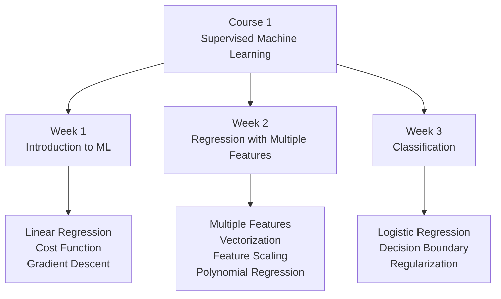

# Course 1：Supervised Machine Learning: Regression and Classification

## 📚 課程簡介

本課程介紹機器學習的基礎概念，重點涵蓋**監督學習**中的回歸與分類任務。

---

## 🗂️ 週次索引

| 週次 | 標題 | 核心主題 |
|------|------|---------|
| Week 1 | [[C1-W1 - Introduction to Machine Learning]] | ML 定義、線性回歸、成本函數、梯度下降 |
| Week 2 | [[C1-W2 - Regression with Multiple Input Variables]] | 多特徵回歸、向量化、特徵縮放、多項式回歸 |
| Week 3 | [[C1-W3 - Classification]] | 邏輯回歸、Sigmoid、決策邊界、正則化 |

---

## 🔑 核心公式速查

### Linear Regression
$$f_{w,b}(x) = wx + b \quad \text{(單特徵)}$$
$$f_{\vec{w},b}(\vec{x}) = \vec{w} \cdot \vec{x} + b \quad \text{(多特徵)}$$

### Cost Function
$$J(\vec{w},b) = \frac{1}{2m}\sum_{i=1}^{m}\left(f_{\vec{w},b}(\vec{x}^{(i)}) - y^{(i)}\right)^2$$

### Gradient Descent
$$w_j \leftarrow w_j - \alpha \frac{\partial J}{\partial w_j}$$

### Logistic Regression
$$f_{\vec{w},b}(\vec{x}) = \frac{1}{1+e^{-(\vec{w}\cdot\vec{x}+b)}}$$

### Regularized Cost Function
$$J = \text{original cost} + \frac{\lambda}{2m}\sum_{j=1}^{n}w_j^2$$

---

## � 延伸知識點（Post-2020 前沿補充）

| 課程主題 | 延伸知識點 |
|---------|-----------|
| 梯度下降 / 學習率 | [[KP-01 - 超參數與學習率]] — Warmup、Cosine Annealing、WSD 排程 |
| 梯度下降 → Adam | [[KP-02 - 現代優化器]] — AdamW、Lion、Sophia、Muon、SPAM |
| 正則化 | [[KP-04 - 正則化技術]] — Dropout、LayerNorm、RMSNorm、DyT |
| Logistic Loss | [[KP-03 - 損失函數]] — Label Smoothing、Focal Loss、InfoNCE |

→ [[KP-Index - 知識點總索引]] — 完整知識點體系

---

## �🔗 前往其他課程

- [[Course 2 - Index]] — Advanced Learning Algorithms
- [[Course 3 - Index]] — Unsupervised Learning, Recommenders, Reinforcement Learning
- [[ML Specialization - Master Index]] — 完整課程地圖
