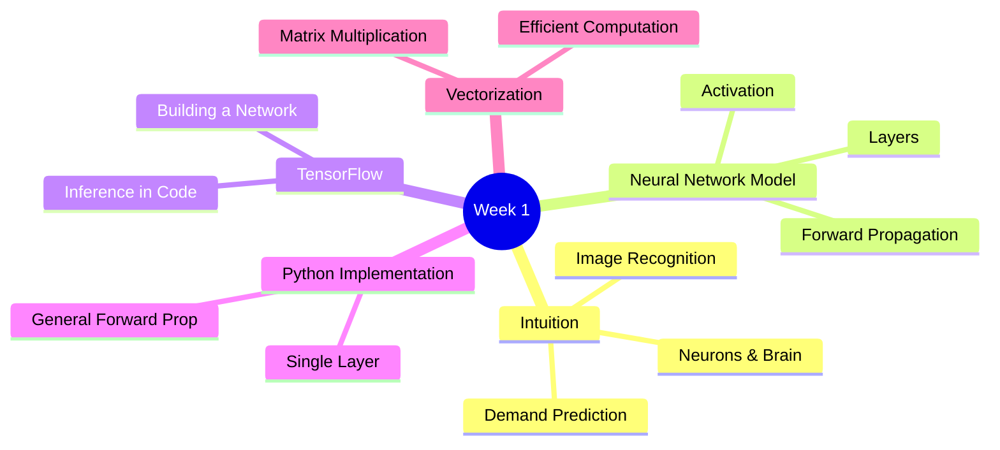
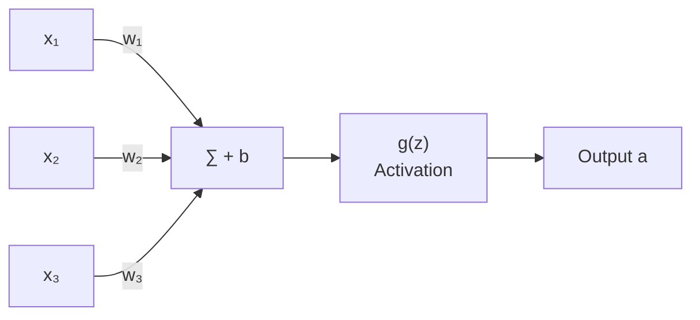
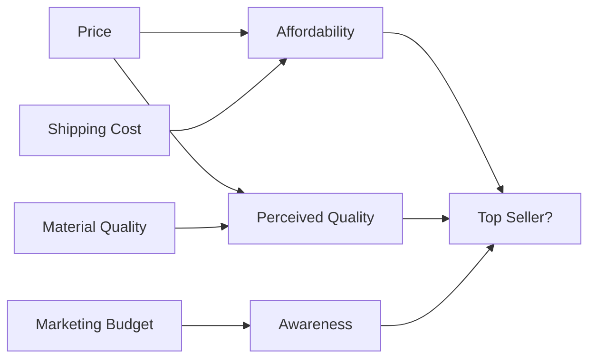
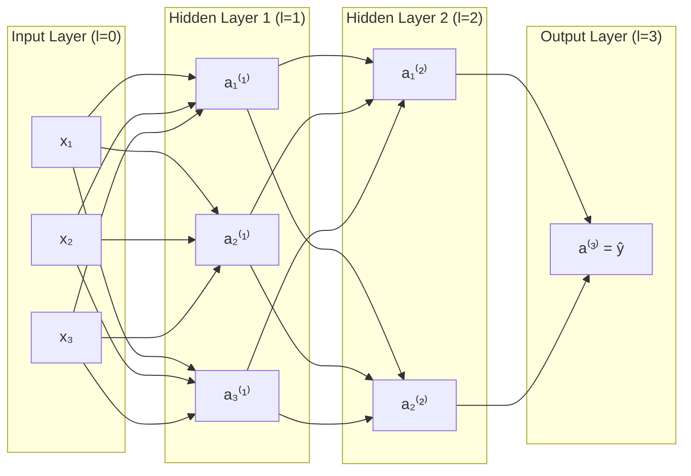

# Course 2 - Week 1: Neural Networks

## 🗺️ Week Overview



---

## 1. Neural Networks Intuition（神經網路直覺）

### 1.1 神經元與大腦

**白話解釋：** 生物神經元接收多個輸入訊號，當訊號強度超過某個閾值，就會「發射（fire）」輸出訊號。人工神經元模仿這個機制：接收輸入，計算加權總和，通過激活函數輸出。



> **重要區別：** 現代神經網路的靈感來自大腦，但實際機制與生物神經元差異很大。ML 成功更多靠大量資料、算力和算法，而非對大腦的精確模擬。

### 1.2 Demand Prediction 範例（需求預測）

**場景：** 預測 T-shirt 的銷量（top seller = 1, not = 0）

**簡單版（單神經元）：**
- 輸入：$x$ = 價格（Price）
- 神經元計算：$a = g(wx + b)$（等同 Logistic Regression）

**複雜版（多特徵）：**
輸入：價格、運費、行銷預算、材質品質



神經網路**自動學習**哪些中間特徵（affordability, quality, awareness）對預測有用，不需要人工定義。

> [!info] 📖 延伸閱讀：從全連接層到現代架構
> 本節介紹的是全連接神經網路（Dense/MLP）。現代深度學習已發展出更強大的架構，特別是 **Transformer**，它透過 **Self-Attention** 機制讓每個神經元能「關注」輸入的任意位置，成為 NLP、CV 等領域的主流架構。
> 詳見 [[KP-06 - Attention 機制與 Transformer]]。

### 1.3 Image Recognition 範例

- 一張 $1000 \times 1000$ 的灰階圖片 = 100萬個像素值 = 100萬維度輸入向量 $\vec{x}$
- 第一層：學習邊緣（edges）
- 第二層：學習形狀（shapes/parts）
- 第三層：學習物件（objects）
- 輸出層：預測是否為人臉

---

## 2. Neural Network Model（神經網路模型）

### 2.1 Layer（層）的結構

每一層包含多個神經元（neurons），每個神經元接收上一層所有輸出作為輸入。

**符號定義：**

| 符號 | 說明 |
|------|------|
| $L$ | 神經網路總層數（不含輸入層） |
| $a^{[l]}$ | 第 $l$ 層的激活值向量 |
| $a^{[0]} = \vec{x}$ | 輸入層（視為第 0 層） |
| $n^{[l]}$ | 第 $l$ 層的神經元數量 |
| $W^{[l]}$ | 第 $l$ 層的權重矩陣，形狀 $(n^{[l]}, n^{[l-1]})$ |
| $b^{[l]}$ | 第 $l$ 層的偏差向量，形狀 $(n^{[l]}, 1)$ |

### 2.2 單一神經元計算

$$z_j^{[l]} = \vec{w}_j^{[l]} \cdot \vec{a}^{[l-1]} + b_j^{[l]}$$

$$a_j^{[l]} = g(z_j^{[l]})$$

其中 $g$ 為激活函數（本週先用 Sigmoid）。

> [!info] 📖 延伸閱讀：激活函數的現代進化
> 課程此處使用 Sigmoid 作為激活函數，但在實務中 Sigmoid 已被 **ReLU**（隱藏層首選）及更新的 **GELU**、**SwiGLU** 取代，這些激活函數能有效避免梯度消失問題。下週（[[C2-W2 - Neural Network Training#2. Activation Functions（激活函數）]]）將詳細討論激活函數的選擇。
> 現代激活函數全景 → [[KP-05 - 激活函數]]。

### 2.3 架構示例（4層網路）



### 2.4 Forward Propagation（前向傳播）

資訊從輸入層到輸出層依序計算：

$$\vec{a}^{[1]} = g(W^{[1]} \vec{a}^{[0]} + \vec{b}^{[1]})$$
$$\vec{a}^{[2]} = g(W^{[2]} \vec{a}^{[1]} + \vec{b}^{[2]})$$
$$\vdots$$
$$\vec{a}^{[L]} = g(W^{[L]} \vec{a}^{[L-1]} + \vec{b}^{[L]})$$

最終輸出：$\hat{y} = \vec{a}^{[L]}$

---

## 3. TensorFlow Implementation（TensorFlow 實作）

### 3.1 Inference（推論）in Code

以手寫數字辨識（0/1）為例：

```python
import numpy as np
import tensorflow as tf
from tensorflow.keras import layers

# 定義輸入
x = np.array([[200.0, 17.0]])  # 一筆資料

# 建立各層
layer1 = tf.keras.layers.Dense(units=3, activation='sigmoid')
layer2 = tf.keras.layers.Dense(units=1, activation='sigmoid')

# 手動前向傳播
a1 = layer1(x)     # shape: (1, 3)
a2 = layer2(a1)    # shape: (1, 1)
```

### 3.2 Data in TensorFlow

TensorFlow 用 **Tensor**（矩陣）儲存資料，比 NumPy array 多一個維度（batch dimension）。

```python
# NumPy: 1D vector
x_np = np.array([1, 2, 3])          # shape: (3,)

# TensorFlow: 2D matrix (矩陣形式)
x_tf = np.array([[1, 2, 3]])        # shape: (1, 3)  ← 注意雙括號

# 轉換
a1 = layer1(x)                       # TensorFlow Tensor
a1_np = a1.numpy()                   # 轉回 NumPy
```

### 3.3 Building a Neural Network

**Keras Sequential API（推薦方式）：**

```python
model = tf.keras.Sequential([
    tf.keras.layers.Dense(units=25, activation='sigmoid'),
    tf.keras.layers.Dense(units=15, activation='sigmoid'),
    tf.keras.layers.Dense(units=1,  activation='sigmoid')
])

# 訓練
model.compile(...)
model.fit(X, y, epochs=100)

# 預測
model.predict(X_new)
```

---

## 4. Neural Network Implementation in Python（Python 實作）

### 4.1 Forward Prop in a Single Layer（手動實作）

```python
def dense(a_in, W, b, activation):
    """
    a_in: 輸入向量, shape (n_in,)
    W:    權重矩陣, shape (n_in, n_out)
    b:    偏差向量, shape (n_out,)
    """
    z = np.dot(a_in, W) + b     # (n_out,)
    a_out = activation(z)       # (n_out,)
    return a_out
```

### 4.2 General Forward Propagation

```python
def sequential(x, W1, b1, W2, b2):
    a1 = dense(x, W1, b1, sigmoid)
    a2 = dense(a1, W2, b2, sigmoid)
    return a2

def sigmoid(z):
    return 1 / (1 + np.exp(-z))
```

---

## 5. Vectorization（向量化）

### 5.1 為何重要？

若一層有 1000 個神經元，用 for loop 計算每個神經元非常慢。向量化讓**整層**同時計算。

### 5.2 矩陣乘法

**矩陣乘法定義：** $C = AB$，其中 $C_{ij} = \sum_k A_{ik} B_{kj}$

**層的向量化計算：**

$$Z^{[l]} = W^{[l]} A^{[l-1]} + b^{[l]}$$
$$A^{[l]} = g(Z^{[l]})$$

其中：
- $A^{[l-1]}$ 形狀為 $(n^{[l-1]}, m)$（$m$ 為 batch size）
- $W^{[l]}$ 形狀為 $(n^{[l]}, n^{[l-1]})$
- $Z^{[l]}$ 形狀為 $(n^{[l]}, m)$

**TensorFlow 中（batch 維度在前）：**
- $X$ 形狀為 $(m, n)$
- $W$ 形狀為 $(n_{\text{in}}, n_{\text{out}})$
- $Z = XW + b$，形狀 $(m, n_{\text{out}})$

```python
# NumPy 向量化實作
def dense_vectorized(A_in, W, b):
    Z = np.matmul(A_in, W) + b    # A_in: (m, n_in), W: (n_in, n_out)
    A_out = sigmoid(Z)             # (m, n_out)
    return A_out
```

### 5.3 矩陣乘法規則

$$C_{m \times p} = A_{m \times n} \cdot B_{n \times p}$$

- 兩矩陣相乘：左矩陣的**列數**必須等於右矩陣的**行數**（內維度相同）
- 結果形狀：左矩陣的**行數** × 右矩陣的**列數**

---

## 6. Speculations on AGI（關於 AGI 的思考）

> **Andrew Ng 的觀點：** 人腦學習幾乎所有事情，都依賴「一個」或「少數幾個」學習演算法。AI 研究者的夢想是找到類似的通用演算法。目前神經網路在特定任務上很強，但距離 AGI（通用人工智慧）仍有很長的路要走。

**腦皮質可塑性（Cortical Plasticity）：** 大腦不同區域可以學習執行不同任務（視覺皮質學習聽覺、觸覺），暗示可能存在通用的學習機制。

> [!info] 📖 延伸閱讀：縮放法則與通用智慧
> Andrew Ng 對 AGI 的討論與近年「縮放法則（Scaling Laws）」研究密切相關——研究表明模型性能與參數量、資料量、算力呈可預測的幂律關係，並且在特定規模下會「湧現」出新能力。
> 詳見 [[KP-07 - 縮放法則與湧現能力]]。

---

## 7. 重點總結

| 概念 | 核心公式 / 說明 |
|------|----------------|
| 單神經元 | $a = g(\vec{w} \cdot \vec{a}^{[l-1]} + b)$ |
| 層的前向傳播 | $\vec{a}^{[l]} = g(W^{[l]}\vec{a}^{[l-1]} + \vec{b}^{[l]})$ |
| 向量化層計算 | $Z = XW + b$，$A = g(Z)$ |
| Keras 建模 | `model = Sequential([Dense(...), ...])`  |

---

## 🔗 Related Notes

- [[C1-W3 - Classification]] — Logistic Regression 是最簡單的「單神經元」網路
- [[C2-W2 - Neural Network Training]] — 訓練神經網路：反向傳播、激活函數選擇
- [[C2-W3 - Advice for Applying ML]] — 如何診斷並改進神經網路
- [[KP-06 - Attention 機制與 Transformer]] — 從基礎神經網路到 Transformer 架構的演進
- [[KP-04 - 正則化技術]] — BatchNorm、LayerNorm 等現代神經網路必備技術
- [[C2-W4 - Decision Trees#6. When to Use Decision Trees vs. Neural Networks？]] — 神經網路 vs 決策樹的適用場景比較
