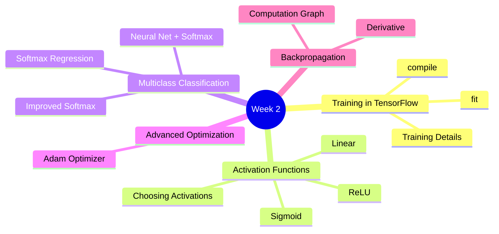
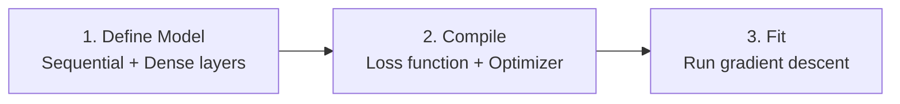
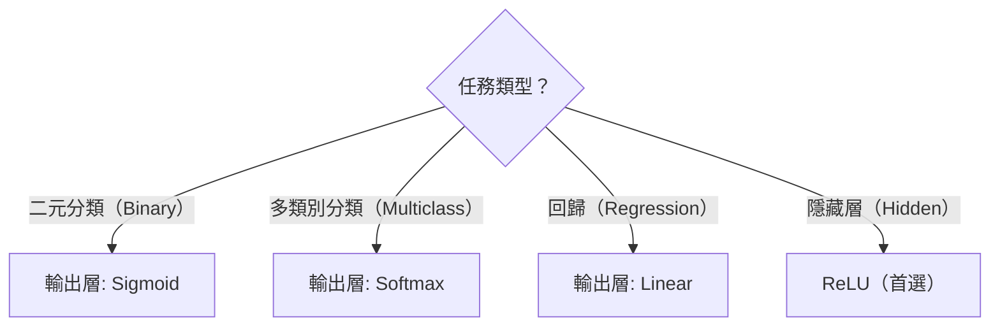
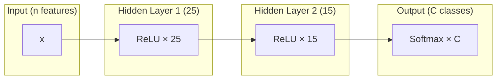
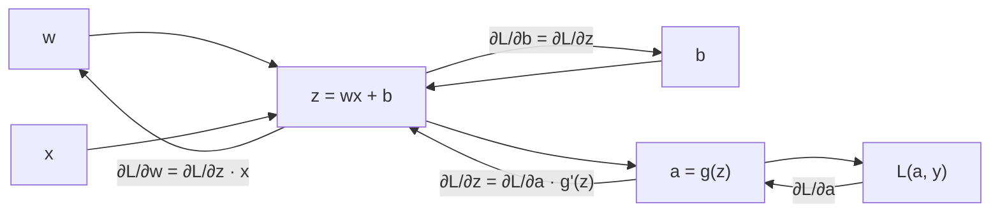

# Course 2 - Week 2: Neural Network Training

## 🗺️ Week Overview



---

## 1. Neural Network Training in TensorFlow

### 1.1 三步驟訓練流程



**程式碼：**

```python
import tensorflow as tf
from tensorflow.keras import Sequential
from tensorflow.keras.layers import Dense
from tensorflow.keras.losses import BinaryCrossentropy

# Step 1: Define
model = Sequential([
    Dense(25, activation='sigmoid'),
    Dense(15, activation='sigmoid'),
    Dense(1,  activation='sigmoid')
])

# Step 2: Compile
model.compile(
    optimizer=tf.keras.optimizers.Adam(learning_rate=0.001),
    loss=BinaryCrossentropy()
)

# Step 3: Fit
model.fit(X, y, epochs=100)
```

### 1.2 訓練細節對應

| 步驟 | 數學意義 | TensorFlow API |
|------|---------|----------------|
| 指定模型 $f_{\vec{w},b}(\vec{x})$ | 定義網路架構 | `Sequential([Dense(...)])` |
| 指定損失函數 $L(\hat{y}, y)$ | Binary Crossentropy | `BinaryCrossentropy()` |
| 最小化 $J = \frac{1}{m}\sum L$ | 梯度下降 | `model.fit(X, y, epochs=n)` |

---

## 2. Activation Functions（激活函數）

### 2.1 為什麼需要激活函數？

**白話解釋：** 如果沒有激活函數（或只用線性激活），無論多少層，整個網路等效於一層線性模型。激活函數引入**非線性**，讓神經網路能學習複雜的模式。

**證明：** 若 $g(z) = z$（線性激活）

$$a^{[1]} = W^{[1]}x + b^{[1]}$$
$$a^{[2]} = W^{[2]}a^{[1]} + b^{[2]} = W^{[2]}(W^{[1]}x + b^{[1]}) + b^{[2]} = W'x + b'$$

多層線性網路 = 一層線性網路。

### 2.2 常見激活函數

#### Sigmoid

$$g(z) = \frac{1}{1 + e^{-z}}$$

- 輸出範圍：$(0, 1)$
- 適用於：**二元分類**輸出層
- 問題：梯度消失（vanishing gradient）

#### ReLU（Rectified Linear Unit）

$$g(z) = \max(0, z)$$

- 輸出範圍：$[0, +\infty)$
- 適用於：**隱藏層（hidden layers）的首選**
- 優點：梯度不消失（$z>0$ 時梯度恆為 1），計算快

> [!info] 💡 ReLU 如何逼近複雜函數？（來自 C2_W2_Relu.ipynb）
> ReLU 的「關閉」特性（$z \leq 0$ 時輸出 0）使得每個神經元可以在特定區間「開啟」或「關閉」。多個 ReLU 神經元組合後，就像拼接多段線性函數（piecewise linear），能逼近任意複雜的非線性函數。
> - **第 1 個神經元**：負責第一段斜率
> - **第 2 個神經元**：在轉折點「開啟」，疊加新的斜率
> - **第 3 個神經元**：在下一個轉折點再疊加
> 
> 這就是為什麼 ReLU 是非線性激活——它的「關閉」區域讓模型能選擇性地啟用不同神經元來建構複雜曲線。

#### Linear（線性）

$$g(z) = z$$

- 輸出範圍：$(-\infty, +\infty)$
- 適用於：**回歸任務的輸出層**
- 等同於「沒有激活函數」

#### Softmax（下節詳述）

$$g(z_j) = \frac{e^{z_j}}{\sum_k e^{z_k}}$$

- 輸出範圍：$(0, 1)$，且所有輸出加總 = 1
- 適用於：**多類別分類**輸出層

### 2.3 如何選擇激活函數？



| 層別 | 推薦激活函數 | 原因 |
|------|------------|------|
| 隱藏層 | **ReLU** | 快速計算，梯度不消失 |
| 輸出層（二元分類） | Sigmoid | 輸出機率 $\in (0,1)$ |
| 輸出層（多類別分類） | Softmax | 輸出多類機率分布 |
| 輸出層（回歸） | Linear | 無限制範圍 |

> [!info] 📖 延伸閱讀：現代激活函數的演進
> ReLU 是很好的默認選擇，但現代大型模型（如 GPT、LLaMA）已轉向使用 **GELU**、**SwiGLU** 等更平滑的激活函數，它們在大規模訓練中表現更穩定。
> 詳見 [[KP-05 - 激活函數]]。

---

## 3. Multiclass Classification（多類別分類）

### 3.1 問題設定

- **輸出：** $y$ 可以是 $1, 2, 3, \ldots, C$ 中的一個類別
- **例子：** 手寫數字辨識（0–9，共 10 類）

### 3.2 Softmax Regression

Softmax 是 Logistic Regression 推廣到多類別的版本：

$$z_j = \vec{w}_j \cdot \vec{x} + b_j, \quad j = 1, \ldots, C$$

$$a_j = \frac{e^{z_j}}{\sum_{k=1}^{C} e^{z_k}} = P(y = j \mid \vec{x})$$

**性質：**
- $a_j \in (0, 1)$
- $\sum_{j=1}^{C} a_j = 1$（所有類別機率加總 = 1）

**例子（$C=4$）：**

| $z_j$ | $e^{z_j}$ | $a_j$ |
|--------|-----------|--------|
| $z_1 = 1$ | 2.72 | 0.084 |
| $z_2 = 2$ | 7.39 | 0.227 |
| $z_3 = 5$ | 148.4 | 0.456 |
| $z_4 = 4$ | 54.6 | 0.168 |

### 3.3 Softmax 損失函數

$$L(\vec{a}, y) = -\log a_y$$

僅懲罰**正確類別**的預測概率低的情況。

**成本函數：**

$$J = -\frac{1}{m} \sum_{i=1}^{m} \log a_{y^{(i)}}^{(i)}$$

### 3.4 Neural Network with Softmax Output



```python
model = Sequential([
    Dense(25, activation='relu'),
    Dense(15, activation='relu'),
    Dense(10, activation='softmax')  # 10 類
])

model.compile(
    loss=tf.keras.losses.SparseCategoricalCrossentropy()
)
```

### 3.5 Improved Implementation of Softmax（數值穩定版）

**問題：** 直接計算 $e^z$ 可能因為 $z$ 很大導致數值溢位（overflow）。

**解決方案：** 讓 TensorFlow 直接從 $z$ 計算 loss，不先轉成 $a$：

```python
# 較差版（數值不穩定）
model = Sequential([
    Dense(25, activation='relu'),
    Dense(15, activation='relu'),
    Dense(10, activation='softmax')    # 先算 a
])
model.compile(loss=SparseCategoricalCrossentropy())

# 推薦版（數值穩定）
model = Sequential([
    Dense(25, activation='relu'),
    Dense(15, activation='relu'),
    Dense(10, activation='linear')     # 輸出 logits z（不先轉 softmax）
])
model.compile(loss=SparseCategoricalCrossentropy(from_logits=True))
```

預測時需手動套 Softmax：
```python
logits = model(X)
probs = tf.nn.softmax(logits)
```

### 3.6 Multi-label Classification（多標籤分類）

**白話解釋：** 一張圖片可以同時含有「車子」、「行人」、「公車」多個標籤，每個標籤獨立預測（不互斥）。

**實作：** 輸出層用多個 Sigmoid 神經元，每個神經元獨立輸出 0/1：

```python
Dense(3, activation='sigmoid')  # 3個獨立二元分類
```

---

## 4. Advanced Optimization（Adam Optimizer）

### 4.1 標準梯度下降的問題

- 學習率 $\alpha$ 固定，需要手動調整
- 沿不同維度最佳學習率可能不同

### 4.2 Adam（Adaptive Moment Estimation）

**白話解釋：** Adam 為每個參數**自適應調整**學習率。若某個參數一直往同一方向更新，就加大它的學習率；若更新方向一直來回震盪，就縮小學習率。

**特性：**
- 對每個參數 $w_j$ 維護個別的學習率
- 結合 Momentum（動量）和 RMSProp 的優點
- 對初始學習率的選擇相對不敏感

```python
model.compile(
    optimizer=tf.keras.optimizers.Adam(learning_rate=1e-3),
    loss=BinaryCrossentropy()
)
```

> [!info] 📖 延伸閱讀：Adam 的完整推導與後續發展
> Adam 結合了 Momentum 和 RMSProp，但其 L2 正則化實作存在問題。**AdamW** 將權重衰減與自適應學習率解耦，是目前的標準優化器。更新的 **Lion** 優化器透過程式搜尋發現，僅用符號更新，記憶體佔用更少。
> - Adam 完整數學 → [[KP-02 - 現代優化器]]
> - 學習率排程與 Warmup → [[KP-01 - 超參數與學習率]]

---

## 5. Backpropagation（反向傳播）

### 5.1 什麼是微分？

**白話解釋：** 微分描述「函數輸入改變一點點，輸出會改變多少」。在梯度下降中，我們需要知道每個參數 $w_j$ 改變時，成本函數 $J$ 會怎麼變化。

$$\frac{dJ}{dw} = \lim_{\epsilon \to 0} \frac{J(w+\epsilon) - J(w)}{\epsilon}$$

### 5.2 Computation Graph（計算圖）

**白話解釋：** 神經網路的前向傳播可以用計算圖表示。反向傳播沿著計算圖**反方向**，利用**鏈式法則（Chain Rule）**計算每個參數的梯度。



### 5.3 鏈式法則

$$\frac{\partial L}{\partial w} = \frac{\partial L}{\partial a} \cdot \frac{\partial a}{\partial z} \cdot \frac{\partial z}{\partial w}$$

**一般形式（多層）：**

$$\frac{\partial J}{\partial W^{[l]}} = \frac{\partial J}{\partial Z^{[l]}} \cdot (A^{[l-1]})^T$$

$$\frac{\partial J}{\partial Z^{[l]}} = (W^{[l+1]})^T \cdot \frac{\partial J}{\partial Z^{[l+1]}} \odot g'^{[l]}(Z^{[l]})$$

（$\odot$ 為元素乘法）

### 5.4 反向傳播的高效性

- 前向傳播計算所有中間值
- 反向傳播**重用**這些中間值，避免重複計算
- 計算所有 $n$ 個參數的梯度，時間複雜度僅為前向傳播的約 2 倍

> **實務上：** TensorFlow / PyTorch 用 `AutoDiff`（自動微分）自動計算梯度，不需手動推導。

> [!info] 📖 延伸閱讀：訓練穩定性與正規化
> 反向傳播的梯度在深層網路中容易消失或爆炸。現代訓練透過 **Layer Normalization**、**Pre-LN Transformer** 架構來穩定梯度流，並使用**梯度裁剪（Gradient Clipping）**防止梯度爆炸。
> - 正規化技術 → [[KP-04 - 正則化技術#2. 現代正規化技術（Normalization）]]
> - 梯度裁剪 → [[KP-01 - 超參數與學習率#4. 梯度裁剪（Gradient Clipping）]]

---

## 6. Additional Layer Types（其他層類型）

### Convolutional Layer（卷積層）
- 每個神經元**只看**輸入的一部分（感受野）
- 適合圖像、序列等有空間結構的資料
- 參數共享，大幅減少參數量
- 詳見 [[C2-W4 - Decision Trees]] 後的進階課程

---

## 7. 重點總結

| 概念 | 要點 |
|------|------|
| 激活函數選擇 | 隱藏層用 ReLU；輸出層看任務類型 |
| Softmax | $a_j = e^{z_j}/\sum e^{z_k}$，多類別分類 |
| 數值穩定訓練 | 輸出層用 `linear`，Loss 用 `from_logits=True` |
| Adam Optimizer | 自適應學習率，優於標準梯度下降 |
| 反向傳播 | 鏈式法則計算梯度，TensorFlow 自動處理 |

---

## 🔗 Related Notes

- [[C2-W1 - Neural Networks]] — 神經網路結構與前向傳播
- [[C2-W3 - Advice for Applying ML]] — 如何評估和改進訓練好的模型
- [[C1-W3 - Classification]] — 邏輯回歸 = Softmax 的二類別特例
- [[KP-05 - 激活函數]] — 現代激活函數的演進：GELU、Swish、SwiGLU
- [[KP-03 - 損失函數]] — Cross-Entropy、Label Smoothing、Focal Loss 等進階損失函數
- [[KP-02 - 現代優化器]] — Adam 的完整數學推導與 AdamW、Lion 等後續發展
