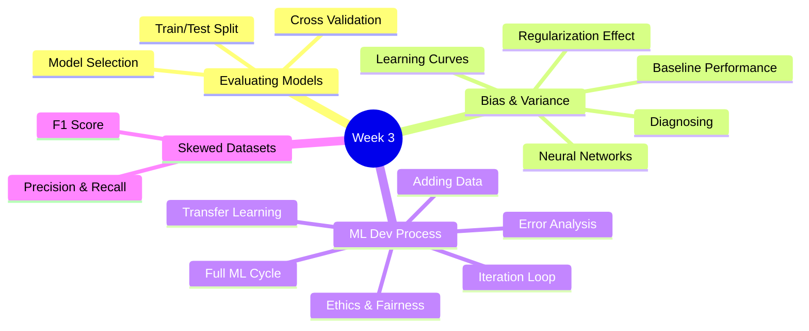
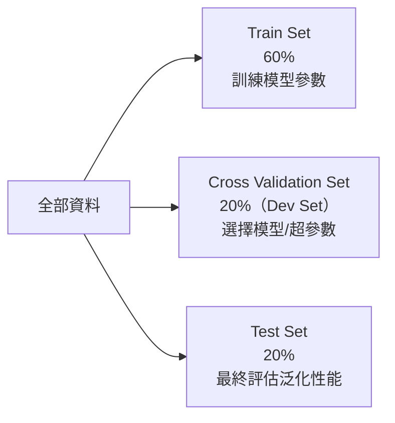
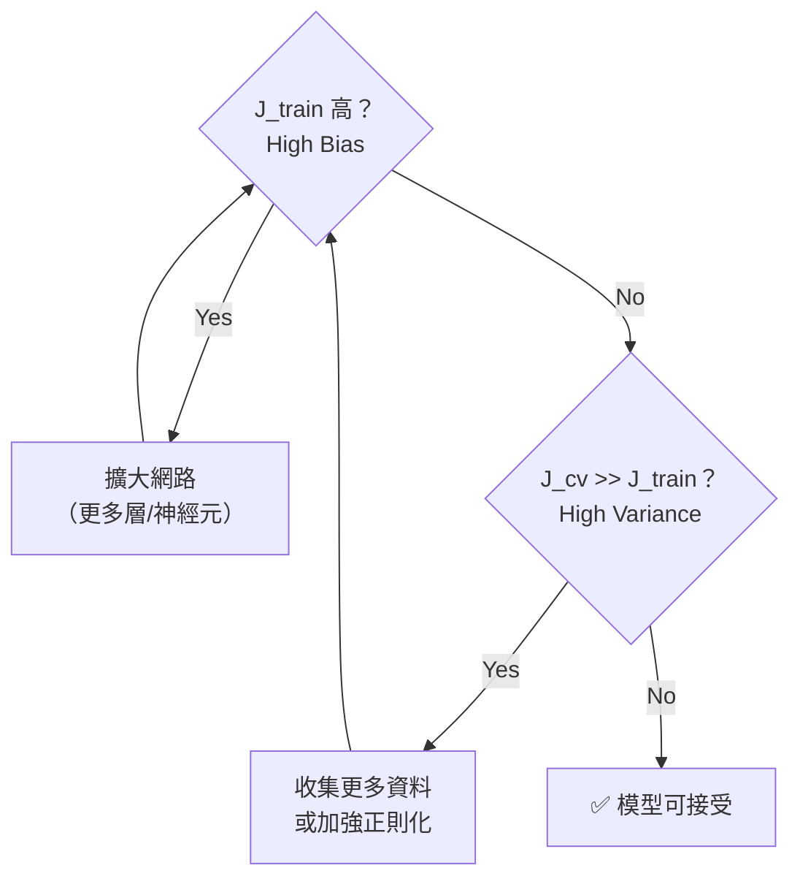
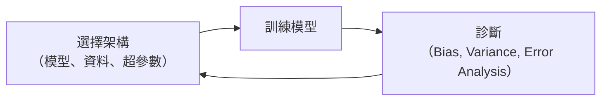
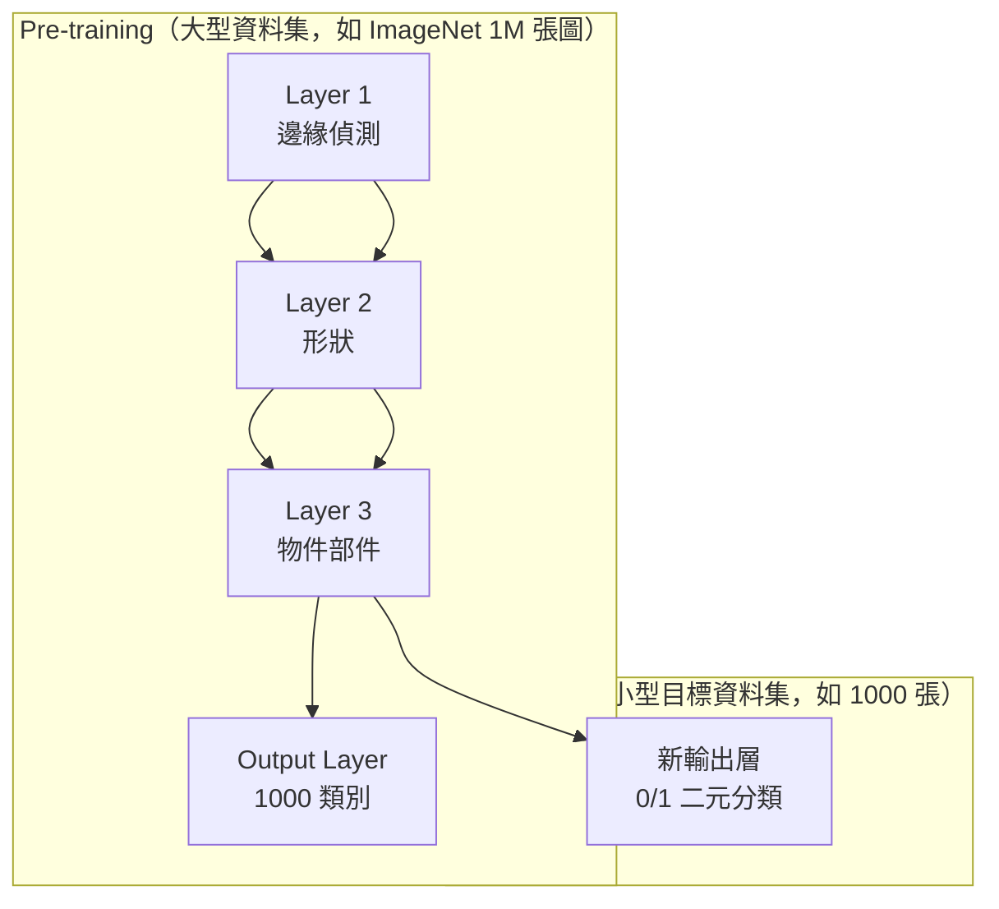
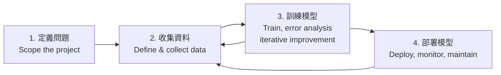

# Course 2 - Week 3: Advice for Applying Machine Learning

## 🗺️ Week Overview



---

## 1. Deciding What to Try Next（下一步做什麼？）

當模型表現不佳，有很多可能的改進方向：

| 可能的修正 | 針對的問題 |
|-----------|-----------|
| 收集更多訓練資料 | High Variance（過擬合） |
| 減少特徵數量 | High Variance |
| 增加特徵 | High Bias（欠擬合） |
| 增加多項式特徵 | High Bias |
| 增加正則化 $\lambda$ | High Variance |
| 減少正則化 $\lambda$ | High Bias |

> **關鍵：** 盲目嘗試代價很高（可能花幾個月在無效方向）。系統性診斷 Bias/Variance 才能高效改進。

---

## 2. Evaluating a Model（評估模型）

### 2.1 Train / Test Split（訓練測試分割）

**白話解釋：** 不能用訓練過的資料來評估模型——就像學生用練習題當考試題，當然得高分，但不代表真的理解了。要用模型**沒有見過**的測試集評估。

$$J_{\text{train}} = \frac{1}{2m_{\text{train}}} \sum_{i=1}^{m_{\text{train}}} (f_{\vec{w},b}(\vec{x}^{(i)}) - y^{(i)})^2$$

$$J_{\text{test}} = \frac{1}{2m_{\text{test}}} \sum_{i=1}^{m_{\text{test}}} (f_{\vec{w},b}(\vec{x}^{(i)}) - y^{(i)})^2$$

| 狀況 | $J_{\text{train}}$ | $J_{\text{test}}$ | 診斷 |
|------|--------------------|--------------------|------|
| 過擬合 | 很低 | 很高 | High Variance |
| 欠擬合 | 很高 | 很高 | High Bias |
| 理想 | 低 | 低（接近 $J_{\text{train}}$） | ✅ |

### 2.2 Model Selection & Cross Validation（模型選擇與交叉驗證）

**問題：** 若用 test set 選擇最佳模型（如多項式次數 $d$），test set 誤差會**樂觀偏低**（因為選了在 test 上最好的）。

**解決：三分法（Train / Cross Validation / Test）**



**流程：**
1. 在 **Train Set** 訓練各個候選模型
2. 在 **CV Set** 比較各模型，選最好的
3. 用 **Test Set** 回報最終性能

$$J_{\text{cv}} = \frac{1}{2m_{\text{cv}}} \sum_{i=1}^{m_{\text{cv}}} \left(f(\vec{x}^{(i)}) - y^{(i)}\right)^2$$

---

## 3. Diagnosing Bias and Variance（診斷偏差與方差）

### 3.1 定義

| 概念 | 說明 | 表現 |
|------|------|------|
| **High Bias** | 欠擬合，模型太簡單 | $J_{\text{train}}$ 高，$J_{\text{cv}}$ 高 |
| **High Variance** | 過擬合，模型太複雜 | $J_{\text{train}}$ 低，$J_{\text{cv}}$ 遠高於 $J_{\text{train}}$ |
| **Both** | 同時欠擬合+不穩定 | $J_{\text{train}}$ 高，$J_{\text{cv}}$ 更高 |

**以多項式次數 $d$ 為例：**

```
J
│  ↑High Var
│  ┊         CV ╲            ╱
│  ┊           ╲          ╱
│  ┊            ╲_______╱
│  ┊    Train ───────────────
│  High Bias         Best d
└──────────────────────────── d
  d=1        d=opt       d=high
```

### 3.2 Regularization 對 Bias/Variance 的影響

| $\lambda$ | 效果 | 問題 |
|-----------|------|------|
| $\lambda$ 太大 | $w_j \approx 0$，模型退化 | High Bias |
| $\lambda$ 太小 | 幾乎無正則化 | High Variance |
| $\lambda$ 適中 | ✅ | — |

**選擇 $\lambda$ 的方法：** 嘗試 $\lambda = 0, 0.01, 0.02, 0.05, \ldots, 10$（每次約 2 倍），在 CV Set 上選最小 $J_{\text{cv}}$ 的值。

### 3.3 Establishing a Baseline（建立基準線）

**白話解釋：** 判斷誤差是否「高」需要參考點。若人類辨識語音的錯誤率是 10.6%，而你的模型 train error = 10.8%、cv error = 14.8%，則 Bias 其實很小（10.8% ≈ 10.6%），但 Variance 很大（14.8% - 10.8% = 4%）。

| 誤差類型 | 計算 | 診斷 |
|---------|------|------|
| Bias 問題 | $J_{\text{train}} - J_{\text{baseline}}$ 很大 | High Bias |
| Variance 問題 | $J_{\text{cv}} - J_{\text{train}}$ 很大 | High Variance |

### 3.4 Learning Curves（學習曲線）

**繪製：** 以訓練集大小 $m$ 為 x 軸，分別繪製 $J_{\text{train}}(m)$ 和 $J_{\text{cv}}(m)$

**High Bias 時的模式：**
```
J  │  cv  ─ ─ ─ ─ ─ ─ ─ ─ ─ ─ ─ ─ ─
   │                                gap 不縮小
   │  train ──────────────────────
   └──────────────────────────── m
```
→ 增加更多資料**幫助有限**，需要改變模型

**High Variance 時的模式：**
```
J  │  cv  ╲
   │        ╲______________
   │  train ──────/─────── ↑ 差距
   └──────────────────────── m
```
→ 增加更多資料**有幫助**，差距會縮小

### 3.5 Bias & Variance in Neural Networks

**關鍵洞察：** 大型神經網路 + 足夠的正則化 → 通常能同時降低 Bias 和 Variance。



> **原則：** 更大的神經網路（配合正則化）幾乎不會比小型網路更差。但訓練成本更高。

> [!info] 📖 延伸閱讀：縮放法則與模型規模的影響
> 「更大的網路通常更好」這個觀察被近年的**縮放法則（Scaling Laws）**研究正式化——模型性能與參數量、資料量、算力呈幂律關係。而在特定規模下，模型會「湧現」出新能力（如思維鏈推理）。同時，現代正則化技術（Dropout、Mixup、DropPath）讓大型網路的過擬合風險更可控。
> - 縮放法則與湧現能力 → [[KP-07 - 縮放法則與湧現能力]]
> - 現代正則化技術 → [[KP-04 - 正則化技術]]

---

## 4. ML Development Process（ML 開發流程）

### 4.1 Iteration Loop（迭代循環）



### 4.2 Error Analysis（誤差分析）

**白話解釋：** 不要一看到 CV 誤差高就盲目收集資料。先仔細看錯誤的例子，找出模式，才能針對性改進。

**步驟：**
1. 從 CV set 中取出被錯分的例子（如 100 個）
2. 手動分類錯誤類型（如：圖片模糊、藥名縮寫、語言混雜）
3. 找出占比最大的錯誤類型，優先處理

**例子（垃圾郵件分類器，100 個錯誤）：**

| 錯誤類型 | 數量 | 優先度 |
|---------|------|--------|
| 藥品相關垃圾郵件 | 21 | 高 |
| 仿冒設計 | 3 | 低 |
| 偷竊密碼 | 7 | 中 |
| 新聞稿（不是垃圾）| 18 | 高 |

### 4.3 Adding Data（增加資料）

**方法一：收集更多真實資料**（貴、慢）

**方法二：Data Augmentation（資料增強）**
- 對現有資料做轉換創造新樣本
- 例子：圖片 → 旋轉、翻轉、縮放、加噪聲
- 例子：語音 → 加背景噪聲、改變音調
- **重點：** 轉換必須反映真實情況

**方法三：Data Synthesis（資料合成）**
- 用程式生成新資料（如 OCR：用不同字型生成文字圖片）

> 💡 當標籤資料不足時，也可考慮用**無監督方法**先探索資料結構（如 [[C3-W1 - Clustering & Anomaly Detection#Part 1：Clustering（聚類）]] 中的 K-Means），或透過**自監督預訓練**從無標籤資料中學習表徵。

### 4.4 Transfer Learning（遷移學習）

**白話解釋：** 把在大型任務上學到的知識，遷移到資料較少的小任務。就像你先學會騎自行車，再學機車就更快。



**兩種策略：**

| 策略 | 適用情境 | 做法 |
|------|---------|------|
| **只訓練輸出層** | 目標資料集極小 | 凍結所有隱藏層參數，只更新輸出層 |
| **Fine-tune 全網路** | 目標資料集中等大小 | 用預訓練參數初始化，然後整體訓練 |

> **重要：** Pre-training 的輸入類型必須與目標任務相同（如同為圖片）。

> [!info] 📖 延伸閱讀：Transfer Learning 的現代形式
> 課程介紹的是監督式預訓練 + Fine-tune。現代前沿已發展出更強大的**自監督預訓練**（如 BERT 的過罩語言模型、MAE 的過罩圖像學習）和**對比學習**（如 SimCLR、CLIP），讓模型從無標籤資料中學習泛用表示。
> - 自監督與對比學習 → [[KP-08 - 自監督與對比學習]]
> - CLIP 等視覺語言模型 → [[KP-08 - 自監督與對比學習#4. CLIP（Contrastive Language-Image Pre-training）]]

### 4.5 Full Cycle of an ML Project（完整 ML 專案週期）



### 4.6 Fairness, Bias & Ethics（公平性與倫理）

- 偏見的 AI 系統可能歧視特定族群（貸款、招募、刑事司法）
- 系統可能被惡意使用（深偽、詐騙）
- **建議流程：** 在部署前召集多樣化團隊，進行偏見/危害分析

---

## 5. Skewed Datasets（不平衡資料集）

### 5.1 問題

**白話解釋：** 若 99.5% 的患者沒有罕見癌症，模型只要「永遠預測 0」，準確率就有 99.5%——但這是個完全無用的模型。準確率（Accuracy）在不平衡資料上是糟糕的評估指標。

### 5.2 Confusion Matrix（混淆矩陣）

$$\begin{array}{c|cc}
 & \text{Predicted: 1} & \text{Predicted: 0} \\\hline
\text{Actual: 1} & \text{TP} & \text{FN} \\
\text{Actual: 0} & \text{FP} & \text{TN}
\end{array}$$

| 術語 | 說明 |
|------|------|
| TP（True Positive） | 預測陽性，實際陽性 |
| FP（False Positive）| 預測陽性，實際陰性（誤警報） |
| FN（False Negative）| 預測陰性，實際陽性（漏報） |
| TN（True Negative） | 預測陰性，實際陰性 |

### 5.3 Precision & Recall

$$\text{Precision} = \frac{TP}{TP + FP}$$

**白話：** 在所有預測為陽性的中，有多少是真的陽性？（精確度——預測「1」有多準）

$$\text{Recall} = \frac{TP}{TP + FN}$$

**白話：** 在所有實際陽性中，有多少被成功找出來？（召回率——實際的「1」有多少被抓到）

**例子：**

| 策略 | Precision | Recall | 問題 |
|------|-----------|--------|------|
| 模型「永遠預測 0」 | undefined（0/0） | 0 | 完全無用 |
| 模型「永遠預測 1」 | 0.5%（所有人都患病）| 100% | Precision 爛 |
| 提高閾值（更保守） | 高 | 低 | 漏報更多 |
| 降低閾值（更積極） | 低 | 高 | 誤報更多 |

### 5.4 Tradeoff Precision vs Recall

**閾值（threshold）設定：**

$$\hat{y} = \begin{cases} 1 & \text{if } f(\vec{x}) \geq \text{threshold} \\ 0 & \text{otherwise} \end{cases}$$

- 提高閾值（如 0.7）→ Precision ↑，Recall ↓（更少但更確定）
- 降低閾值（如 0.3）→ Precision ↓，Recall ↑（更多但不確定）

### 5.5 F1 Score（綜合指標）

自動平衡 Precision 和 Recall，選出最好的組合：

$$F_1 = \frac{2 \cdot \text{Precision} \cdot \text{Recall}}{\text{Precision} + \text{Recall}}$$

這是**調和平均數（Harmonic Mean）**，對極端值更敏感——若其中一個很低，$F_1$ 也會低。

> 💡 Precision/Recall/F1 在**異常偵測**中尤為重要，因為異常樣本極少，Accuracy 完全失效。詳見 [[C3-W1 - Clustering & Anomaly Detection#10. Developing & Evaluating an Anomaly Detection System]]。

---

## 6. 重點總結

| 診斷 | 特徵 | 解法 |
|------|------|------|
| High Bias | $J_{\text{train}}$ 高 | 更大模型、更多特徵 |
| High Variance | $J_{\text{cv}} \gg J_{\text{train}}$ | 更多資料、正則化 |
| 不平衡資料 | Accuracy 誤導 | 用 Precision/Recall/F1 |

---

## 🔗 Related Notes

- [[C2-W2 - Neural Network Training]] — 激活函數、Softmax、訓練技巧
- [[C2-W4 - Decision Trees]] — 另一種強大的分類模型
- [[C1-W3 - Classification]] — 正則化基礎
- [[KP-04 - 正則化技術]] — Dropout、Data Augmentation、Mixup 等現代正則化方法
- [[KP-01 - 超參數與學習率]] — 超參數搜尋策略（Hyperband、μP）與學習率排程
- [[KP-08 - 自監督與對比學習]] — Transfer Learning 的進階形式：自監督預訓練
