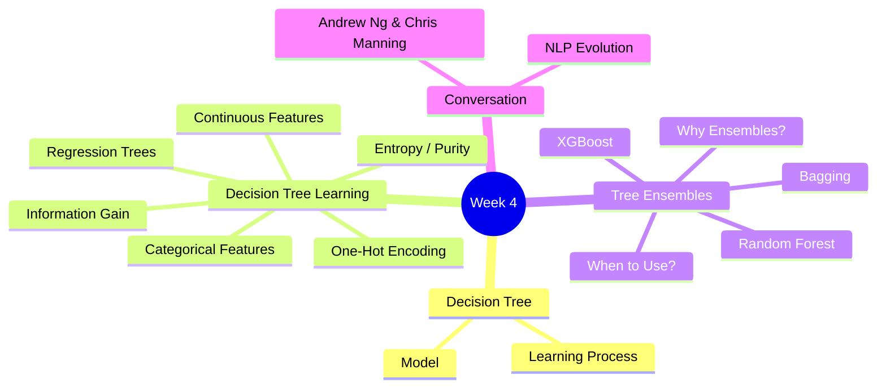
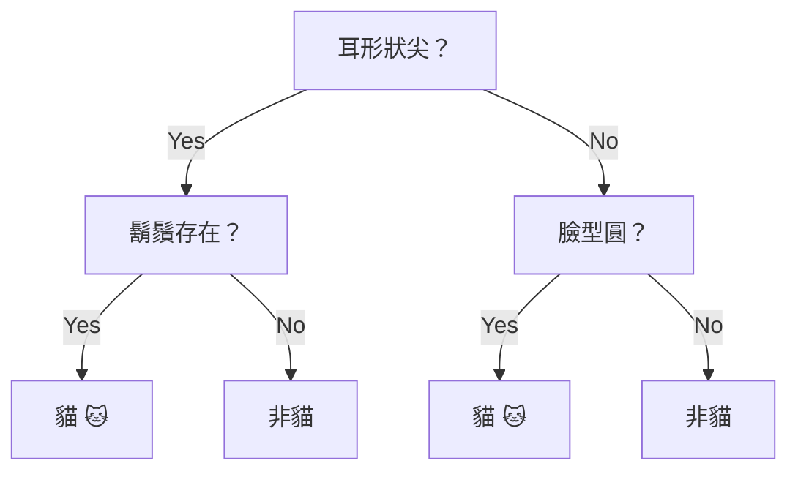
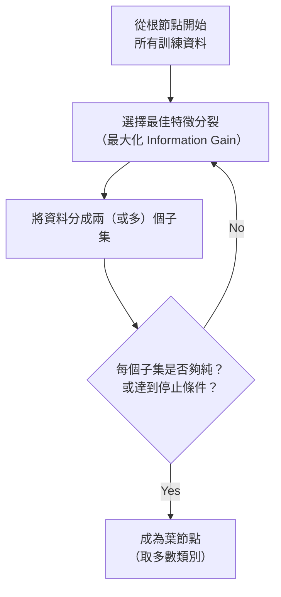
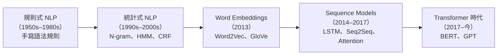

# Course 2 - Week 4: Decision Trees

## 🗺️ Week Overview



---

## 1. Decision Tree Model（決策樹模型）

### 1.1 直覺理解

**白話解釋：** 決策樹就像一個「20 個問題」遊戲——每個節點問一個關於特徵的問題，根據答案往左或往右走，最終到達葉節點（leaf node）得到預測結果。

**例子（分辨貓咪：cat vs. not cat）：**



### 1.2 術語

| 術語 | 說明 |
|------|------|
| Root Node | 根節點（最頂端，第一個分裂點） |
| Decision Node | 中間節點，包含特徵問題 |
| Leaf Node | 葉節點，包含最終預測 |
| Depth | 樹的深度（根到最深葉節點的層數） |

---

## 2. Decision Tree Learning（決策樹學習）

### 2.1 學習過程總覽



### 2.2 停止條件

- 節點內所有樣本都是同一類（100% 純）
- 達到最大深度 `max_depth`
- 節點樣本數低於閾值（防止過擬合）
- Information Gain 低於閾值

### 2.3 Measuring Purity：Entropy（熵）

**白話解釋：** 熵衡量一個節點「有多不純（impure）」。如果節點裡一半是貓一半是非貓，熵最高（最混亂）；如果全是貓，熵為 0（最純）。

$$H(p) = -p \log_2(p) - (1-p) \log_2(1-p)$$

其中 $p$ = 正類（如貓）的比例。

**熵的特性：**

| $p$（貓的比例） | $H(p)$ |
|----------------|--------|
| 0（全是非貓） | 0 |
| 0.5（各半）| 1（最大） |
| 1（全是貓） | 0 |

$$H(p) \in [0, 1]$$

```
H(p)
1 │        *
  │      *   *
  │    *       *
  │  *           *
0 └──────────────── p
  0    0.5       1
```

### 2.4 Information Gain（信息增益）

**白話解釋：** 選擇哪個特徵分裂？選讓子節點「加權平均熵」比父節點熵**下降最多**的那個。

$$\text{Information Gain} = H(p_{\text{root}}) - \left(\frac{m_{\text{left}}}{m} H(p_{\text{left}}) + \frac{m_{\text{right}}}{m} H(p_{\text{right}})\right)$$

**例子（貓咪分類，$m=10$）：**

| 特徵 | 左節點 | 右節點 | 信息增益 |
|------|--------|--------|---------|
| 耳形尖 | $p=4/5$ | $p=1/5$ | $H(0.5) - \frac{5}{10}H(0.8) - \frac{5}{10}H(0.2) \approx 0.28$ |
| 臉型圓 | $p=4/7$ | $p=1/3$ | $\approx 0.03$ |
| 鬍鬚 | $p=3/4$ | $p=2/6$ | $\approx 0.12$ |

→ 選**耳形尖**（信息增益最高 $\approx 0.28$）

---

## 3. Handling Different Feature Types（處理不同特徵類型）

### 3.1 Categorical Features（類別特徵）

**One-Hot Encoding：** 若類別特徵有 $k$ 個值，創建 $k$ 個二元（0/1）特徵：

**例子（耳形：尖、圓、扁）：**

| 耳形 | 尖耳 | 圓耳 | 扁耳 |
|------|------|------|------|
| 尖 | 1 | 0 | 0 |
| 圓 | 0 | 1 | 0 |
| 扁 | 0 | 0 | 1 |

如此每個特徵都變成二元問題（Yes/No），決策樹可以統一處理。

**同樣適用於神經網路和線性回歸。**

### 3.2 Continuous Valued Features（連續特徵）

對連續特徵，需要找到最佳分裂**閾值 $t$**：

- 對特徵值排序
- 嘗試所有可能的分裂點（相鄰值的中點）
- 選擇信息增益最大的 $t$

**例子（體重，kg）：** 嘗試 $t = 7, 9, 13, \ldots$，計算每個閾值的信息增益，取最大值。

---

## 4. Regression Trees（回歸樹）

**目標：** 預測連續值（而非類別）

**分裂標準：** 改用**方差減少（Variance Reduction）**代替信息增益：

$$\text{Variance Reduction} = \text{Var}(y_{\text{root}}) - \left(\frac{m_l}{m}\text{Var}(y_l) + \frac{m_r}{m}\text{Var}(y_r)\right)$$

**葉節點預測：** 取該葉節點所有訓練樣本的 $y$ 值**平均**。

---

## 5. Tree Ensembles（樹的集成）

### 5.1 單棵決策樹的弱點

**白話解釋：** 單棵決策樹非常敏感——訓練資料稍微改變，整棵樹的結構可能完全不同（因為根節點分裂一變，後面全變）。High Variance。

**解法：** 訓練多棵樹，讓它們「投票」決定最終預測。

### 5.2 Sampling with Replacement（放回抽樣）

**概念：** 從 $m$ 個訓練樣本中，每次隨機抽一個（可重複），抽 $m$ 次，得到一個新的訓練集（Bootstrap Sample）。

**白話解釋：** 就像從一袋球中抽球，每次抽完後放回，重新抽，所以同一個球可能被抽到多次，也可能完全沒被抽到。這個方法叫做 **Bagging**。

### 5.3 Random Forest Algorithm（隨機森林）

**步驟：**

```
For b = 1, ..., B:  (通常 B = 64 ~ 128)
  1. 放回抽樣得到 Bootstrap Sample（大小 m）
  2. 訓練一棵決策樹：
     在每個分裂點，不考慮所有 n 個特徵，
     而是隨機選擇 k 個特徵（通常 k = √n）
     從這 k 個中選信息增益最大的
  
預測：讓所有 B 棵樹投票（分類）或取平均（回歸）
```

**為什麼隨機選特徵？** 避免所有樹在根節點都選同一個特徵，增加樹的多樣性，降低相關性，提升集成效果。

### 5.4 XGBoost（eXtreme Gradient Boosting）

**白話解釋：** XGBoost 是一種「序列式學習」（Boosting）方法——每棵新樹都專注於修正前面樹**犯錯的樣本**，而不是隨機抽樣。

**核心思想（與 Bagging 的對比）：**

| | Bagging（Random Forest）| Boosting（XGBoost）|
|--|--|--|
| 樹的訓練方式 | 並行，互相獨立 | 序列，後樹修正前樹錯誤 |
| 抽樣方式 | 均勻放回抽樣 | 對錯誤樣本加權（更大機率抽到）|
| 最終預測 | 多數投票/平均 | 加權求和 |

**XGBoost 特性：**
- 快速且高效（極致優化的實作）
- 內建正則化
- 自動處理缺失值
- 工業界最常用的表格資料模型

**使用方式：**
```python
from xgboost import XGBClassifier

model = XGBClassifier(n_estimators=100, learning_rate=0.1)
model.fit(X_train, y_train,
          eval_set=[(X_val, y_val)],
          early_stopping_rounds=5)
predictions = model.predict(X_test)
```

> [!info] 📖 延伸閱讀：XGBoost 的現代替代與表格資料最佳實踐
> XGBoost 之後還有 **LightGBM**（更快、對高維稀疏特徵更優）和 **CatBoost**（原生支援類別特徵）。研究顯示在中小型表格資料上，GBDT 仍系統性優於深度學習。可配合 **SHAP** 做特徵重要性解釋，以及 **Optuna** 進行自動超參數搜尋。
> 詳見 [[KP-11 - 表格資料與現代決策樹]]。

---

## 6. When to Use Decision Trees vs. Neural Networks？

| 情境 | 決策樹 / XGBoost | 神經網路 |
|------|-----------------|---------|
| **資料類型** | 表格/結構化資料（Tabular）✅ | 圖像、音訊、文字 ✅ |
| **訓練速度** | 快 ✅ | 慢（大型網路） |
| **特徵可解釋性** | 高（可視化樹） | 低（黑盒） |
| **小/中型資料集** | 往往表現更好 ✅ | 需要較多資料 |
| **非結構化資料** | 較弱 | 強 ✅ |
| **Transfer Learning** | 不適用 | 適用 ✅ |
| **競賽表格資料** | XGBoost 常勝 ✅ | — |

---

## 7. Conversations with Andrew：Andrew Ng & Chris Manning on NLP

> 📹 **影片來源：** C2_W4_04 [Conversations_with_Andrew]_Andrew_Ng_and_Chris_Manning_on_NLP.mp4

### 7.1 Chris Manning 簡介

**Chris Manning** 是 Stanford 大學計算機科學與語言學教授，Stanford NLP Group 創辦人之一，自然語言處理（NLP）領域最具影響力的學者之一。他的研究涵蓋 statistical NLP、deep learning for NLP、以及語言理解的核心問題。

### 7.2 NLP 的演進歷程

Andrew Ng 與 Chris Manning 討論了 NLP 從規則驅動到深度學習的發展歷程：



**關鍵轉折點：**
- **Word2Vec（2013）：** 將詞彙映射到連續向量空間，語義相似的詞有相近的向量。例如 `King - Man + Woman ≈ Queen`，這讓 NLP 從離散符號走向連續表示。
- **Attention Mechanism（2014–2015）：** 讓模型在翻譯時「注意」輸入句子的相關部分，大幅提升機器翻譯品質。
- **Transformer（2017）：** 完全取代 RNN 架構，成為 NLP 的基礎。（詳見 [[KP-06 - Attention 機制與 Transformer]]）

> [!info] 📖 延伸閱讀：Transformer 架構與自監督預訓練
> Transformer 的發明弹底改變了 NLP 的研究範式。配合**自監督預訓練**（如 BERT 的 Masked LM、GPT 的自回歸生成），大型語言模型在少量標註資料上就能達到優異效果。
> - Transformer 架構詳解 → [[KP-06 - Attention 機制與 Transformer]]
> - 自監督預訓練範式 → [[KP-08 - 自監督與對比學習]]

### 7.3 對話核心洞察

| 主題 | Manning 的觀點 |
|------|--------------|
| **深度學習對 NLP 的影響** | 深度學習使 NLP 從「特徵工程」轉向「端到端學習」，模型自動從原始文字學習有用的表示 |
| **語言理解的挑戰** | 真正的語言理解仍是開放問題——模型擅長模式匹配（pattern matching），但對推理（reasoning）和常識（common sense）仍有限制 |
| **預訓練的力量** | 大型預訓練模型（如 BERT、GPT）在少量標注資料上就能達到很好的效果，改變了 NLP 的研究範式（詳見 [[KP-08 - 自監督與對比學習]]） |
| **對 NLP 入門者的建議** | 學好基礎（線性代數、機率、機器學習），然後從實際任務（如文本分類、命名實體識別）動手做起 |

### 7.4 與課程內容的關聯

- **One-Hot Encoding（Section 3.1）** 是 NLP 中早期表示詞彙的方式，但缺乏語義資訊 → Word Embeddings 解決了這個問題
- **Decision Trees vs Neural Networks（Section 6）** 的討論直接延伸到 NLP 領域：NLP 是神經網路明確優於決策樹的場景（非結構化、序列性的文字資料）
- **Transfer Learning（[[C2-W3 - Advice for Applying ML#4.4 Transfer Learning]]）** 在 NLP 中尤其重要——預訓練語言模型 + Fine-tune 已成為標準流程

---

## 8. 重點總結

| 概念 | 核心要點 |
|------|---------|
| 分裂標準 | $\text{Information Gain} = H(p_{\text{root}}) - \text{加權子節點熵}$ |
| 熵 | $H(p) = -p\log_2 p - (1-p)\log_2(1-p)$ |
| 一位熱編碼 | 類別特徵 → $k$ 個二元特徵 |
| Random Forest | B 棵樹 + 放回抽樣 + 隨機 $k$ 個特徵 |
| XGBoost | Boosting：後樹修正前樹的錯誤 |
| NLP 演進 | 規則 → 統計 → Word Embeddings → Transformer |

---

## 🔗 Related Notes

- [[C2-W3 - Advice for Applying ML]] — Bias/Variance 診斷也適用於決策樹；Transfer Learning 在 NLP 中的核心角色
- [[C3-W1 - Clustering & Anomaly Detection]] — 無監督學習
- [[KP-06 - Attention 機制與 Transformer]] — Transformer 架構：NLP 的基礎
- [[KP-08 - 自監督與對比學習]] — 預訓練語言模型（BERT、GPT）的自監督學習範式
- [[KP-11 - 表格資料與現代決策樹]] — XGBoost/LightGBM 在表格資料上的優勢
