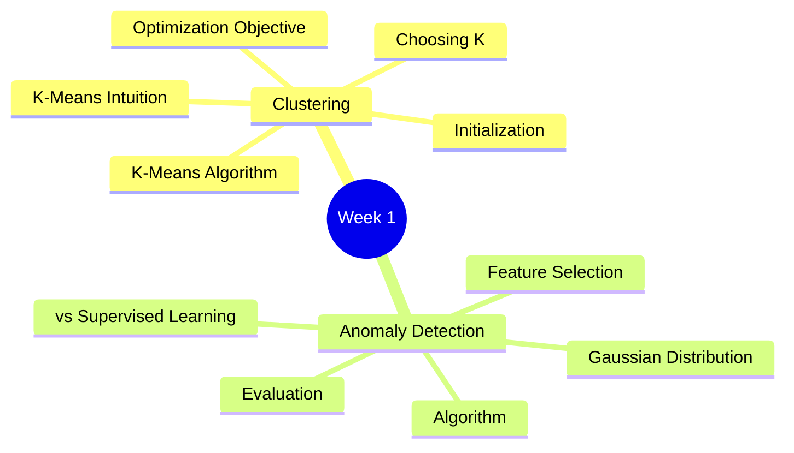
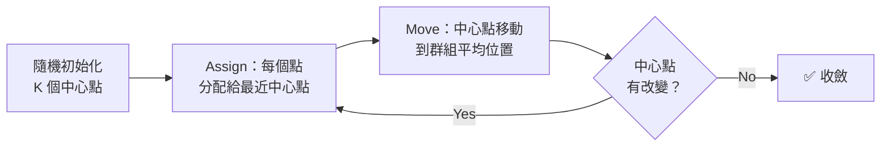
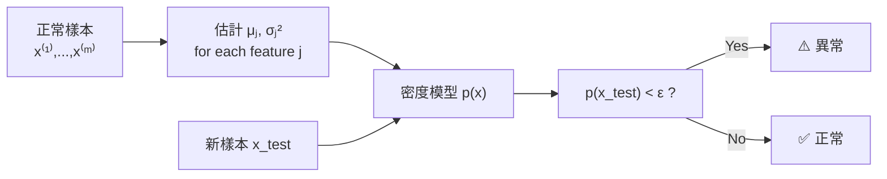

# Course 3 - Week 1: Clustering & Anomaly Detection

## 🗺️ Week Overview



---

## Part 1：Clustering（聚類）

## 1. What is Clustering?（什麼是聚類？）

**白話解釋：** 聚類是一種無監督學習——沒有標籤 $y$，只有輸入 $\vec{x}$。演算法自動把相似的資料點分成群組（clusters），就像整理書桌時把同類物品放在一起。

**應用場景：**
- 市場分群（將顧客分成不同購買偏好群體）
- DNA 分析（找出基因表現相似的群組）
- 社群網路分析（找出緊密連結的社群）
- 天文資料（將星系分類）

---

## 2. K-Means Intuition（K-Means 直覺）

**白話解釋：** K-Means 是最常用的聚類演算法。先隨機放 $K$ 個「中心點（centroids）」，然後不斷重複：
1. 把每個資料點分配給最近的中心點
2. 移動中心點到其群組的平均位置

直到中心點不再移動為止。



---

## 3. K-Means Algorithm（K-Means 演算法）

### 3.1 符號定義

- $K$：群的數量
- $m$：資料點數量
- $\mu_1, \mu_2, \ldots, \mu_K$：$K$ 個群的中心點（cluster centroids）
- $c^{(i)}$：資料點 $\vec{x}^{(i)}$ 被分配到的群（$c^{(i)} \in \{1, \ldots, K\}$）

### 3.2 演算法步驟

**Step 1 - Assign clusters（分配）：**

$$c^{(i)} := \arg\min_k \|\vec{x}^{(i)} - \mu_k\|^2$$

將每個資料點分配給歐氏距離最近的中心點。

**Step 2 - Move centroids（移動中心點）：**

$$\mu_k := \frac{1}{|C_k|} \sum_{i: c^{(i)}=k} \vec{x}^{(i)}$$

將每個中心點移動到其群組所有點的平均位置。

> **特殊情況：** 若某個中心點沒有任何資料點分配到它，可以刪除該中心點（$K-1$ 個群），或重新隨機初始化。

---

## 4. K-Means Optimization Objective（優化目標）

### 4.1 成本函數（Distortion Function）

$$J(c^{(1)}, \ldots, c^{(m)}, \mu_1, \ldots, \mu_K) = \frac{1}{m} \sum_{i=1}^{m} \|\vec{x}^{(i)} - \mu_{c^{(i)}}\|^2$$

這是每個資料點到其所屬中心點距離平方的平均值（**總畸變/Distortion**）。

- **Assign 步驟：** 固定 $\mu_k$，最小化 $J$ 關於 $c^{(i)}$
- **Move 步驟：** 固定 $c^{(i)}$，最小化 $J$ 關於 $\mu_k$
- 兩步交替，$J$ 必定單調遞減（或不變）

> K-Means 保證收斂，但不保證找到**全局最優解**，可能陷入局部最優。

> [!info] 📖 延伸閱讀：從 K-Means 到現代表徵學習
> K-Means 的「簇分配」思想被現代自監督學習延伸：**SwAV** 將聚類與對比學習結合，透過將增強後的圖像分配到同一簇來學習表徵，不需任何標籤。此外，**DINO** 透過自蒸餞（Self-Distillation）學到的特徵自然形成有意義的聚類。
> 詳見 [[KP-08 - 自監督與對比學習]]。

---

## 5. Initializing K-Means（初始化 K-Means）

### 5.1 隨機初始化（推薦方法）

從訓練集中隨機選 $K$ 個不同的資料點作為初始中心點。

### 5.2 Local Optima 問題

不同的初始化可能導致截然不同的聚類結果：
- 好的初始化 → 好的聚類
- 差的初始化 → 次優聚類（局部最優）

### 5.3 解決方法：多次隨機重啟

```
For i = 1, ..., 100:
    隨機初始化 K-Means
    執行 K-Means，得到 c^(1), ..., c^(m), μ₁, ..., μ_K
    計算成本函數 J
    
選擇 J 最小的那次的聚類結果
```

**建議：** 當 $K$ 較小（2–10）時，多次重啟很有效。當 $K$ 很大時，單次執行通常就夠。

---

## 6. Choosing the Number of Clusters K（選擇群數）

### 6.1 Elbow Method（手肘法）

繪製不同 $K$ 下的成本函數 $J$：

```
J  │ ╲
   │  ╲
   │   ╲__  ← "手肘"
   │      ‾‾‾‾__________
   └──────────────────── K
   1  2  3  4  5  6
```

在「手肘點」處，增加 $K$ 的邊際收益開始遞減——**選擇手肘處的 $K$ 值**。

**問題：** 現實中曲線往往很平滑，沒有明顯手肘，方法不總是有效。

### 6.2 根據下游任務選擇 K

**白話解釋：** 更好的方法是根據你的**最終使用目的**來選 $K$。

**例子（T-shirt 尺寸）：**
- $K=3$（S, M, L）→ 製造成本低，但某些人穿不合
- $K=5$（XS, S, M, L, XL）→ 更合身，但製造成本高

選擇能最佳化你真正關心的商業指標的 $K$。

### 6.3 K-Means 應用：圖片壓縮

> 📓 **來源：** C3_W1_KMeans_Assignment.ipynb

K-Means 的一個經典應用是**圖片色彩壓縮**。原始 24-bit RGB 圖片中每個像素用 3 個 8-bit 值表示（紅、綠、藍），可表達約 1600 萬種顏色。透過 K-Means 將所有像素聚成 $K$ 群（例如 $K=16$），每個像素只需儲存其所屬群的索引：

```python
# 將圖片轉為 (m, 3) 矩陣，每列是一個像素的 RGB 值
X_img = original_img.reshape(-1, 3)

# 用 K-Means 找出 K=16 個代表色
centroids, idx = run_kMeans(X_img, initial_centroids, max_iters=10)

# 用最近的中心點顏色取代每個像素
X_recovered = centroids[idx, :]
compressed_img = X_recovered.reshape(original_img.shape)
```

**壓縮效果（128×128 圖片，$K=16$）：**

| | 原始 | 壓縮後 |
|--|------|--------|
| **每像素位元** | 24 bits（8×3 RGB） | 4 bits（$\log_2 16$） |
| **總位元** | $128 \times 128 \times 24 = 393{,}216$ | $16 \times 24 + 128 \times 128 \times 4 = 65{,}920$ |
| **壓縮比** | — | **約 6 倍** |

> 壓縮後的圖片保留了大部分視覺特徵，但因色彩數減少會出現些許壓縮偽影（compression artifacts）。

---

## Part 2：Anomaly Detection（異常偵測）

## 7. What is Anomaly Detection?（什麼是異常偵測？）

**白話解釋：** 在大量「正常」資料中找出「異常」的少數點。就像質檢員在流水線上盯著成千上萬個零件，偶爾抓出一個不符規格的。

**應用場景：**
- 飛機引擎品管（大量正常引擎中找出可能故障的）
- 信用卡詐欺偵測（找出異常的交易行為）
- 電腦網路入侵偵測
- 資料中心伺服器監控

---

## 8. Gaussian Distribution（高斯分布）

### 8.1 概率密度函數

$$p(x; \mu, \sigma^2) = \frac{1}{\sqrt{2\pi}\sigma} \exp\left(-\frac{(x-\mu)^2}{2\sigma^2}\right)$$

- $\mu$：均值（mean）
- $\sigma^2$：方差（variance），$\sigma$ 為標準差

```
p(x)│         ╭─╮
    │        ╱   ╲
    │       ╱     ╲
    │──────╱       ╲──────
    └──────────────────── x
              μ
         ←2σ→
```

### 8.2 參數估計（Maximum Likelihood）

給定訓練集 $\{x^{(1)}, \ldots, x^{(m)}\}$：

$$\hat{\mu} = \frac{1}{m} \sum_{i=1}^{m} x^{(i)}$$

$$\hat{\sigma}^2 = \frac{1}{m} \sum_{i=1}^{m} (x^{(i)} - \hat{\mu})^2$$

---

## 9. Anomaly Detection Algorithm（異常偵測演算法）

### 9.1 假設各特徵獨立（Density Estimation）

對多維資料，假設各特徵**相互獨立**，計算聯合概率密度：

$$p(\vec{x}) = \prod_{j=1}^{n} p(x_j; \mu_j, \sigma_j^2)$$

**分解（乘積）：**
$$= p(x_1; \mu_1, \sigma_1^2) \cdot p(x_2; \mu_2, \sigma_2^2) \cdots p(x_n; \mu_n, \sigma_n^2)$$

### 9.2 完整演算法

**訓練：**
1. 選擇 $n$ 個特徵 $x_1, \ldots, x_n$
2. 用訓練集估計 $\mu_j, \sigma_j^2$ for $j = 1, \ldots, n$

**預測：**
1. 計算 $p(\vec{x}_{\text{new}}) = \prod_{j=1}^{n} p(x_j; \mu_j, \sigma_j^2)$
2. 預測：若 $p(\vec{x}_{\text{new}}) < \epsilon$ → 異常（anomaly）

**流程圖：**



---

## 10. Developing & Evaluating an Anomaly Detection System

### 10.1 資料分割建議

異常偵測的資料分布通常極度不平衡（異常樣本很少）：

| 集合 | 組成 | 用途 |
|------|------|------|
| **Train Set** | 大量正常樣本（如 6000 個）| 估計 $\mu_j, \sigma_j^2$ |
| **CV Set** | 少量正常 + 少量異常（如 2000 正常 + 10 異常）| 選擇閾值 $\epsilon$ |
| **Test Set** | 少量正常 + 少量異常（如 2000 正常 + 10 異常）| 評估最終性能 |

### 10.2 評估指標

因為資料極度不平衡，使用 **Precision, Recall, F1 Score**（同 [[C2-W3 - Advice for Applying ML#5. Skewed Datasets（不平衡資料集）]]）。

> [!info] 📖 延伸閱讀：異常偵測與損失函數設計
> 異常偵測的核心是機率密度估計，這與損失函數設計密切相關。現代方法如 **Focal Loss** 專門處理類別不平衡問題，而 **InfoNCE** 損失可用於對比式異常偵測。
> 詳見 [[KP-03 - 損失函數]]。

---

## 11. Anomaly Detection vs Supervised Learning

| | 異常偵測 | 有監督學習 |
|--|---------|-----------|
| **標籤** | 只需要正常樣本，少量異常（可選）| 需要大量正/負樣本 |
| **未來異常類型** | 可以偵測**從未見過的異常類型** | 只能偵測訓練過的類型 |
| **異常樣本量** | 異常樣本極少（0–20 個）| 需要足夠的異常樣本 |
| **適用場景** | 引擎故障、詐欺（異常類型多樣）| 垃圾郵件、疾病分類（已知類型）|

**白話解釋：**
- 若有足夠的陽性樣本（異常），用監督學習
- 若異常樣本極少、且異常類型千變萬化，用異常偵測

---

## 12. Choosing Features for Anomaly Detection

### 12.1 使用 Gaussian-like 特徵

確保特徵近似高斯分布（正態分布）：
- 繪製直方圖檢查
- 若不像高斯，嘗試**對數轉換**：$x_j \to \log(x_j)$ 或 $x_j \to \log(x_j + c)$
- 或 $x_j \to x_j^{1/2}$ 等

### 12.2 設計能區分正常/異常的特徵

**白話解釋：** 選擇在異常情況下會顯示出異常值的特徵。

**例子（電腦監控）：**
- 個別特徵：CPU 使用率、記憶體使用率、網路流量
- **組合特徵（更有效）：** `CPU使用率 / 網路流量` → 若 CPU 高但網路低，可能是異常計算行為

---

## 13. 重點總結

### K-Means

| 概念 | 核心公式 |
|------|---------|
| 分配步驟 | $c^{(i)} = \arg\min_k \|\vec{x}^{(i)} - \mu_k\|^2$ |
| 移動步驟 | $\mu_k = \frac{1}{|C_k|}\sum_{c^{(i)}=k}\vec{x}^{(i)}$ |
| 成本函數 | $J = \frac{1}{m}\sum\|\vec{x}^{(i)} - \mu_{c^{(i)}}\|^2$ |

### Anomaly Detection

| 概念 | 核心公式 |
|------|---------|
| 高斯分布 | $p(x) = \frac{1}{\sqrt{2\pi}\sigma}\exp\left(-\frac{(x-\mu)^2}{2\sigma^2}\right)$ |
| 多維密度 | $p(\vec{x}) = \prod_j p(x_j; \mu_j, \sigma_j^2)$ |
| 偵測規則 | 若 $p(\vec{x}) < \epsilon$ → 異常 |

---

## 🔗 Related Notes

- [[C1-W1 - Introduction to Machine Learning]] — 無監督學習的基本概念
- [[C3-W2 - Recommender Systems & PCA]] — 更多無監督方法（PCA 降維）
- [[C2-W3 - Advice for Applying ML]] — Precision/Recall 評估指標詳解
- [[KP-08 - 自監督與對比學習]] — K-Means 與對比學習的關聯：簇分配與表徵學習
- [[KP-03 - 損失函數]] — 異常偵測中的概率密度估計與損失函數設計
