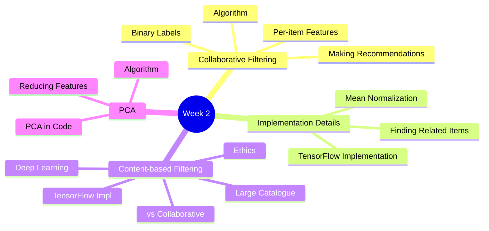
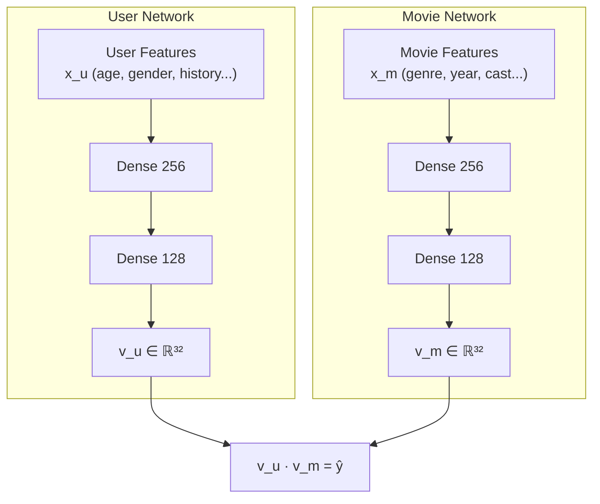
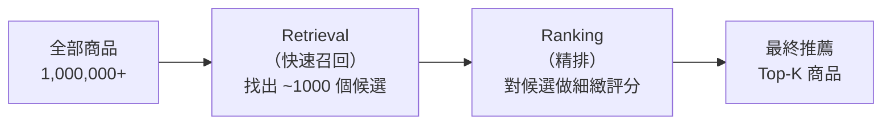

# Course 3 - Week 2: Recommender Systems & PCA

## 🗺️ Week Overview



---

## Part 1：Collaborative Filtering（協同過濾）

## 1. Making Recommendations（推薦系統概述）

### 1.1 問題設定

**白話解釋：** Netflix 需要預測你對沒看過的電影的評分，這樣才能推薦你可能喜歡的。這就是推薦系統的核心問題。

**符號定義：**

| 符號 | 說明 |
|------|------|
| $n_u$ | 使用者數量（users） |
| $n_m$ | 電影數量（items） |
| $r(i,j) = 1$ | 使用者 $j$ 對電影 $i$ 有評分 |
| $y^{(i,j)}$ | 使用者 $j$ 對電影 $i$ 的評分 |
| $\vec{w}^{(j)}, b^{(j)}$ | 使用者 $j$ 的模型參數 |
| $\vec{x}^{(i)}$ | 電影 $i$ 的特徵向量 |
| $m^{(j)}$ | 使用者 $j$ 評分的電影數 |

**評分矩陣（Rating Matrix）：**

$$Y = \begin{pmatrix} 5 & 5 & 0 & ? \\ 5 & ? & ? & 0 \\ ? & 4 & 0 & ? \\ 0 & 0 & 5 & 4 \end{pmatrix}$$

（行 = 電影，列 = 使用者，? = 未評分）

### 1.2 Using Per-Item Features（使用電影特徵）

假設已知每部電影的特徵向量（如：愛情成分、動作成分等）：

$$\hat{y}^{(i,j)} = \vec{w}^{(j)} \cdot \vec{x}^{(i)} + b^{(j)}$$

**成本函數（對使用者 $j$）：**

$$\min_{\vec{w}^{(j)}, b^{(j)}} J = \frac{1}{2m^{(j)}} \sum_{i:r(i,j)=1} \left(\vec{w}^{(j)} \cdot \vec{x}^{(i)} + b^{(j)} - y^{(i,j)}\right)^2 + \frac{\lambda}{2m^{(j)}} \sum_{k=1}^{n} (w_k^{(j)})^2$$

---

## 2. Collaborative Filtering Algorithm（協同過濾演算法）

### 2.1 核心思想

**白話解釋：** 若我們不知道電影特徵，但知道使用者偏好，可以**反推**電影特徵；反之亦然。協同過濾同時學習使用者偏好和電影特徵。

**「協同」的意義：** 不同使用者共同幫助學習電影特徵，不同電影共同幫助學習使用者偏好。

### 2.2 同時優化所有參數

$$J\left(\{w^{(j)}\}, \{b^{(j)}\}, \{x^{(i)}\}\right) = \frac{1}{2} \sum_{(i,j): r(i,j)=1} \left(\vec{w}^{(j)} \cdot \vec{x}^{(i)} + b^{(j)} - y^{(i,j)}\right)^2 + \frac{\lambda}{2} \sum_j \sum_k (w_k^{(j)})^2 + \frac{\lambda}{2} \sum_i \sum_k (x_k^{(i)})^2$$

**三組參數同時更新（梯度下降）：**
- $\vec{w}^{(j)}, b^{(j)}$：所有使用者的參數
- $\vec{x}^{(i)}$：所有電影的特徵

### 2.3 Binary Labels（二元標籤）

不只是評分（1–5），也可以是隱式反饋（implicit feedback）：

| $y^{(i,j)}$ | 說明 |
|------------|------|
| 1 | 使用者「喜歡」（點擊、購買、長時間停留）|
| 0 | 使用者「不喜歡」（略過、短暫停留）|
| ? | 尚未有互動記錄 |

使用 **Logistic Loss**：

$$L = -y^{(i,j)} \log f(\vec{w}^{(j)} \cdot \vec{x}^{(i)} + b^{(j)}) - (1-y^{(i,j)}) \log(1 - f(\ldots))$$

其中 $f = \text{sigmoid}$。這裡的 Logistic Loss 與 [[C1-W3 - Classification#4. Cost Function for Logistic Regression（損失函數）]] 中的損失函數形式完全相同。

---

## 3. Recommender Systems Implementation Details

### 3.1 Mean Normalization（均值歸一化）

**問題：** 若某個使用者沒有對任何電影評分，協同過濾會預測其對所有電影評 0 分（最低），推薦效果差。

**解決：均值歸一化**

1. 對每部電影計算平均評分 $\mu_i$（只算有評分的）
2. 將所有評分減去 $\mu_i$：$y^{(i,j)} \leftarrow y^{(i,j)} - \mu_i$
3. 訓練後，預測時加回均值：$\hat{y}^{(i,j)} = \vec{w}^{(j)} \cdot \vec{x}^{(i)} + b^{(j)} + \mu_i$

**效果：** 對沒有評分記錄的新使用者，預測值退化為平均評分，是合理的默認推薦。

### 3.2 TensorFlow Implementation of Collaborative Filtering

使用 TensorFlow 的 **AutoDiff** 自動計算梯度：

```python
import tensorflow as tf

W = tf.Variable(tf.random.normal((num_users, num_features), dtype=tf.float64), name='W')
X = tf.Variable(tf.random.normal((num_movies, num_features), dtype=tf.float64), name='X')
b = tf.Variable(tf.zeros((1, num_users), dtype=tf.float64), name='b')

optimizer = tf.keras.optimizers.Adam(learning_rate=1e-1)

iterations = 200
for iter in range(iterations):
    with tf.GradientTape() as tape:
        cost = cofiCostFuncV(X, W, b, Ynorm, R, num_users, num_movies, lambda_)
    grads = tape.gradient(cost, [X, W, b])
    optimizer.apply_gradients(zip(grads, [X, W, b]))
```

### 3.3 Finding Related Items（找相似商品）

若電影 $i$ 已學到特徵向量 $\vec{x}^{(i)}$，找與它最相似的電影：

$$\text{相似度} = \|\vec{x}^{(k)} - \vec{x}^{(i)}\|^2$$

選擇距離最小的 $k$ 部電影推薦給使用者。

> [!info] 📖 延伸閱讀：Embedding 學習與對比損失
> 協同過濾學到的特徵向量本質上是一種 **Embedding**。現代推薦系統常用 **對比學習**（如 InfoNCE Loss）來訓練更高品質的 Embedding，使得相似物品在向量空間中更接近、不相似的更遠離。
> - 對比學習與 InfoNCE → [[KP-08 - 自監督與對比學習]]
> - InfoNCE Loss 詳解 → [[KP-03 - 損失函數#5. InfoNCE Loss]]

---

## Part 2：Content-Based Filtering（基於內容的過濾）

## 4. Collaborative vs Content-Based Filtering

| | 協同過濾 | 基於內容的過濾 |
|--|---------|--------------|
| **特徵來源** | 從評分矩陣學習 | 使用已知的使用者/電影特徵 |
| **冷啟動** | 新使用者/電影沒有資料，困難 | 可用已知特徵解決 |
| **可解釋性** | 低（學到的特徵無語義）| 高（特徵有明確意義）|
| **特徵依賴** | 不需要額外特徵 | 需要豐富的使用者/電影特徵 |

### 4.1 問題設定

使用者特徵 $\vec{x}_u^{(j)}$（如年齡、性別、過去行為）和電影特徵 $\vec{x}_m^{(i)}$（如類型、導演、演員）分開存在。

$$\hat{y}^{(i,j)} = \vec{v}_u^{(j)} \cdot \vec{v}_m^{(i)}$$

其中 $\vec{v}_u^{(j)}$ 和 $\vec{v}_m^{(i)}$ 是通過神經網路從原始特徵學到的**embedding 向量**。

---

## 5. Deep Learning for Content-Based Filtering

### 5.1 雙塔架構（Two-Tower）



$$\hat{y}^{(i,j)} = \vec{v}_u^{(j)} \cdot \vec{v}_m^{(i)}$$

**訓練：** 最小化預測評分與實際評分的差距（或 Binary Cross Entropy for 隱式反饋）。

**成本函數：**
$$J = \sum_{(i,j):r(i,j)=1} \left(\vec{v}_u^{(j)} \cdot \vec{v}_m^{(i)} - y^{(i,j)}\right)^2 + \text{正則化項}$$

### 5.2 Recommending from a Large Catalogue（大型目錄推薦）

**問題：** 電影可能有百萬部，不能對每部電影都做完整推薦計算。

**兩階段架構（Retrieval + Ranking）：**



- **Retrieval：** 用 Approximate Nearest Neighbor 快速找出與使用者 embedding 相近的商品
- **Ranking：** 對候選商品用完整模型精確排序

> [!info] 📖 延伸閱讀：現代推薦系統架構
> 課程介紹的 Two-Tower + Retrieval/Ranking 是工業級推薦系統的基礎架構。現代發展包括 **序列推薦**（SASRec、BERT4Rec）考慮用戶行為序列，**DLRM** 處理大規模稀疏特徵，以及 **LLM-based** 推薦（用大型語言模型理解用戶意圖）。
> 詳見 [[KP-10 - 現代推薦系統]]。

### 5.3 TensorFlow Implementation of Content-Based Filtering

> 📓 **來源：** C3_W2_RecSysNN_Assignment.ipynb

**完整的雙塔模型實作（Keras Functional API）：**

```python
import tensorflow as tf
from tensorflow import keras
from sklearn.preprocessing import StandardScaler, MinMaxScaler

num_outputs = 32  # embedding 向量維度
num_user_features = 14  # 使用者特徵數（去除 id、rating count 等）
num_item_features = 16  # 電影特徵數（去除 movie id）

# 使用者塔（User Tower）
user_NN = tf.keras.models.Sequential([
    tf.keras.layers.Dense(256, activation='relu'),
    tf.keras.layers.Dense(128, activation='relu'),
    tf.keras.layers.Dense(num_outputs),         # 輸出 embedding（無激活）
])

# 電影塔（Item Tower）
item_NN = tf.keras.models.Sequential([
    tf.keras.layers.Dense(256, activation='relu'),
    tf.keras.layers.Dense(128, activation='relu'),
    tf.keras.layers.Dense(num_outputs),
])

# 使用 Functional API 組合雙塔
input_user = tf.keras.layers.Input(shape=(num_user_features,))
vu = user_NN(input_user)
vu = tf.linalg.l2_normalize(vu, axis=1)  # L2 正規化，確保向量在單位球上

input_item = tf.keras.layers.Input(shape=(num_item_features,))
vm = item_NN(input_item)
vm = tf.linalg.l2_normalize(vm, axis=1)

output = tf.keras.layers.Dot(axes=1)([vu, vm])  # 點積 → 預測評分
model = tf.keras.Model([input_user, input_item], output)

# 訓練
model.compile(optimizer=keras.optimizers.Adam(learning_rate=0.01),
              loss=tf.keras.losses.MeanSquaredError())
model.fit([user_train, item_train], y_train, epochs=30)
```

**關鍵實作細節：**

| 細節 | 說明 |
|------|------|
| **L2 正規化** | `tf.linalg.l2_normalize` 確保 embedding 向量在單位球面上，使點積等效於 cosine similarity |
| **特徵縮放** | 訓練前用 `StandardScaler` 標準化使用者和電影特徵，用 `MinMaxScaler(-1, 1)` 縮放目標評分 |
| **使用者特徵** | 每個 genre 的平均評分（14 個 genre）→ 刻畫使用者偏好 |
| **電影特徵** | 上映年份 + 平均評分 + genre one-hot 向量（14 維） |

**找相似電影（基於學到的 embedding）：**

```python
# 提取電影 embedding
item_vecs = item_NN(scaled_item_features)  # (n_movies, 32)
item_vecs = tf.linalg.l2_normalize(item_vecs, axis=1).numpy()

# 計算與目標電影的距離
def sq_dist(a, b):
    return np.sum((a - b) ** 2)

target_movie_vec = item_vecs[target_idx]
distances = [sq_dist(target_movie_vec, item_vecs[i]) for i in range(len(item_vecs))]
sorted_indices = np.argsort(distances)  # 距離由小到大
# sorted_indices[:10] 即為最相似的 10 部電影
```

### 5.4 Ethical Use of Recommender Systems

> **反思：** 推薦系統的目標不只是最大化點擊/觀看時間，也需要考慮：
> - 是否助長了信息繭房（filter bubble）？
> - 是否推薦了有害內容？
> - 廣告與有機推薦的區別是否清晰？

---

## Part 3：Principal Component Analysis（主成分分析）

## 6. PCA：Reducing the Number of Features（降維）

### 6.1 為什麼要降維？

**白話解釋：**
- 50 個特徵的資料很難可視化（人最多理解 3 維）
- 有些特徵高度相關，代表的資訊重疊，降維可去除冗餘
- 降維後的資料更易於視覺化和分析

**例子：** 身高（cm）和身高（英寸）高度相關，PCA 可以把它們合成一個特徵。

### 6.2 PCA 的直覺

PCA 找到**方差最大的方向**（主成分），把資料投影到這個方向：

```
x2 │    *  *
   │   * *  *
   │  PC1 ↗
   │ * * *
   └──────────── x1
```

- **PC1（第一主成分）：** 方差最大的方向（資訊最多）
- **PC2（第二主成分）：** 與 PC1 正交且方差次大的方向

投影到 PC1 後，資料從 2D 壓縮到 1D，同時保留最多資訊。

---

## 7. PCA Algorithm（PCA 演算法）

### 7.1 完整步驟

**Step 1：特徵標準化（均值歸零，方差歸一）**

此步驟與 [[C1-W2 - Regression with Multiple Input Variables#4.4 Z-score Normalization（Z 分數標準化）]] 完全相同。

$$x_j \leftarrow \frac{x_j - \mu_j}{\sigma_j}$$

**Step 2：計算協方差矩陣（Covariance Matrix）**

$$\Sigma = \frac{1}{m} X^T X \quad (\text{形狀 } n \times n)$$

**Step 3：奇異值分解（SVD）**

$$\Sigma = U \cdot S \cdot V^T$$

- $U$ 的各列即為主成分（特徵向量）
- $S$ 的對角線元素為對應方差（特徵值）

**Step 4：選取前 $k$ 個主成分**

$$z = U_{\text{reduce}}^T \cdot x$$

其中 $U_{\text{reduce}}$ 是 $U$ 前 $k$ 列組成的矩陣，$z \in \mathbb{R}^k$。

### 7.2 選擇保留的成分數 $k$

**解釋方差比（Explained Variance Ratio）：**

$$\text{Explained Variance} = \frac{\sum_{i=1}^{k} S_{ii}}{\sum_{i=1}^{n} S_{ii}}$$

**建議：** 選擇保留 **95%–99% 方差**的最小 $k$ 值。

---

## 8. PCA in Code

```python
from sklearn.decomposition import PCA
import numpy as np

# 假設 X 已標準化
X_normalized, _, _ = z_score_normalize_features(X)

# 訓練 PCA，保留 2 個主成分
pca = PCA(n_components=2)
pca.fit(X_normalized)

# 查看解釋方差
print(pca.explained_variance_ratio_)  # e.g., [0.72, 0.15]

# 轉換資料（降維）
X_reduced = pca.transform(X_normalized)  # 從 n 維降到 2 維

# 反轉換（近似重建原始資料）
X_recovered = pca.inverse_transform(X_reduced)
```

### 8.1 PCA 用於探索性資料分析（EDA）

> 📓 **來源：** C3_W2_PCA_Visualization_Examples.ipynb

PCA 的一個強大應用是在**高維資料中發現隱藏結構**。即使只保留少量方差，降維後的視覺化也能揭示肉眼無法在原始空間中看到的模式：

```python
from sklearn.decomposition import PCA
import pandas as pd

# 假設 df 有 1000 個特徵、500 個樣本
pca = PCA(n_components=2)
X_pca = pca.fit_transform(df)

print(sum(pca.explained_variance_ratio_))  # e.g., 0.146（僅保留 14.6% 方差）

# 即便只保留 ~15% 方差，散佈圖仍可能顯示出清晰的群集結構
plt.scatter(X_pca[:, 0], X_pca[:, 1])
```

**關鍵洞察：** 在一個 1000 維的資料集中，任意兩個特徵的散佈圖和相關性分析（最大相關 ~0.63）都無法揭示資料結構。但 PCA 降到 2D 後，即使只保留約 15% 的方差，仍能清楚看到 **8–10 個群集**。這說明 PCA 能捕捉到高維空間中人眼無法直接觀察的全局結構。

### 8.2 PCA 的應用

| 應用 | 說明 |
|------|------|
| 視覺化 | 將高維資料降到 2D/3D 後繪圖 |
| 探索性分析 | 在高維資料中發現隱藏的群集結構 |
| 資料壓縮 | 減少儲存空間 |
| 去噪 | 丟棄低方差成分（雜訊）|
| 加速訓練 | 減少特徵數，加快模型訓練 |

> ⚠️ **不推薦：** 不要用 PCA 來防止過擬合（應該用正則化）。不要「先降維再訓練」作為預設流程——先用原始特徵訓練，若速度太慢再考慮 PCA。

---

## 9. 重點總結

### Collaborative Filtering

| 概念 | 核心要點 |
|------|---------|
| 成本函數 | 最小化預測評分與實際評分的差距，同時學習 $\vec{w}, b, \vec{x}$ |
| Mean Normalization | 解決新使用者冷啟動問題 |
| 相似商品 | $\|\vec{x}^{(k)} - \vec{x}^{(i)}\|^2$ 最小 |

### Content-Based Filtering

| 概念 | 核心要點 |
|------|---------|
| 雙塔模型 | 使用者和商品各自通過神經網路得到 embedding |
| 預測 | $\hat{y} = \vec{v}_u \cdot \vec{v}_m$ |
| 大型目錄 | Retrieval（快速召回）+ Ranking（精排）|

### PCA

| 概念 | 核心要點 |
|------|---------|
| 目標 | 找到方差最大的投影方向 |
| 核心操作 | $z = U_{\text{reduce}}^T x$ |
| 選擇 $k$ | 保留 95%–99% 的方差 |

---

## 🔗 Related Notes

- [[C3-W1 - Clustering & Anomaly Detection]] — 其他無監督學習方法
- [[C2-W1 - Neural Networks]] — 雙塔模型用到神經網路
- [[C3-W3 - Reinforcement Learning]] — 課程最後一週
- [[KP-10 - 現代推薦系統]] — 從 Two-Tower 到 LLM-based 推薦系統的演進；SASRec、BERT4Rec 等序列推薦
- [[KP-08 - 自監督與對比學習]] — Embedding 學習與對比學習在推薦系統中的應用
- [[KP-03 - 損失函數]] — InfoNCE Loss 與推薦系統中的對比損失函數
