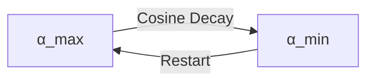
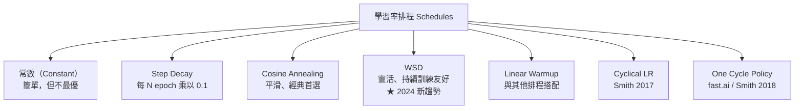

# KP-01：超參數與學習率（Hyperparameters & Learning Rate）

> **課程關聯：** 梯度下降中的 $\alpha$（學習率）首見於 [[C1-W1 - Introduction to Machine Learning#6. Gradient Descent（梯度下降）]]，超參數調整診斷見 [[C2-W3 - Advice for Applying ML]]

---

## 1. 學習率的基本性質（複習）

$$\theta \leftarrow \theta - \alpha \cdot \nabla_\theta J(\theta)$$

- $\alpha$ 太大 → 發散（overshoot）
- $\alpha$ 太小 → 收斂緩慢
- 最優 $\alpha$ 因模型、資料和優化器而異

> [!tip] 🎯 白話舉例：學習率就像下山的步伐大小
> 想像你蒙著眼睛在山上，想走到最低的山谷。**學習率就是你每一步走多遠。**
> - 步伐太大（$\alpha$ 太大）→ 你可能直接跨過山谷，跳到對面的山坡上，越走越高
> - 步伐太小（$\alpha$ 太小）→ 你一步只挪一公分，天黑了還沒到谷底
> - 剛好的步伐 → 穩穩地走到谷底，既不跨過、也不太慢

---

## 2. 學習率排程（Learning Rate Schedules）

### 2.1 Cosine Annealing（餘弦退火）

**核心思想：** 讓學習率以餘弦曲線平滑衰減至近零，避免陡降帶來的訓練不穩定。

$$\alpha_t = \alpha_{\min} + \frac{1}{2}(\alpha_{\max} - \alpha_{\min})\left(1 + \cos\left(\frac{t}{T}\pi\right)\right)$$

**論文來源：**
> Loshchilov, I. & Hutter, F. (2017). **SGDR: Stochastic Gradient Descent with Warm Restarts.** *ICLR 2017.* [arxiv:1608.03983](https://arxiv.org/abs/1608.03983)

**Warm Restarts（熱重啟）：** 週期性地將學習率重置至峰值，讓模型跳出局部最優，探索更好的解。



> [!tip] 🎯 白話舉例：Cosine Annealing 像冷氣的智慧溫控
> 想像你剛進一間很熱的房間，冷氣一開始全力運轉（大學習率），讓溫度快速下降。隨著接近舒適溫度，冷氣**慢慢降低風量**（學習率平滑衰減），避免過冷。Warm Restarts 就像偶爾打開窗戶讓熱風進來，再重新冷卻——這樣能確認「現在的溫度真的是最舒服的」，而不是困在一個不太好的溫度。

### 2.2 Linear Warmup（線性預熱）

**白話解釋：** 訓練初期參數隨機，若學習率太大會造成梯度爆炸。Warmup 讓 $\alpha$ 從 0 線性增大到設定值，再開始正常衰減。

$$\alpha_t = \alpha_{\max} \cdot \frac{t}{t_{\text{warmup}}}, \quad t \leq t_{\text{warmup}}$$

**論文來源（Large-Batch 訓練）：**
> Goyal, P. et al. (2017). **Accurate, Large Minibatch SGD: Training ImageNet in 1 Hour.** [arxiv:1706.02677](https://arxiv.org/abs/1706.02677)

**現代實踐：** 幾乎所有大型 Transformer 模型（BERT、GPT、LLaMA 等）都採用 Warmup + Cosine Decay 的組合。

> [!tip] 🎯 白話舉例：Warmup 像汽車的暖機
> 冬天啟動汽車時，不會立刻全速踩油門——你會先**怠速暖機**幾分鐘，讓引擎達到工作溫度後再正常行駛。Warmup 同理：模型一開始的參數是隨機的（冷引擎），如果馬上用大學習率猛踩油門，容易「拋錨」（梯度爆炸）。先用小學習率慢慢啟動，再逐步加速到正常速度。

### 2.3 Warmup-Stable-Decay（WSD）排程 ★ 2024 新趨勢

**問題：** Cosine Annealing 需要**預先決定總訓練步數** $T$，對於持續訓練（continual training）不友好。

**WSD 三階段：**
1. **Warmup 階段：** 學習率線性增加至 $\alpha_{\text{peak}}$（約佔 1–2% 總步數）
2. **Stable 階段：** 維持恆定學習率 $\alpha_{\text{peak}}$（佔 60–80%，此期間可隨時分支取 checkpoint）
3. **Decay 階段：** 學習率衰減至接近零（佔 10–25%）

**核心優勢：** Decay 的起點不需要預先決定，可以在 Stable 階段的**任意時刻**啟動 Decay 獲取 checkpoint，大幅提升訓練靈活性。

**論文來源：**
> Hu, S. et al. (2024). **MiniCPM: Unveiling the Potential of Small Language Models with Scalable Training Strategies.** [arxiv:2404.06395](https://arxiv.org/abs/2404.06395)

**理論分析：**
> Wen, K. et al. (2024). **Understanding Warmup-Stable-Decay Learning Rates: A River Valley Loss Landscape Perspective.** [arxiv:2410.05192](https://arxiv.org/abs/2410.05192)

**「河谷」直覺：** 損失地形有兩個方向——沿河流方向（平坦）和沿山脈方向（陡峭）。Stable 階段的恆定大學習率讓優化器沿河谷快速前進，最終的 Decay 階段才將模型「安置」到谷底。

**使用模型：** MiniCPM、DeepSeek-V2/V3、LLaMA3（部分實驗）

> [!tip] 🎯 白話舉例：WSD 像長途公路旅行
> - **Warmup** = 出發時慢慢從停車場開上高速公路
> - **Stable** = 在高速公路上定速巡航，跑多遠都行，隨時可以決定下交流道
> - **Decay** = 下交流道後減速，穩穩停進目的地停車場
> 相比之下，Cosine Annealing 像是出發前就必須決定「要跑幾公里後停車」，中途改不了。

### 2.4 常見排程一覽



### 2.5 One Cycle Policy

**論文來源：**
> Smith, L.N. & Topin, N. (2019). **Super-Convergence: Very Fast Training of Neural Networks Using Large Learning Rates.** *WACV 2019.* [arxiv:1708.07120](https://arxiv.org/abs/1708.07120)

學習率先從 $\alpha_{\min}$ 升至 $\alpha_{\max}$，再降至 $\alpha_{\min}/100$，同時動量反向調整，可大幅加速訓練收斂。

---

## 3. Batch Size 與學習率的關係

**線性縮放法則：** 若 Batch Size 增大 $k$ 倍，相應地將 $\alpha$ 也乘以 $k$：

$$\alpha_{\text{new}} = \alpha_{\text{base}} \times \frac{B_{\text{new}}}{B_{\text{base}}}$$

**論文來源：**
> Goyal, P. et al. (2017). *Accurate, Large Minibatch SGD.* [arxiv:1706.02677](https://arxiv.org/abs/1706.02677)

**限制：** 此線性關係在超大 Batch Size 時失效（需 Warmup 緩衝）。

**LAMB 優化器（大 Batch 專用）：** 當 Batch Size 極大（如 32K–64K）時，即使搭配 Warmup，標準 Adam 仍可能不穩定。LAMB（Layerwise Adaptive Moments optimizer for Batch training）透過逐層自適應學習率解決此問題。

> You, Y. et al. (2020). **Large Batch Optimization for Deep Learning: Training BERT in 76 Minutes.** *ICLR 2020.* [arxiv:1904.00962](https://arxiv.org/abs/1904.00962)

> [!tip] 🎯 白話舉例：Batch Size 與學習率的關係像投票
> 想像你要調查「大家喜歡什麼口味的冰淇淋」。
> - **小 Batch**（問 10 個人）= 樣本少、結論可能偏頗，你根據這個結論做的調整（學習率）不敢太大
> - **大 Batch**（問 1000 個人）= 樣本多、結論更可靠，你可以更大膽地調整（更大的學習率）
> - **但問太多人**（Batch 太大）= 調查時間太長，而且可能不同社區偏好差異大，需要特殊處理（Warmup + LAMB）

---

## 4. 梯度裁剪（Gradient Clipping）

**問題：** 梯度爆炸（gradient explosion）在 RNN、Transformer 等深層網路中常見。

**Norm Clipping（L2 norm 裁剪）：**

$$\text{if } \|\nabla\theta\| > \text{clip\_norm}: \quad \nabla\theta \leftarrow \frac{\text{clip\_norm}}{\|\nabla\theta\|} \nabla\theta$$

```python
torch.nn.utils.clip_grad_norm_(model.parameters(), max_norm=1.0)
```

**論文來源：**
> Pascanu, R., Mikolov, T. & Bengio, Y. (2013). **On the difficulty of training recurrent neural networks.** *ICML 2013.* [arxiv:1211.5063](https://arxiv.org/abs/1211.5063)

**Value Clipping（值裁剪）：** 除了 Norm Clipping，也可直接將梯度的每個元素限制在 $[-c, c]$ 之間。但 Norm Clipping 更常用，因為它保留梯度方向。

> [!tip] 🎯 白話舉例：梯度裁剪像限速器
> 想像你在山路上開車下坡。正常坡度（正常梯度）你可以安全駕駛，但遇到**超陡下坡**（梯度爆炸），車速會飆到危險值。梯度裁剪就是車上的**限速器**——即使坡再陡，車速也不會超過設定的上限（clip_norm），你仍然朝正確的方向走，只是速度被限制住了。

---

## 5. 超參數搜尋的系統方法（2020+ 進展）

### 5.1 Random Search 優於 Grid Search

**論文來源：**
> Bergstra, J. & Bengio, Y. (2012). **Random Search for Hyper-Parameter Optimization.** *JMLR 2012.* — 奠定了隨機搜尋的理論基礎

### 5.2 Hyperband + Bayesian Optimization

> Li, L. et al. (2018). **Hyperband: A Novel Bandit-Based Approach to Hyperparameter Optimization.** *JMLR 2018.* [arxiv:1603.06212](https://arxiv.org/abs/1603.06212)

結合 Successive Halving（提前終止差的配置）和 Bandit 策略，在計算資源有限的情況下高效搜尋。

### 5.3 μP（Maximal Update Parametrization）

**重大突破（2022）：** 超參數（包括學習率）可以在小模型上調好後直接遷移至大模型，無需重新搜尋。

**論文來源：**
> Yang, G. et al. (2022). **Tensor Programs V: Tuning Large Neural Networks via Zero-Shot Hyperparameter Transfer.** [arxiv:2203.03466](https://arxiv.org/abs/2203.03466)

**實踐意義：** 微軟等公司用此方法大幅降低大型 LLM 調參成本。

---

## 6. 學習率與損失曲面幾何

### 6.1 Flat Minima 假說

**白話解釋：** 在「平坦」的最小值附近，參數稍微移動，損失變化不大，泛化能力更強；「尖銳」的最小值則相反。

> Hochreiter, S. & Schmidhuber, J. (1997). *Flat Minima.* Neural Computation.

**更完整的理論研究：**
> Keskar, N.S. et al. (2017). **On Large-Batch Training for Deep Learning: Generalization Gap and Sharp Minima.** *ICLR 2017.* [arxiv:1609.04836](https://arxiv.org/abs/1609.04836)

> [!tip] 🎯 白話舉例：平坦最小值 vs 尖銳最小值
> 想像你在兩個不同的碗裡放一顆彈珠：
> - **寬碗**（平坦最小值）= 彈珠稍微滾動也還是在碗底附近。即使測試數據和訓練數據有些差異（碗被輕輕搖晃），模型的表現依然穩定
> - **窄管**（尖銳最小值）= 彈珠稍微偏移就滾出去了。模型在訓練數據上表現完美，但一遇到稍有不同的新數據就崩潰（過擬合）

### 6.2 SAM（Sharpness-Aware Minimization）

SAM 直接最小化「最壞情況下鄰域的損失」，強制找到平坦最小值：

$$\min_\theta \max_{\|\epsilon\| \leq \rho} J(\theta + \epsilon)$$

> Foret, P., Kleiner, A., Mobahi, H. & Neyshabur, B. (2021). **Sharpness-Aware Minimization for Efficiently Improving Generalization.** *ICLR 2021.* [arxiv:2010.01412](https://arxiv.org/abs/2010.01412)

詳見 → [[KP-02 - 現代優化器#SAM]]

---

## 7. 重點總結

| 技術 | 論文 | 年份 | 關鍵貢獻 |
|------|------|------|---------|
| Cosine Annealing | Loshchilov & Hutter | 2017 | 平滑 LR 衰減，Warm Restarts |
| Linear Warmup | Goyal et al. | 2017 | 大 batch 訓練穩定化 |
| WSD Schedule | Hu et al. | 2024 | 靈活排程，不需預設總步數 |
| Linear LR Scaling | Goyal et al. | 2017 | Batch Size ↑k → LR ↑k |
| LAMB Optimizer | You et al. | 2020 | 超大 Batch（64K）穩定訓練 |
| Gradient Clipping | Pascanu et al. | 2013 | 防止梯度爆炸 |
| Sharp Minima | Keskar et al. | 2017 | 大 Batch → 尖銳最小值 → 泛化差 |
| μP Parametrization | Yang et al. | 2022 | 超參數從小模型遷移至大模型 |

---

## 🔗 相關知識點

- [[KP-02 - 現代優化器]] — Adam、AdamW、Lion、SAM 各自對學習率的敏感度不同
- [[KP-03 - 損失函數]] — 損失函數形狀影響最優學習率與損失曲面幾何
- [[KP-04 - 正則化技術]] — Weight Decay 與學習率的交互影響（見 AdamW 的解耦設計）
- [[KP-07 - 縮放法則與湧現能力]] — 大模型中的學習率策略與 Chinchilla 最優配置
- [[KP-06 - Attention 機制與 Transformer]] — Transformer 訓練幾乎必備 Warmup + LR Decay

## 🔗 相關課程筆記

- [[C1-W1 - Introduction to Machine Learning]] — 梯度下降基礎與學習率直覺
- [[C1-W2 - Regression with Multiple Input Variables]] — Feature Scaling 對學習率收斂的影響
- [[C2-W2 - Neural Network Training]] — Adam Optimizer 的自適應學習率機制
- [[C2-W3 - Advice for Applying ML]] — 超參數搜尋診斷與 Bias-Variance 分析
