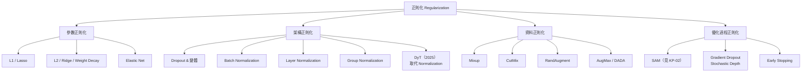

# KP-04：正則化技術（Regularization Techniques）

> **課程關聯：** L2 正則化基礎見 [[C1-W3 - Classification#7. Regularization（正則化）]]；Overfitting/Underfitting 診斷見 [[C2-W3 - Advice for Applying ML]]

---

## 1. 正則化技術全景

---

## 2. L1 / L2 正則化（複習）

> 詳見 [[C1-W3 - Classification#7. Regularization（正則化）]]

**L2（Weight Decay）：**
$$J_{\text{reg}} = J + \frac{\lambda}{2m}\sum_j w_j^2 \quad \Rightarrow \quad w_j \leftarrow w_j(1 - \alpha\lambda/m) - \alpha\nabla_w J$$

- **L1（Lasso）：** $\Omega = \lambda \sum |\theta_i|$ → 稀疏化（許多參數被推向 0）
- **L2（Ridge / Weight Decay）：** $\Omega = \frac{\lambda}{2} \sum \theta_i^2$ → 參數均勻縮小

**與 AdamW 的關係：** 在 Adam 中，L2 ≠ Weight Decay。AdamW 解耦了兩者 → 詳見 [[KP-02 - 現代優化器#4. AdamW]]

> [!tip] 🎯 白話舉例：L1 與 L2 像行李限重
> 你要搭飛機，行李有重量限制（正則化預算 $\lambda$）。
> - **L2（Weight Decay）** = 每件行李都「按比例減重」。帶了 10 件物品，每件都輕一點，但全部都還留著。結果：**均勻瘦身，沒有東西被完全丟掉**
> - **L1（Lasso）** = 你必須「直接丟掉一些行李」來滿足限重。結果：**少數重要物品留下，其他直接變成 0（稀疏化）**
> 
> L1 適合特徵選擇（哪些變數重要？），L2 適合防止任何單一參數過大。

---

## 3. Dropout 及其現代變體

### 3.1 標準 Dropout

$$\tilde{a}_j = \begin{cases} a_j / (1-p) & \text{with prob. } 1-p \\ 0 & \text{with prob. } p \end{cases}$$

**推論時等效：** $\hat{y} = pW^Tx$（權重乘以保留率）

**論文來源：**
> Srivastava, N. et al. (2014). **Dropout: A Simple Way to Prevent Neural Networks from Overfitting.** *JMLR 2014.*

> [!tip] 🎯 白話舉例：Dropout 像團隊的輪休制度
> 想像一個籃球隊有 10 名球員，每場比賽**隨機讓 50% 的球員休息**。
> - 如果每場都靠同一個明星球員（共適應），其他人不會成長
> - 強制輪休後，**每個球員都必須學會獨當一面**，整體團隊更強韌
> - 正式比賽（推論時）全員上場，但每人只發揮「平常練習的水準 × 上場率」
> 
> 這就是為什麼 Dropout 能防止過擬合——它阻止神經元「抱團」，強迫每個神經元都有用。

### 3.2 DropPath / Stochastic Depth

**思想：** 隨機丟棄整個殘差路徑（而非單一神經元），用於深層殘差網路和 Vision Transformer。

$$x_{l+1} = x_l + b_l \cdot f(x_l)$$

其中 $b_l \sim \text{Bernoulli}(p_l)$，且 $p_l$ 可隨深度線性遞增（越深層丟棄率越高）。

**論文來源：**
> Huang, G. et al. (2016). **Deep Networks with Stochastic Depth.** *ECCV 2016.* [arxiv:1603.09382](https://arxiv.org/abs/1603.09382)

**關鍵發現：** Stochastic Depth 不僅正則化，還大幅減少訓練時間（期望值下只需訓練 3/4 的層），同時改善泛化。

---

## 4. Batch Normalization（BN）

### 4.1 原理

**白話：** 每個 mini-batch 後強制讓每層的輸出分布回歸到均值 0、方差 1，避免梯度消失/爆炸，大幅加快訓練。

$$\hat{x}_i = \frac{x_i - \mu_B}{\sqrt{\sigma_B^2 + \epsilon}}, \quad y_i = \gamma \hat{x}_i + \beta$$

- $\mu_B, \sigma_B^2$：mini-batch 的均值和方差（訓練時每 batch 計算）
- $\gamma, \beta$：可學習的縮放和偏移參數

**論文來源：**
> Ioffe, S. & Szegedy, C. (2015). **Batch Normalization: Accelerating Deep Network Training.** *ICML 2015.* [arxiv:1502.03167](https://arxiv.org/abs/1502.03167)

### 4.2 BN 的問題

- Batch Size 過小時，$\mu_B, \sigma_B^2$ 估計不穩定
- 序列長度不固定的 NLP 任務（Batch 的統計量意義不明）
- **已被 Layer Normalization 在 Transformer 中取代**

> [!tip] 🎯 白話舉例：Batch Normalization 像考試成績標準化
> 想像每次考試的難度不同，導致分數忽高忽低。BN 就像每次考試後都做**標準化**（減平均、除標準差），讓 60 分永遠代表「中等程度」，不管這次考試難不難。
> - **好處**：後續的課程安排（下一層神經元）可以放心地假設「輸入大約在 0 附近」
> - **問題**：如果班上只有 2 個人（小 batch），算出來的平均和標準差不準；而且考試時（推論）用的是「歷史平均」而非當下的統計，行為不一致

---

## 5. Layer Normalization（LN）★ Transformer 標配

### 5.1 與 BN 的差異

| | Batch Norm | Layer Norm |
|--|--|--|
| 歸一化維度 | Batch 維度（所有樣本同一特徵）| Feature 維度（單一樣本所有特徵）|
| 適合場景 | 固定 batch 的 CNN | NLP、Transformer（序列不等長）|
| 推理行為 | 需要運行統計量 | 不依賴 batch，一致性好 |

$$\hat{x}_i = \frac{x_i - \mu_L}{\sqrt{\sigma_L^2 + \epsilon}}, \quad y_i = \gamma \hat{x}_i + \beta$$

$\mu_L, \sigma_L^2$ 在**同一樣本的特徵維度**計算。

**論文來源：**
> Ba, J.L., Kiros, J.R. & Hinton, G.E. (2016). **Layer Normalization.** [arxiv:1607.06450](https://arxiv.org/abs/1607.06450)

### 5.2 Pre-LN vs Post-LN（2020+ 重要區別）

**Post-LN（原始 Transformer）：** $\text{LN}(x + \text{SubLayer}(x))$
- 訓練不穩定（尤其深層網路）
- 需要 Warmup 才能穩定

**Pre-LN（現代標準）：** $x + \text{SubLayer}(\text{LN}(x))$
- 訓練穩定，可使用更大學習率
- LLaMA、GPT-2/3、PaLM 等均採用

> Xiong, R. et al. (2020). **On Layer Normalization in the Transformer Architecture.** *ICML 2020.* [arxiv:2002.04745](https://arxiv.org/abs/2002.04745)

### 5.3 RMSNorm（更輕量的 LN 變體）

$$\bar{x}_i = \frac{x_i}{\text{RMS}(x)}, \quad \text{RMS}(x) = \sqrt{\frac{1}{n}\sum_j x_j^2}$$

去掉了均值中心化步驟，更快速且效果相近。**LLaMA、Gemma、Mistral 等現代 LLM 使用。**

> Zhang, B. & Sennrich, R. (2019). **Root Mean Square Layer Normalization.** *NeurIPS 2019.* [arxiv:1910.07467](https://arxiv.org/abs/1910.07467)

> [!tip] 🎯 白話舉例：LayerNorm vs BatchNorm 的差別
> - **BatchNorm** = 全班同學考完同一科，對**這一科的成績**做標準化（跨樣本、同特徵）
> - **LayerNorm** = 每個同學看**自己所有科目的成績**做標準化（跨特徵、同樣本）
> 
> LayerNorm 不需要知道「班上其他人考幾分」，所以**不依賴 batch size**，非常適合 Transformer 這種常用不同長度序列的模型。

---

## 6. 資料增強（Data Augmentation）

### 6.1 Mixup

**核心思想：** 將兩個訓練樣本線性插值，創造「混合」的新樣本：

$$\tilde{x} = \lambda x_i + (1-\lambda) x_j, \quad \tilde{y} = \lambda y_i + (1-\lambda) y_j$$

$\lambda \sim \text{Beta}(\alpha, \alpha)$，通常 $\alpha = 0.2$。

**論文來源：**
> Zhang, H. et al. (2018). **mixup: Beyond Empirical Risk Minimization.** *ICLR 2018.* [arxiv:1710.09412](https://arxiv.org/abs/1710.09412)

**效果：** 使決策邊界更平滑，改善泛化，提高對抗樣本魯棒性。

### 6.2 CutMix

**核心思想：** 將一張圖片的矩形區域貼入另一張圖片，標籤按面積比例混合：

$$\tilde{x} = \mathbf{M} \odot x_A + (1-\mathbf{M}) \odot x_B$$

$$\tilde{y} = \frac{|\mathbf{M}|}{HW} y_A + \left(1 - \frac{|\mathbf{M}|}{HW}\right) y_B$$

**論文來源：**
> Yun, S. et al. (2019). **CutMix: Training Strategy that Makes Use of Sample Mixing.** *ICCV 2019.* [arxiv:1905.04899](https://arxiv.org/abs/1905.04899)

**優點（vs Mixup）：** 保留完整的局部語義特徵，模型學會從局部線索分類。

### 6.3 RandAugment

**核心思想：** 從一組固定的增強操作（旋轉、翻轉、顏色變換等）中隨機選 $N$ 個，每個以強度 $M$ 執行。

**論文來源：**
> Cubuk, E.D. et al. (2020). **RandAugment: Practical Automated Data Augmentation.** *NeurIPS 2020.* [arxiv:1909.13719](https://arxiv.org/abs/1909.13719)

> [!tip] 🎯 白話舉例：Mixup 與 CutMix 像調酒和拼貼畫
> - **Mixup** = 把兩杯果汁**混合**（70% 蘋果汁 + 30% 柳橙汁），標籤也混合（70% 蘋果、30% 柳橙）。模型必須學會「中間地帶」的概念
> - **CutMix** = 把蘋果照片的一角**剪掉**，換成柳橙照片的一塊。模型必須學會「局部特徵」——不能只看一小角就下結論
> 
> 兩者都是在創造「訓練時沒見過的新樣本」，讓模型更不容易死記硬背（過擬合）。

---

## 7. DyT（Dynamic Tanh, 2025）—— 取代 Normalization 的新方向

### 7.1 核心思想

Meta 研究團隊提出 **DyT（Dynamic Tanh）**，用一個簡單的可學習 tanh 函數直接**取代** LayerNorm / RMSNorm：

$$\text{DyT}(x) = \gamma \cdot \tanh(\alpha x) + \beta$$

其中 $\alpha$ 是可學習的縮放參數（預設初始化 0.5），$\gamma, \beta$ 與 LN 相同。

### 7.2 為什麼有效？

- tanh 的**擠壓效果**自然限制了激活值的範圍，達到與 Normalization 類似的穩定化效果
- 不需要計算均值/方差統計量，**更簡單、更快**
- 在 LLM 訓練、ViT、Diffusion 等多種任務上匹配或超越原始的 LN/RMSNorm 效果

### 7.3 論文來源

> Zhu, B. et al. (2025). **Transformers without Normalization.** [arxiv:2503.10622](https://arxiv.org/abs/2503.10622)

> [!tip] 🎯 白話舉例：DyT 像「可調整的音量旋鈕」
> LayerNorm 像一個複雜的自動音量系統，需要測量現場平均音量和波動才能調節。DyT 則是一個簡單的「旋鈕」（$\alpha$），轉大就壓縮更多、轉小就放過更多，不需要任何統計計算。

---

## 8. 正則化的系統視角

**過擬合診斷（連結課程）：**

| 症狀 | 診斷 | 正則化方案 |
|------|------|-----------|
| $J_{\text{train}}$ 低，$J_{\text{cv}}$ 高 | High Variance → 過擬合 | L2 Weight Decay, Dropout, Data Augmentation |
| $J_{\text{train}}$ 高，$J_{\text{cv}}$ 高 | High Bias → 欠擬合 | 減少正則化，更大模型 |

詳見 [[C2-W3 - Advice for Applying ML#3. Diagnosing Bias and Variance]]

---

## 9. 重點論文彙整

| 論文 | 年份 | arxiv | 貢獻 |
|------|------|-------|------|
| Batch Normalization | 2015 | [1502.03167](https://arxiv.org/abs/1502.03167) | 加速訓練，防梯度消失 |
| Dropout | 2014 | — | 隨機去激活，防過擬合 |
| Layer Normalization | 2016 | [1607.06450](https://arxiv.org/abs/1607.06450) | NLP/Transformer 標準歸一化 |
| Pre-LN Transformer | 2020 | [2002.04745](https://arxiv.org/abs/2002.04745) | 更穩定的訓練 |
| RMSNorm | 2019 | [1910.07467](https://arxiv.org/abs/1910.07467) | 輕量 LN，現代 LLM 標配 |
| Stochastic Depth | 2016 | [1603.09382](https://arxiv.org/abs/1603.09382) | 隨機丟棄整層，Transformer 使用 |
| Mixup | 2018 | [1710.09412](https://arxiv.org/abs/1710.09412) | 樣本插值，平滑邊界 |
| CutMix | 2019 | [1905.04899](https://arxiv.org/abs/1905.04899) | 區域替換，保留語義 |
| RandAugment | 2020 | [1909.13719](https://arxiv.org/abs/1909.13719) | 自動化資料增強 |
| DyT | 2025 | [2503.10622](https://arxiv.org/abs/2503.10622) | 動態 tanh 取代 Normalization |

---

## 🔗 相關知識點

- [[KP-02 - 現代優化器]] — AdamW 的 Weight Decay 解耦設計與 SAM 的平坦最小值
- [[KP-01 - 超參數與學習率]] — 正則化強度作為超參數，Weight Decay 與學習率的交互影響
- [[KP-03 - 損失函數]] — Label Smoothing 本質上是正則化技術；Focal Loss 也有類似效果
- [[KP-05 - 激活函數]] — Dropout 與激活函數的交互（ReLU 的稀疏性本身具有正則化效果）
- [[KP-06 - Attention 機制與 Transformer]] — Pre-LN / RMSNorm 在 Transformer 中的必要性

## 🔗 相關課程筆記

- [[C1-W3 - Classification]] — L2 正則化基礎與正則化對決策邊界的影響
- [[C2-W2 - Neural Network Training]] — ReLU 激活與 Softmax 的數值穩定性
- [[C2-W3 - Advice for Applying ML]] — Bias-Variance 診斷與正則化的調整策略
- [[C2-W4 - Decision Trees]] — 樹模型中的正則化：max_depth、min_samples 等診斷與對策
