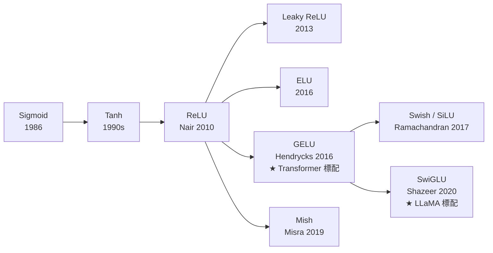
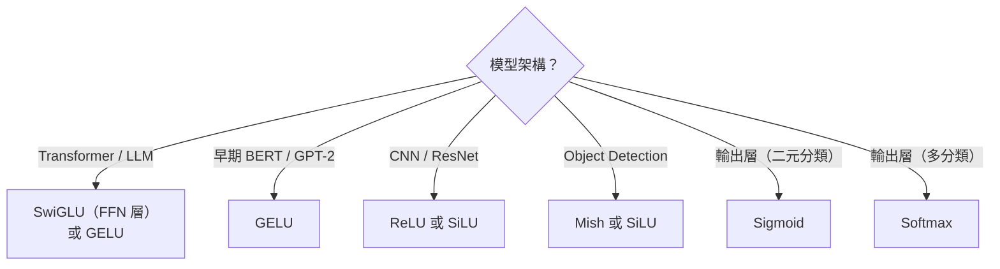

# KP-05：激活函數（Activation Functions）

> **課程關聯：** Sigmoid、ReLU 見 [[C2-W2 - Neural Network Training#2. Activation Functions（激活函數）]]；神經網路架構見 [[C2-W1 - Neural Networks]]

---

## 1. 激活函數演化時間線



---

## 2. 經典激活函數回顧

### 2.1 Sigmoid（複習）

$$\sigma(z) = \frac{1}{1 + e^{-z}} \in (0, 1)$$

**問題：**
- 梯度消失（|z| 大時導數 ≈ 0）
- 非零均值（zero-centering problem）
- 現代僅用於**輸出層**（二元分類概率輸出）

### 2.2 ReLU

$$\text{ReLU}(z) = \max(0, z)$$

**優點：** 計算快、無梯度消失（正區間）  
**問題：** "Dead ReLU" — 一旦神經元輸出永遠 ≤ 0，梯度為 0，再也無法更新

**Dead ReLU 的深入分析：**
> Lu, L. et al. (2019). **Dying ReLU and Initialization: Theory and Numerical Examples.** *Communications in Computational Physics.* [arxiv:1903.06733](https://arxiv.org/abs/1903.06733)

> [!tip] 🎯 白話舉例：激活函數像水管的閥門
> 神經網路中的每一層就像一段水管，激活函數是水管上的**閥門**，決定「讓多少水（信號）通過」。
> - **Sigmoid** = 閥門把水壓縮到 0~1 之間。水流太大或太小時，閥門幾乎不動（梯度消失），像是被卡住了
> - **ReLU** = 閥門只分兩段：水壓 > 0 全開，水壓 ≤ 0 完全關閉。簡單有效，但一旦閥門卡在關閉位置（Dead ReLU），就再也打不開了
> - **GELU/Swish** = 智慧閥門，水壓小時**微微開一點**（不完全關閉），過渡平滑，不會卡死

---

## 3. GELU（Gaussian Error Linear Unit）★

### 3.1 定義

$$\text{GELU}(x) = x \cdot \Phi(x) = x \cdot \frac{1}{2}\left[1 + \text{erf}\left(\frac{x}{\sqrt{2}}\right)\right]$$

其中 $\Phi(x)$ 是標準正態累積分布函數（CDF）。

**快速近似（實際使用）：**
$$\text{GELU}(x) \approx 0.5x\left(1 + \tanh\left[\sqrt{2/\pi}(x + 0.044715 x^3)\right]\right)$$

**論文來源：**
> Hendrycks, D. & Gimpel, K. (2016). **Gaussian Error Linear Units (GELUs).** [arxiv:1606.08415](https://arxiv.org/abs/1606.08415)

### 3.2 GELU 的特性

- **隨機性解釋：** $\text{GELU}(x) = x \cdot P(\text{bernoulli}(x))$，可視為「根據輸入值概率性地通過」
- **無梯度截斷：** 負值區域有小的非零梯度（不同於 ReLU 的硬截斷）
- **實際效果：** 在幾乎所有 Transformer 架構中優於 ReLU

```
ReLU:   /‾‾‾
GELU:  /‾‾‾  (略微平滑的 S 形過渡)
```

**使用場景：** BERT、GPT-2、ViT 等早期 Transformer 模型的 FFN 層標配。

> [!tip] 🎯 白話舉例：GELU 的「概率性通過」
> 想像一家公司的面試：
> - **ReLU** = 分數 > 0 就錄取，≤ 0 直接淘汰（一刀切）
> - **GELU** = 分數越高錄取機率越大，但**低分也有微小機會被錄取**。這種「軟性篩選」讓模型能保留一些可能有用的弱信號，而不是粗暴地全部丟棄

---

## 4. Swish / SiLU

$$\text{Swish}(x) = x \cdot \sigma(\beta x) = \frac{x}{1 + e^{-\beta x}}$$

- $\beta = 1$ 時稱為 **SiLU（Sigmoid Linear Unit）**
- PyTorch 中為 `torch.nn.SiLU()`

**論文來源：**
> Ramachandran, P., Zoph, B. & Le, Q.V. (2017). **Searching for Activation Functions.** [arxiv:1710.05941](https://arxiv.org/abs/1710.05941)

**特點：** 非單調（在 x ≈ -1.28 處有極小值），提供比 GELU 更強的非線性。

> [!tip] 🎯 白話舉例：Swish 的非單調特性
> Swish 在負值區域會先往下再往上（非單調），就像一條路先下坡再上坡。這個「小低谷」讓模型能學到更細膩的特徵——有些看起來「負面」的信號，其實經過轉換後可能有用。ReLU 則是直接把負值全砍掉，丟失了這些細節。

---

## 5. SwiGLU ★ 現代 LLM 標配

### 5.1 什麼是 GLU（Gated Linear Unit）？

$$\text{GLU}(x, W, V, b, c) = \sigma(xW + b) \odot (xV + c)$$

GLU 在每個特徵維度引入一個可學習的「門控」信號。

### 5.2 SwiGLU 定義

$$\text{SwiGLU}(x, W, V) = \text{Swish}(xW) \odot (xV)$$

用 Swish 代替 Sigmoid 作為門控激活函數。

**論文來源：**
> Shazeer, N. (2020). **GLU Variants Improve Transformer.** [arxiv:2002.05202](https://arxiv.org/abs/2002.05202)

### 5.3 SwiGLU 為何優越？

SwiGLU 在 **Feed-Forward Network (FFN)** 中替換標準的兩層 MLP：

**原始 FFN：**
$$\text{FFN}(x) = \text{GELU}(xW_1) \cdot W_2$$

**SwiGLU FFN：**
$$\text{FFN}(x) = (\text{Swish}(xW_1) \odot xW_3) \cdot W_2$$

⚠️ 因為引入了額外的投影矩陣 $W_3$，通常將隱藏層維度縮至 $\frac{2}{3} \times \text{original}$ 以保持參數量相近。

**使用模型：** LLaMA、LLaMA2/3、Mistral、Gemma、PaLM2、GPT-4（推測）

> [!tip] 🎯 白話舉例：SwiGLU 的門控機制
> 想像你在看一部電影時做筆記：
> - **普通 FFN（GELU）** = 你把所有內容都記下來，然後統一篩選
> - **SwiGLU** = 你有兩支筆：一支負責**寫內容**（$xV$），另一支負責**判斷哪些值得記**（$\text{Swish}(xW)$ 作為門控）。只有「門控」認為重要的內容才會被記錄下來
>
> 這種「寫作 + 篩選」的雙通道設計，讓 FFN 能更精準地選擇哪些特徵該傳遞給下一層。

---

## 6. Mish

$$\text{Mish}(x) = x \cdot \tanh(\text{softplus}(x)) = x \cdot \tanh(\ln(1 + e^x))$$

**論文來源：**
> Misra, D. (2019). **Mish: A Self Regularized Non-Monotonic Neural Activation Function.** [arxiv:1908.08681](https://arxiv.org/abs/1908.08681)

**特點：** 無上界、有下界、光滑、非單調；在物體偵測（YOLOv4）等任務上表現出色。

**產業採用：** YOLOv4 將 Mish 設為預設激活函數，在 COCO 資料集上取得當時最佳偵測精度。
> Bochkovskiy, A. et al. (2020). **YOLOv4: Optimal Speed and Accuracy of Object Detection.** [arxiv:2004.10934](https://arxiv.org/abs/2004.10934)

---

## 7. 激活函數比較

| 函數 | 公式 | 下界 | 上界 | 梯度 | 主要用途 |
|------|------|------|------|------|---------|
| Sigmoid | $\frac{1}{1+e^{-x}}$ | 0 | 1 | 消失 | 輸出層（二元分類）|
| Tanh | $\frac{e^x - e^{-x}}{e^x + e^{-x}}$ | -1 | 1 | 消失 | RNN（較少）|
| ReLU | $\max(0,x)$ | 0 | ∞ | Dead | CNN 隱藏層 |
| GELU | $x\Phi(x)$ | ≈-0.17 | ∞ | 平滑 | Transformer FFN |
| SiLU | $x\sigma(x)$ | ≈-0.28 | ∞ | 平滑 | 現代 CNN/Transformer |
| SwiGLU | Gate + Swish | — | ∞ | 平滑 | LLaMA、PaLM FFN |
| Mish | $x\cdot\tanh(\text{sp}(x))$ | ≈-0.31 | ∞ | 平滑 | Object Detection |

---

## 8. 選擇指南



---

## 🔗 相關知識點

- [[KP-06 - Attention 機制與 Transformer]] — SwiGLU 在 Transformer FFN 中的核心地位
- [[KP-04 - 正則化技術]] — BN/LN 與激活函數的搭配；ReLU 的稀疏性本身有正則化效果
- [[KP-02 - 現代優化器]] — 激活函數影響梯度流，進而影響優化器效率（Adam 的自適應性部分彌補梯度消失）
- [[KP-03 - 損失函數]] — Softmax 作為輸出層激活與 Cross-Entropy 的搭配

## 🔗 相關課程筆記

- [[C2-W1 - Neural Networks]] — 激活函數在前向傳播中的角色與直覺
- [[C2-W2 - Neural Network Training]] — Sigmoid、ReLU 選擇指南與 Softmax 多分類
- [[C1-W3 - Classification]] — Sigmoid 在 Logistic Regression 中的原始用途
