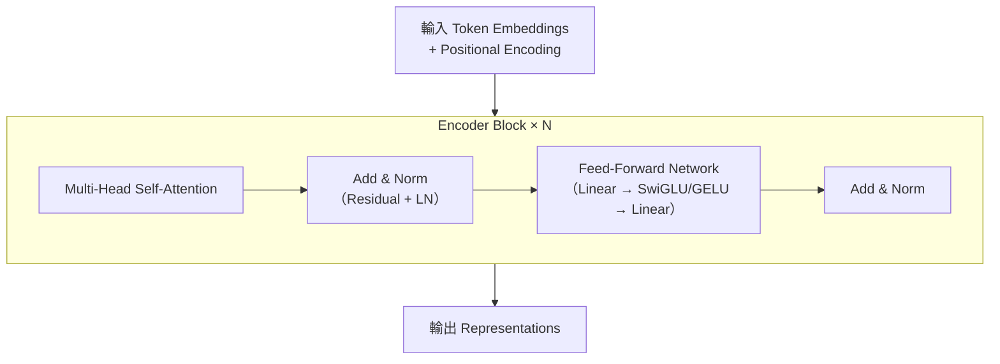

# KP-06：Attention 機制與 Transformer

> **課程關聯：** 本主題是 [[C2-W1 - Neural Networks]] 和 [[C2-W2 - Neural Network Training]] 的重要延伸，也是 [[C3-W2 - Recommender Systems & PCA#5. Deep Learning for Content-Based Filtering]] 中雙塔模型的理論基礎。

---

## 1. 為什麼需要 Attention？

**RNN/LSTM 的瓶頸：**
- 序列化計算，無法並行
- 長距離依賴困難（梯度消失）
- 固定大小的隱向量是信息瓶頸

**Attention 的核心思想：** 讓模型在處理每個位置時，**直接關注序列中所有其他位置**，而不是通過中間隱向量。

> [!tip] 🎯 白話舉例：Attention 像開會時的目光
> 想像你在開會，主持人問「下季行銷策略怎麼做？」。
> - **RNN** = 你只能看到左邊的同事，他把之前所有人的意見「壓縮」成一句話傳給你——資訊大量流失
> - **Attention** = 你可以**直接看向會議室裡的每一個人**，評估「誰的意見和這個問題最相關」，然後重點聽取最相關的人的意見

---

## 2. Scaled Dot-Product Attention

### 2.1 核心公式

$$\text{Attention}(Q, K, V) = \text{softmax}\left(\frac{QK^T}{\sqrt{d_k}}\right) V$$

其中：
- $Q \in \mathbb{R}^{n \times d_k}$：Query（查詢），「我想找什麼？」
- $K \in \mathbb{R}^{m \times d_k}$：Key（鍵），「我有什麼？」
- $V \in \mathbb{R}^{m \times d_v}$：Value（值），「實際取出的內容」
- $\sqrt{d_k}$：縮放因子，防止點積在高維時過大導致 softmax 飽和

**直觀理解（資料庫比喻）：**
- 用 Query 去比對所有 Key 計算相似度（注意力分數）
- 用 softmax 將分數轉化為「注意力權重」
- 以注意力權重加權求和所有 Value

### 2.2 Self-Attention

$Q = XW_Q$，$K = XW_K$，$V = XW_V$（同一個輸入 $X$ 產生 Q、K、V）

**效果：** 同一序列的每個位置都可以「看到」其他所有位置。

**論文來源：**
> Vaswani, A. et al. (2017). **Attention Is All You Need.** *NeurIPS 2017.* [arxiv:1706.03762](https://arxiv.org/abs/1706.03762)

---

## 3. Multi-Head Attention（多頭注意力）

$$\text{MultiHead}(Q, K, V) = \text{Concat}(\text{head}_1, \ldots, \text{head}_h) W^O$$

$$\text{head}_i = \text{Attention}(QW_i^Q, KW_i^K, VW_i^V)$$

**白話：** 並行運行 $h$ 個注意力「頭」，每個頭學習不同的注意力模式（句法關係、語義關係、指代關係等），最後拼接。

典型設定（GPT-3）：$h=96$ 個頭，$d_{\text{model}}=12288$，$d_k = d_v = 128$

> [!tip] 🎯 白話舉例：Multi-Head Attention 像多個專家同時看同一件事
> 一張句子「小明和小華去了公園，**他**買了冰淇淋」，不同的注意力頭會關注不同面向：
> - **頭 1**（語法頭）→ 「他」指的是誰？→ 關注「小明」
> - **頭 2**（語義頭）→ 「公園」和「冰淇淋」的場景關係
> - **頭 3**（動詞頭）→ 「去」和「買」的時間順序
>
> 多個頭同時工作，然後把各自的「專家意見」合併，就得到了對這句話的全方位理解。

---

## 4. Transformer 架構

**關鍵設計原則：**
1. **Residual Connections（殘差連接）：** 防止梯度消失，讓資訊繞過每層
2. **Layer Normalization：** 穩定訓練（詳見 [[KP-04 - 正則化技術#5. Layer Normalization（LN）★ Transformer 標配]]）
3. **FFN with SwiGLU：** 大部分參數集中在 FFN（佔比 ~2/3）（詳見 [[KP-05 - 激活函數#5. SwiGLU ★ 現代 LLM 標配]]）

> [!tip] 🎯 白話舉例：Transformer Block 像一條生產線
> 每個 Transformer Block 就像工廠的一個工作站：
> 1. **Self-Attention** = 工人先和其他所有工作站**開會討論**，決定「誰的工件和我的最相關」
> 2. **Add & Norm** = 把討論結果和原本的工件合併（殘差），再標準化品質檢查（LN）
> 3. **FFN** = 工人自己**深入加工**每個工件（SwiGLU 篩選重要特徵）
> 4. **Add & Norm** = 再次合併 + 品檢
>
> 疊疊 N 層（如 LLaMA3-70B = 80 層），每層都在前一層的基礎上提取更抽象的特徵。

---

## 5. Positional Encoding（位置編碼）

Self-Attention 本身不感知序列位置，需要額外加入位置信息。

### 5.1 Sinusoidal PE（原始 Transformer）

$$PE_{(pos, 2i)} = \sin(pos / 10000^{2i/d_{\text{model}}})$$
$$PE_{(pos, 2i+1)} = \cos(pos / 10000^{2i/d_{\text{model}}})$$

### 5.2 RoPE（Rotary Position Embedding）★ 現代 LLM 標配

**核心思想：** 通過旋轉矩陣將位置信息**乘性地**融入 Q、K，使得 $Q_m \cdot K_n$ 只依賴於**相對位置** $m-n$。

> [!tip] 🎯 白話舉例：位置編碼像座位號
> Attention 本身不知道詞的順序（「狗咬人」和「人咬狗」看起來一樣），所以需要給每個詞貼上「座位號」。
> - **Sinusoidal PE** = 座位號是固定的（第 1 排、第 2 排…），簡單但不靈活
> - **RoPE** = 不直接貼座位號，而是讓每個詞的向量**旋轉一個角度**，旋轉多少取決於位置。兩個詞之間的「距離感」自然地由旋轉角度差決定，更靈活且能處理更長序列

$$q_m^T k_n = (\mathcal{R}_m q)^T (\mathcal{R}_n k) = q^T \mathcal{R}_{n-m} k$$

**優點：**
- 自然支持**推理時外推**（handling longer sequences than seen in training）
- 相對位置建模更自然
- 計算高效（只需旋轉）

**論文來源：**
> Su, J. et al. (2024). **RoFormer: Enhanced Transformer with Rotary Position Embedding.** *Neurocomputing.* [arxiv:2104.09864](https://arxiv.org/abs/2104.09864)

**使用模型：** LLaMA、GPT-NeoX、Falcon、Mistral、Qwen

### 5.3 ALiBi（Attention with Linear Biases）

在注意力分數上加入線性偏置 $m \cdot |i-j|$（頭間 $m$ 不同），推理時可外推到更長序列。

> Press, O. et al. (2022). **Train Short, Test Long: Attention with Linear Biases Enables Input Length Extrapolation.** *ICLR 2022.* [arxiv:2108.12409](https://arxiv.org/abs/2108.12409)

---

## 6. Vision Transformer（ViT）

### 6.1 核心思想

**白話：** 把圖片切成固定大小的 patch（如 16×16 像素），每個 patch 展平成向量後當作「token」，送入標準 Transformer。

$$\text{Image} \xrightarrow{\text{切 patches}} [p_1, p_2, \ldots, p_N] \xrightarrow{\text{Linear Projection}} \text{Tokens} \rightarrow \text{Transformer}$$

**論文來源：**
> Dosovitskiy, A. et al. (2021). **An Image is Worth 16x16 Words: Transformers for Image Recognition at Scale.** *ICLR 2021.* [arxiv:2010.11929](https://arxiv.org/abs/2010.11929)

**關鍵發現：** ViT 在大規模預訓練資料上優於 CNN；在小資料集上需要更多正則化。

> [!tip] 🎯 白話舉例：ViT 像拼圖遊戲
> CNN 用「滑動窗口」一小塊一小塊地看圖片（先看局部，再組合成全局）。
> ViT 則是把圖片**切成一塊塊拼圖**，然後讓每塊拼圖都能**直接看到所有其他塊**（透過 Attention）。這讓它能立即掌握全局資訊（圖片左上角和右下角的關係），但需要更多資料才能學好。

### 6.2 BERT（Bidirectional Encoder）

**預訓練任務：**
1. **Masked Language Modeling (MLM)：** 隨機遮蔽 15% token，預測被遮蔽的詞
2. **Next Sentence Prediction (NSP)：** 預測兩個句子是否相鄰

$$\mathcal{L} = \mathcal{L}_{\text{MLM}} + \mathcal{L}_{\text{NSP}}$$

> Devlin, J. et al. (2019). **BERT: Pre-training of Deep Bidirectional Transformers.** *NAACL 2019.* [arxiv:1810.04805](https://arxiv.org/abs/1810.04805)

**Encoder-only → 適合分類、NER、QA 等理解任務**

---

## 7. Efficient Attention 變體（2020+）

**問題：** 標準 Self-Attention 的時間/空間複雜度為 $O(n^2)$（$n$ = 序列長度），對長序列代價極高。

### 7.1 Flash Attention

**核心創新：** 不在 GPU HBM 中儲存完整注意力矩陣，通過分塊計算（tiling）在 SRAM 中完成，大幅減少 IO 開銷。

**論文來源：**
> Dao, T. et al. (2022). **FlashAttention: Fast and Memory-Efficient Exact Attention.** *NeurIPS 2022.* [arxiv:2205.14135](https://arxiv.org/abs/2205.14135)

**效果：** 速度提升 2-4×，記憶體節省 5-20×，精度與標準 Attention **完全相同**。

**Flash Attention 2：**
> Dao, T. (2023). **FlashAttention-2: Faster Attention with Better Parallelism and Work Partitioning.** [arxiv:2307.08691](https://arxiv.org/abs/2307.08691)

> [!tip] 🎯 白話舉例：Flash Attention 像智慧型倉庫管理
> 標準 Attention 就像把所有貨物都放到一張**巨大的桌子**（HBM 記憶體）上排列，再一個個挑選——桌子放不下時就崩潰了。
> Flash Attention 則是用「小手推車」（SRAM 快取記憶體）**分批處理**：每次只搬一小批貨物到工作檯台，處理完再搬下一批。結果完全一樣，但速度更快、不佔空間。

### 7.2 Grouped Query Attention（GQA）

每組 Query 頭共享一組 Key/Value，減少 KV Cache 大小：

| 方案 | KV 頭數 | 記憶體 | 速度 |
|------|---------|--------|------|
| MHA | = Q 頭數 | 最高 | 標準 |
| GQA | Q 頭數的子集 | 中等 | 快 |
| MQA | 1 個 KV 頭 | 最低 | 最快 |

> Ainslie, J. et al. (2023). **GQA: Training Generalized Multi-Query Transformer Models.** [arxiv:2305.13245](https://arxiv.org/abs/2305.13245)

**使用模型：** LLaMA2/3（GQA），GPT-3.5/4（推測）

> [!tip] 🎯 白話舉例：GQA 像共用筆記的讀書會
> MHA 中每個注意力頭都有自己的 K/V（像每個人都帶自己的筆記本）。
> GQA 讓幾個頭**共用同一本筆記**（共享 K/V）——節省了存放筆記本的空間（KV Cache），速度更快，但參考的資訊稍微減少。MQA 則是所有人共用**同一本**，程度最極端。

### 7.3 Multi-head Latent Attention（MLA）—— DeepSeek 的 KV Cache 壓縮

GQA 透過減少 KV 頭數來縮小 KV Cache，但犧牲了表達力。DeepSeek-V2 提出 **MLA**，用**低秩壓縮**將 Key-Value 射影到一個潛在向量，推理時僅需快取該潛在向量：

$$c_t^{KV} = W^{DKV} x_t \quad (\text{latent vector, 維度} \ll d_{\text{model}})$$
$$K_t = W^{UK} c_t^{KV}, \quad V_t = W^{UV} c_t^{KV}$$

| 方案 | KV Cache 大小 | 效果 |
|------|---------------|------|
| MHA | $2 \times n_h \times d_h$ | 最佳 |
| GQA | $2 \times n_g \times d_h$ | 稍降 |
| MLA | $d_c$（潛在維度）| **匹配或超越 MHA** |

**關鍵優勢：** MLA 的 KV Cache 可比 GQA 小數倍，但效果反而更好（因為保留了完整的多頭表達力）。

> DeepSeek-AI (2024). **DeepSeek-V2: A Strong, Economical, and Efficient Mixture-of-Experts Language Model.** [arxiv:2405.04434](https://arxiv.org/abs/2405.04434)

### 7.4 Native Sparse Attention（NSA, 2025）

標準 Attention 的 $O(n^2)$ 複雜度在長序列（64K+）時仍是瓶頸。DeepSeek 提出 **NSA**，一個可**原生訓練**的稀疏注意力機制：

- **硬體對齊**：設計與 GPU 計算單元對齊，避免隨機稀疏帶來的 IO 開銷
- **原生可訓練**：從預訓練開始就用稀疏 Attention，而非後期補丁
- 在 64K 序列上的解碼、前向、反向傳播均顯著加速

> Yuan, J. et al. (2025). **Native Sparse Attention: Hardware-Aligned and Natively Trainable Sparse Attention.** [arxiv:2502.11089](https://arxiv.org/abs/2502.11089)

---

## 8. Transformer 系列總覽

| 模型 | 年份 | 類型 | 特點 |
|------|------|------|------|
| Transformer | 2017 | Encoder-Decoder | 機器翻譯奠基 |
| BERT | 2019 | Encoder | MLM 雙向語言模型 |
| GPT-2 | 2019 | Decoder | 自回歸生成 |
| GPT-3 | 2020 | Decoder | Few-shot learning |
| ViT | 2021 | Encoder（視覺）| Patch-based 圖像 Transformer |
| LLaMA | 2023 | Decoder | 開源，RoPE+SwiGLU+RMSNorm |
| LLaMA3 | 2024 | Decoder | GQA，128K 上下文 |
| DeepSeek-V3 | 2024 | Decoder (MoE) | MLA + DeepSeekMoE + Multi-Token Prediction |
| DeepSeek-R1 | 2025 | Decoder (MoE) | 純 RL 推理，GRPO（見 [[KP-09 - RLHF 與現代強化學習#7. GRPO 與 DeepSeek-R1（2025 突破）]]）|

---

## 🔗 相關知識點

- [[KP-05 - 激活函數]] — SwiGLU / GELU 在 Transformer FFN 中的核心地位
- [[KP-04 - 正則化技術]] — Pre-LN、RMSNorm、DropPath 在 Transformer 中的必要性
- [[KP-01 - 超參數與學習率]] — Transformer 訓練幾乎必備 Warmup + LR Decay
- [[KP-02 - 現代優化器]] — AdamW 是 Transformer 訓練的標準優化器
- [[KP-07 - 縮放法則與湧現能力]] — Transformer 的規模化效應與 Scaling Laws
- [[KP-08 - 自監督與對比學習]] — BERT MLM / MAE / CLIP 等預訓練方法
- [[KP-09 - RLHF 與現代強化學習]] — Transformer 作為 LLM 基礎，RLHF 對齊

## 🔗 相關課程筆記

- [[C2-W1 - Neural Networks]] — 前向傳播與神經網路基礎（Transformer 的前身）
- [[C2-W2 - Neural Network Training]] — 反向傳播、Adam、Softmax
- [[C3-W2 - Recommender Systems & PCA]] — 雙塔模型中的 Embedding 與 Attention 應用
