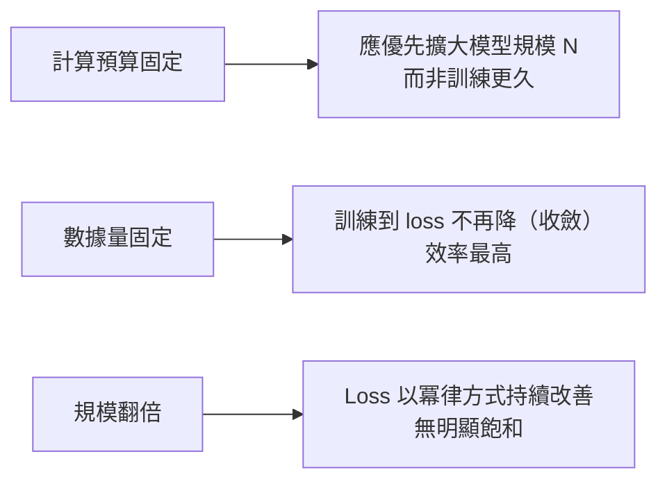
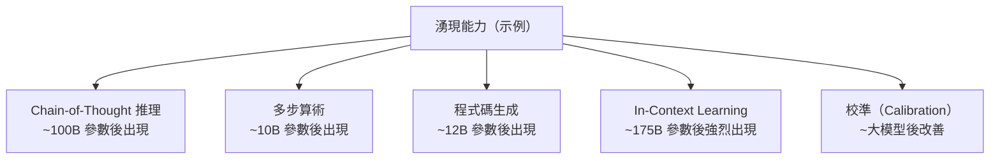
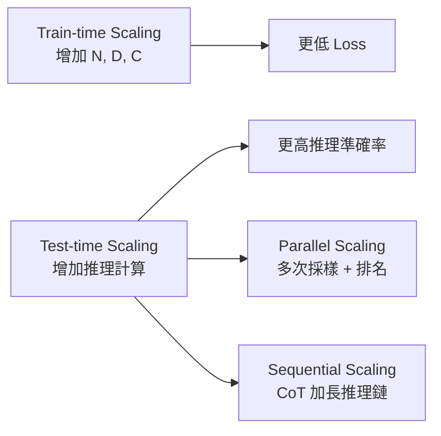

# KP-07：縮放法則與湧現能力（Scaling Laws & Emergent Abilities）

> **課程關聯：** 本主題是 [[C2-W1 - Neural Networks]] 和 [[C2-W3 - Advice for Applying ML]] 的重要延伸，探討「模型越大效果越好」的數學規律及其邊界。

---

## 1. 為什麼縮放法則重要？

**白話解釋：** 「花多少計算資源訓練多大的模型，能得到多好的效果？」這個問題影響了數十億美元的 AI 研究投資決策。縮放法則提供了數學上的預測框架。

> [!tip] 🎯 白話舉例：縮放法則像建築的設計規則
> 想像你要蓋一棟大樓，三個關鍵因素：
> - **地基大小**（模型參數量 $N$）
> - **建材數量**（訓練資料量 $D$）
> - **工人工時**（計算量 $C$）
>
> 縮放法則就是告訴你：「在固定預算下，地基、建材、工人該怎麼分配，才能蓋出最高的樓」。而且每多花一倍預算，樓高的增加是**可預測的**。

---

## 2. Kaplan Scaling Laws（2020）

### 2.1 核心發現

模型性能（Cross-Entropy Loss）與三個因素呈**冪律關係（Power Law）**：

$$L(N) \approx \left(\frac{N_c}{N}\right)^{\alpha_N}, \quad L(D) \approx \left(\frac{D_c}{D}\right)^{\alpha_D}, \quad L(C) \approx \left(\frac{C_c}{C}\right)^{\alpha_C}$$

- $N$：模型參數量
- $D$：訓練資料量（tokens）
- $C$：計算量（FLOPs）
- $\alpha_N \approx 0.076$，$\alpha_D \approx 0.095$，$\alpha_C \approx 0.050$

**三條關鍵結論：**

**論文來源：**
> Kaplan, J. et al. (2020). **Scaling Laws for Neural Language Models.** [arxiv:2001.08361](https://arxiv.org/abs/2001.08361)

### 2.2 關鍵洞察：大模型比小模型更樣本高效

直覺反違——但大模型在每個 token 上學得更多，訓練到收斂需要的步數更少。

> [!tip] 🎯 白話舉例：大模型更「聰明」
> 像是教學：給一個天才和一個普通人同樣看 100 題數學，天才可能從每題中學到更多規律，更快掌握要領。同理，大模型每看一個 token 就能提取更多信息，所以不需要看那麼多資料就能學好。

---

## 3. Chinchilla Scaling Laws（2022）★ 修正 Kaplan

### 3.1 核心發現

Kaplan 的結論被 DeepMind 推翻：**最優的 N 和 D 應該同步增長**，比例約為 $1:20$（每個參數對應約 20 個訓練 tokens）。

**Chinchilla 最優計算配置：**

$$N_{\text{opt}} \propto C^{0.49}, \quad D_{\text{opt}} \propto C^{0.51}$$

$$D_{\text{opt}} \approx 20 \times N_{\text{opt}}$$

**具體例子：**

| 模型（Kaplan 風格） | 參數量 | 訓練 tokens | Chinchilla 最優？ |
|------|--------|------------|---------|
| GPT-3 | 175B | 300B | ❌ 訓練不足 |
| Chinchilla | 70B | 1.4T | ✅ 最優（比 280B Gopher 更好）|
| LLaMA-2 | 70B | 2T | ✅+ 超出最優 |

**論文來源：**
> Hoffmann, J. et al. (2022). **Training Compute-Optimal Large Language Models (Chinchilla).** *NeurIPS 2022.* [arxiv:2203.15556](https://arxiv.org/abs/2203.15556)

### 3.2 Chinchilla 的實踐影響

- GPT-3 等模型是「過大而訓練不足」（parameter-rich but data-starved）
- LLaMA 系列採用「小模型 + 超量訓練」策略，推理成本低得多
- 推動了「1T+ tokens 訓練資料」成為新標準

> [!tip] 🎯 白話舉例：Chinchilla 的教訓
> Kaplan 說「預算有限的話，蓋更大的地基（更大模型）最重要」。
> Chinchilla 糾正說：「不對！地基跟建材要**同步擴大**。你蓋了巨大的地基但只用很少的建材（GPT-3：175B 參數但只用 300B tokens），蓋出來的樓很空虛。不如蓋個小一點的地基，但用更多建材（Chinchilla：70B + 1.4T tokens），反而更堅固。」

### 3.3 超越 Chinchilla：Inference-Optimal Scaling

**新趨勢：** Chinchilla 優化的是「訓練計算」，但實際部署時「推理計算」才是主要成本。LLaMA 系列刻意訓練超過 Chinchilla 最優點（over-train），用更多資料訓練更小的模型，换取更低的推理成本。

> Sardana, N. & Frankle, J. (2023). **Beyond Chinchilla-Optimal: Accounting for Inference in Language Model Scaling Laws.** [arxiv:2401.00448](https://arxiv.org/abs/2401.00448)

---

## 4. 縮放法則的統一形式（Henighan 2022）

$$L(N, D) = E + \frac{A}{N^\alpha} + \frac{B}{D^\beta}$$

- $E$：不可約熵（irreducible entropy，反映資料本身的噪聲下限）
- $A/N^\alpha$：參數限制項
- $B/D^\beta$：資料限制項

> Hoffmann, J. et al. (2022). *Chinchilla.* （同上）

---

## 5. 湧現能力（Emergent Abilities）

### 5.1 定義

> **「湧現能力」是指在較小模型中不存在、但在較大模型中突然出現的能力。**

在小模型上，某個任務的準確率接近隨機猜測（near zero）；當模型超過某個規模閾值，性能突然大幅躍升。

**論文來源：**
> Wei, J. et al. (2022). **Emergent Abilities of Large Language Models.** *TMLR 2022.* [arxiv:2206.07682](https://arxiv.org/abs/2206.07682)

### 5.2 湧現能力的例子

### 5.3 Chain-of-Thought（CoT）的湧現

**白話：** 在提示中加入「讓我們一步步思考」（Let's think step by step），讓模型輸出推理過程，只在足夠大的模型中有效。

> [!tip] 🎯 白話舉例：湧現能力像「開竅」
> 小孩子學算術：先學加法、再學乘法、再學除法…每個技能都是漸進的。但**解應用題**（「小明有 3 顆蘋果，小華給了他 5 顆…」）需要**同時掌握閱讀理解 + 算術 + 邏輯推理**。
> 這種「組合技能」在基礎能力不夠時完全不行（準確率≈ 0），但基礎能力夠強後**突然開竅**。CoT 就是這樣一種湧現能力。

> Wei, J. et al. (2022). **Chain-of-Thought Prompting Elicits Reasoning in Large Language Models.** *NeurIPS 2022.* [arxiv:2201.11903](https://arxiv.org/abs/2201.11903)

### 5.4 爭議：湧現是真實的嗎？

> Schaeffer, R. et al. (2023). **Are Emergent Abilities of Large Language Models a Mirage?** *NeurIPS 2023.* [arxiv:2304.15004](https://arxiv.org/abs/2304.15004)

**反論：** 湧現現象可能是由**非線性評估指標**（如 Exact Match）造成的假象，若換用線性指標（如 Token Accuracy），性能是連續提升的。

**啟示：** 評估指標的選擇對是否「觀測到湧現」至關重要。

> [!tip] 🎯 白話舉例：湧現的「海市蘓樓」爭議
> 想像你觀察海市蘓樓：從岸上看，在某個距離後建築物「突然」從水平線下出現。但如果你減水（換指標），你會發現建築物一直都在那裡，只是之前被水擋住了。
> 湧現能力也許是真實的「突然出現」，也也許只是我們的「測量工具」不夠精細，看不到漸進的提升。

---

## 6. Grokking（遲到的泛化）

### 6.1 現象描述

**白話：** 模型在訓練集上早已過擬合（準確率 100%），但**在更長訓練後**，測試集準確率突然從隨機猜測跳升到完美——這稱為「Grokking」。

**論文來源：**
> Power, A. et al. (2022). **Grokking: Generalization Beyond Overfitting on Small Algorithmic Datasets.** [arxiv:2201.02177](https://arxiv.org/abs/2201.02177)

### 6.2 原因（理論）

- 模型先學到「記憶型」解（低效但有效的捷徑）
- 通過持續訓練（+ Weight Decay 等正則化）緩慢學習「泛化型」解（更優雅的算法）
- 最終泛化型解「擠掉」記憶型解

**影響：** 提示我們不應過早停止訓練（Early Stopping 可能過於激進）；Weight Decay 是促進 Grokking 的關鍵。

> [!tip] 🎯 白話舉例：Grokking 像「頓悟」
> 想像一個學生學乘法表：一開始它死記硬背了所有答案（訓練集 100% 但測試集 0%）。你以為它學不會了，但如果繼續讓它練習，突然有一天它**「頓悟」了乘法的規律**（測試集也變成 100%）。
> 這告訴我們：有時訓練看起來「沒用」（已過擬合），但繼續訓練可能會讓模型從「死記」轉為「理解」。

---

## 7. Test-time Scaling Laws（2025 新範式）

### 7.1 從訓練縮放到推理縮放

傳統縮放法則關注「訓練時」的計算分配。OpenAI o1 和 DeepSeek-R1 開啟了新範式：**在推理時投入更多計算來提升效果**。

### 7.2 關鍵技術

**Budget Forcing（s1, 2025）：** 透過強制終止或延長模型的思考過程來控制推理計算量。當模型過早停止思考時，附加 "Wait" 令其繼續推理，常能讓模型自我檢查並修正錯誤。

> Muennighoff, N. et al. (2025). **s1: Simple Test-Time Scaling.** [arxiv:2501.19393](https://arxiv.org/abs/2501.19393)

**Latent Reasoning（潛在空間推理）：** 不透過產生更多 token，而是在潛在空間中迭代運算。用遞迴區塊在測試時展開到任意深度，可達到等效 50B 參數的效果。

> Geiping, J. et al. (2025). **Scaling up Test-Time Compute with Latent Reasoning: A Recurrent Depth Approach.** [arxiv:2502.05171](https://arxiv.org/abs/2502.05171)

### 7.3 與 DeepSeek-R1 的關聯

DeepSeek-R1 的成功驗證了 test-time scaling 的巨大潛力：透過 GRPO 訓練模型學會「花更多時間思考」，在推理時自動產生更長的 CoT 推理鏈，達到與 o1 相當的效果。詳見 [[KP-09 - RLHF 與現代強化學習#7. GRPO 與 DeepSeek-R1（2025 突破）]]。

> [!tip] 🎯 白話舉例：Test-time Scaling 像「考試時多想幾分鐘」
> 傳統縮放法則像「讓學生讀更多書」（訓練更久）。Test-time Scaling 則是「考試時給更多時間思考」。
> 一個學生如果在考卷上花 5 分鐘思考可能錯，但花 20 分鐘仔細推導就能答對。DeepSeek-R1 就是透過 RL 訓練學會了「該什麼時候多想一會」。

---

## 8. 縮放法則的局限

| 局限 | 說明 |
|------|------|
| 任務相關性 | 縮放法則主要基於 Cross-Entropy Loss，對特定下游任務不一定適用 |
| 資料品質 | 法則假設資料品質均一，實際高品質資料對效能的影響超越量的預測 |
| 架構創新 | Mamba、RWKV 等新架構可能偏離 Transformer 縮放曲線；MoE 稀疏架構有自己的縮放規律 |
| 湧現的不確定性 | 無法準確預測哪些能力在哪個規模湧現 |

---

## 9. 重點論文彙整

| 論文 | 年份 | arxiv | 貢獻 |
|------|------|-------|------|
| Kaplan Scaling Laws | 2020 | [2001.08361](https://arxiv.org/abs/2001.08361) | 模型規模 > 資料量，冪律關係 |
| Chinchilla | 2022 | [2203.15556](https://arxiv.org/abs/2203.15556) | N 與 D 應等量縮放（1:20）|
| Emergent Abilities | 2022 | [2206.07682](https://arxiv.org/abs/2206.07682) | 能力在規模閾值後突現 |
| Chain-of-Thought | 2022 | [2201.11903](https://arxiv.org/abs/2201.11903) | CoT 只在大模型中有效 |
| Grokking | 2022 | [2201.02177](https://arxiv.org/abs/2201.02177) | 遲到的泛化，訓練要夠長 |
| Emergent Mirage | 2023 | [2304.15004](https://arxiv.org/abs/2304.15004) | 湧現可能是評估指標的假象 |
| Inference-Optimal | 2023 | [2401.00448](https://arxiv.org/abs/2401.00448) | 考慮推理成本的縮放法則 |
| s1 Test-Time Scaling | 2025 | [2501.19393](https://arxiv.org/abs/2501.19393) | Budget Forcing 控制推理計算 |
| Latent Reasoning | 2025 | [2502.05171](https://arxiv.org/abs/2502.05171) | 潛在空間推理，等效 50B 參數 |

---

## 🔗 相關知識點

- [[KP-06 - Attention 機制與 Transformer]] — Transformer 是縮放法則的主要對象（含 MoE 稀疏變體）
- [[KP-09 - RLHF 與現代強化學習]] — RLHF 建立在大型預訓練模型之上，CoT 是湧現能力的代表
- [[KP-01 - 超參數與學習率]] — μP 允許超參數跨規模遷移；WSD 排程適合大規模訓練
- [[KP-02 - 現代優化器]] — AdamW 是大模型訓練的標準優化器
- [[KP-04 - 正則化技術]] — Weight Decay 是促進 Grokking 的關鍵正則化

## 🔗 相關課程筆記

- [[C2-W3 - Advice for Applying ML]] — 模型大小與 Bias-Variance 的關係（縮放法則的前身）
- [[C2-W1 - Neural Networks]] — 神經網路的規模與表達力
- [[C2-W4 - Decision Trees]] — 集成學習（Ensemble）的「規模效應」與 Boosting 的疊加思想
