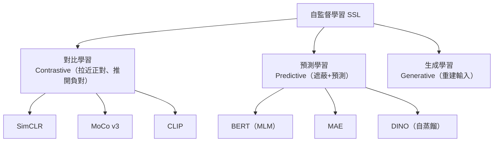
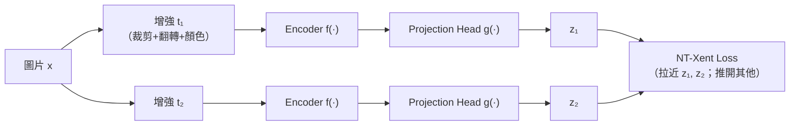
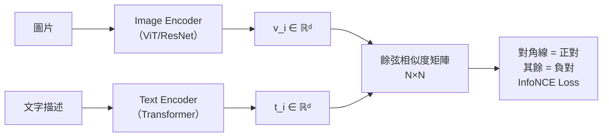
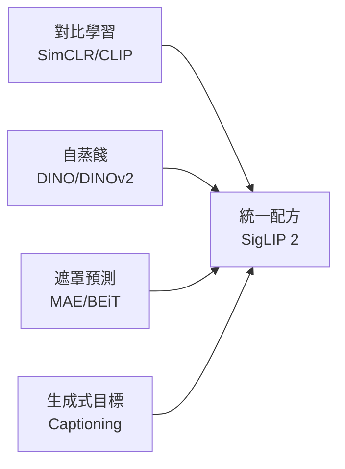

# KP-08：自監督與對比學習（Self-Supervised & Contrastive Learning）

> **課程關聯：** 本主題是 [[C3-W1 - Clustering & Anomaly Detection]] 無監督學習的重要延伸，也與 [[C3-W2 - Recommender Systems & PCA]] 的 Embedding 學習密切相關。

---

## 1. 為什麼需要自監督學習？

**問題：** 標記資料（labeled data）昂貴且稀缺，但未標記資料（unlabeled data）幾乎無限。

**自監督學習（SSL）：** 從資料本身構造監督訊號，無需人工標注。

> [!tip] 🎯 白話舉例：自監督學習像自學拼圖
> 監督學習 = 有老師告訴你每張圖是什麼（標籤），但找老師很貴。
> 自監督學習 = 你自己發明遊戲來學習：
> - **對比學習** = 「這兩張是同一隻狗嗎？」（判斷相似度）
> - **預測學習** = 「這張圖被擋住的部分是什麼？」（填空）
> - **生成學習** = 「把整張圖重新畫出來」（重建）
>
> 透過這些「自發遊戲」，模型學到了強大的表徵能力，之後只需少量標籤就能完成具體任務。

---

## 2. SimCLR（Simple Contrastive Learning）

### 2.1 框架

**核心思想：** 同一張圖片的兩個增強視角（正對），與 Batch 中所有其他圖片（負對）對比，讓正對表示相近、負對相遠。

**NT-Xent（Normalized Temperature-scaled Cross Entropy）Loss：**

$$\ell_{i,j} = -\log \frac{\exp(\text{sim}(z_i, z_j)/\tau)}{\sum_{k=1}^{2N} \mathbf{1}_{[k\neq i]} \exp(\text{sim}(z_i, z_k)/\tau)}$$

**關鍵設計：**
1. 強力的資料增強（隨機裁剪 + 顏色扭曲最關鍵）
2. 非線性 Projection Head（訓練後丟掉，只用 Encoder 輸出）
3. 大 Batch Size（4096+）以獲得足夠的負樣本

**論文來源：**
> Chen, T., Kornblith, S., Norouzi, M. & Hinton, G. (2020). **A Simple Framework for Contrastive Learning of Visual Representations.** *ICML 2020.* [arxiv:2002.05709](https://arxiv.org/abs/2002.05709)

**效果：** Linear probe on ImageNet 達 76.5%（接近有監督 ResNet-50）。

> [!tip] 🎯 白話舉例：SimCLR 像「找不同角度的自己」
> 想像你拍了一張自拍照，然後對它做兩種不同處理（裁剪、調色）。SimCLR 的目標是：
> - 這兩張處理過的照片應該被認出是**同一個人**（拉近正對）
> - 但與 Batch 中其他人的照片應該被區分開（推開負對）
> - 需要**很多其他人的照片**（大 Batch）才能學好區分

---

## 3. MoCo（Momentum Contrast）

### 3.1 解決 SimCLR 的大 Batch 問題

SimCLR 需要大 Batch（負樣本多），計算代價高。MoCo 引入**動量編碼器 + 隊列（Queue）**：

- **隊列：** 儲存大量（如 65536 個）歷史負樣本的 Key，不需要超大 Batch
- **動量編碼器：** 緩慢更新（避免 Key 分布突變）

$$\theta_k \leftarrow m \cdot \theta_k + (1-m) \cdot \theta_q, \quad m = 0.999$$

> He, K. et al. (2020). **Momentum Contrast for Unsupervised Visual Representation Learning.** *CVPR 2020.* [arxiv:1911.05722](https://arxiv.org/abs/1911.05722)

**MoCo v3（2021）：** 移除隊列，直接在 ViT 上應用，並加入 Stop-Gradient，是 ViT 自監督的重要里程碑。

> Chen, X., Xie, S. & He, K. (2021). **An Empirical Study of Training Self-Supervised Vision Transformers.** *ICCV 2021.* [arxiv:2104.02057](https://arxiv.org/abs/2104.02057)

**相關方法：BYOL（Bootstrap Your Own Latent）：** 證明對比學習不一定需要負樣本，僅用正對 + Stop-Gradient + EMA 即可避免崩潰。

> Grill, J.B. et al. (2020). **Bootstrap Your Own Latent: A New Approach to Self-Supervised Learning.** *NeurIPS 2020.* [arxiv:2006.07733](https://arxiv.org/abs/2006.07733)

> [!tip] 🎯 白話舉例：MoCo 像「有記憶的對比學習」
> SimCLR 需要同時找很多人來比較（大 Batch），很花資源。
> MoCo 的解決方案是建一個「相簿」（Queue），裡面存了之前見過的幾萬張臉。每次只需要拿新照片和相簿裡的舊照片比，不需要同時叫很多人到場。「動量編碼器」確保相簿裡的照片風格一致（不會突變）。

---

## 4. CLIP（Contrastive Language-Image Pre-training）★

### 4.1 核心思想

**白話：** 用 4 億組「（圖片, 文字描述）」配對訓練，讓圖片和其對應文字的 embedding 相近，其他圖文對的 embedding 相遠。

**Zero-Shot 分類：** 無需微調，直接用文字描述（如 "a photo of a dog"）作為分類器，計算圖片與每個類別描述的相似度。

**論文來源：**
> Radford, A. et al. (2021). **Learning Transferable Visual Models From Natural Language Supervision.** *ICML 2021.* [arxiv:2103.00020](https://arxiv.org/abs/2103.00020)

**重大影響：**
- 奠定多模態（vision-language）基礎
- 催生了 Stable Diffusion、DALL-E 等圖像生成模型
- 是 [[KP-10 - 現代推薦系統]] 中跨模態推薦的基礎

> [!tip] 🎯 白話舉例：CLIP 像「看圖說故事」的訓練
> 想像你在網路上收集了 4 億組「圖片 + 文字說明」。CLIP 的訓練就像一個配對遊戲：
> - 給你 N 張圖和 N 句說明，你要找出「哪句說明對應哪張圖」
> - 訓練完後，模型學會了「圖像和語言的共同語言」
> - **Zero-Shot 魔法：** 對新圖片，只需寫「一張狗的照片」「一張貓的照片」等描述，看哪個跟圖片最像——不需要任何額外訓練！

---

## 5. MAE（Masked Autoencoder）

### 5.1 核心思想

**白話：** 把圖片切成 patches，隨機遮蔽 75%，讓模型重建被遮蔽的像素——這個任務難到需要真正理解圖片語義。

**關鍵設計：**
- 遮蔽率高達 75%（遠高於 BERT 的 15%），迫使模型學習全局語義
- Encoder 只處理**可見 patches**（計算量低 3-4×）
- Decoder 在訓練後丟棄，只保留 Encoder

**論文來源：**
> He, K., Chen, X., Xie, S., Li, Y., Dollár, P. & Girshick, R. (2022). **Masked Autoencoders Are Scalable Vision Learners.** *CVPR 2022.* [arxiv:2111.06377](https://arxiv.org/abs/2111.06377)

**效果：** ViT-H + MAE 在 ImageNet 達 87.8%，超越先前所有自監督和半監督方法。

> [!tip] 🎯 白話舉例：MAE 像「拼圖達人」
> 想像一張 1000 片的拼圖，你拿走 750 片（遮蔽 75%），只留下 250 片。模型要從這 250 片**猜出完整圖片長什麼樣**。
> - 這個任務難到不能只記局部紋理（像 CNN 那樣），必須**真正理解圖像的全局語義**
> - 而且 Encoder 只處理可見的 25% patches，計算量只有標準 ViT 的 1/4

---

## 6. DINO（Self-Distillation with No Labels）

### 6.1 核心思想

**白話：** 用**自我知識蒸餾**——Student 網路學習預測 Teacher 網路的輸出，而 Teacher 是 Student 的**指數移動平均（EMA）**，二者皆無標籤。

$$\mathcal{L} = -\sum_x p_t(x) \log p_s(x)$$

- Teacher softmax 使用更低的溫度（更尖銳），Student 使用更高溫度
- Teacher 的參數：$\theta_t \leftarrow \lambda\theta_t + (1-\lambda)\theta_s$（EMA，類似 MoCo）

**論文來源：**
> Caron, M. et al. (2021). **Emerging Properties in Self-Supervised Vision Transformers.** *ICCV 2021.* [arxiv:2104.14294](https://arxiv.org/abs/2104.14294)

**驚人發現：** DINO 訓練的 ViT 的注意力圖譜**自然形成語義分割**，無需任何監督。

> [!tip] 🎯 白話舉例：DINO 像「師徒自學」
> 想像師徒們都看同一張圖（不同視角），徒弟學習模仿師父的「看法」，而師父是徒弟的「慢動作版」（EMA）。
> - 沒有任何人告訴他們「這是狗」或「這是貓」
> - 但經過充分訓練後，DINO 的注意力圖譜竟然能**自動區分物體與背景**（語義分割）——這是一種湧現能力（見 [[KP-07 - 縮放法則與湧現能力]]）

**DINOv2（2023）：** 在更大資料集上訓練，達到 SOTA 的圖像特徵提取性能。

> Oquab, M. et al. (2024). **DINOv2: Learning Robust Visual Features without Supervision.** *TMLR 2024.* [arxiv:2304.07193](https://arxiv.org/abs/2304.07193)

---

## 7. 2024-2025 最新進展

### 7.1 SigLIP 2（2025）—— 統一訓練配方

Google 提出 **SigLIP 2**，將多種獨立發展的技術統一成一個訓練配方：

- **對比學習**（原 SigLIP 的 Sigmoid Loss）
- **自監督損失**（自蒸餞 + 遮罩預測，類似 DINO + MAE）
- **Captioning 預訓練**（生成式目標）
- **線上資料篩選**（自動過濾低品質圖文對）

**效果：** 在所有模型尺度上全面超越 SigLIP v1，包括 zero-shot 分類、圖文檢索、以及作為 VLM 視覺編碼器的遷移效果。

> Tschannen, M. et al. (2025). **SigLIP 2: Multilingual Vision-Language Encoders with Improved Semantic Understanding, Localization, and Dense Features.** [arxiv:2502.14786](https://arxiv.org/abs/2502.14786)

### 7.2 趨勢：訓練範式的融合

2025 年的明確趨勢是：**對比學習、自蒸餞、遮罩預測、生成式目標不再互斥**，而是統一成單一訓練流程：

這意味著未來的基礎模型不再是「對比學習 vs 生成學習」的二選一，而是多目標聯合訓練。

---

## 8. 自監督方法比較

| 方法 | 年份 | 類型 | 負樣本需求 | 關鍵創新 |
|------|------|------|-----------|---------|
| SimCLR | 2020 | 對比 | 大 Batch | 強增強 + Projection Head |
| MoCo | 2020 | 對比 | Queue（低 Batch）| 動量編碼器 |
| CLIP | 2021 | 對比（跨模態）| 圖文對 | 語言監督，Zero-Shot |
| DINO | 2021 | 自蒸餞 | 無 | EMA Teacher，語義湧現 |
| MAE | 2022 | 預測（重建）| 無 | 高遮蔽率，高效 Encoder |
| DINOv2 | 2023 | 自蒸餞 | 無 | 大規模，SOTA 特徵 |
| SigLIP 2 | 2025 | 對比+自蒸餞+生成 | 圖文對 | 統一配方，多語言 VLM |

---

## 9. 重點論文彙整

| 論文 | 年份 | arxiv | 貢獻 |
|------|------|-------|------|
| SimCLR | 2020 | [2002.05709](https://arxiv.org/abs/2002.05709) | 簡潔對比框架，大 Batch |
| MoCo | 2020 | [1911.05722](https://arxiv.org/abs/1911.05722) | 動量隊列，低 Batch |
| CLIP | 2021 | [2103.00020](https://arxiv.org/abs/2103.00020) | 語言監督，Zero-Shot 遷移 |
| DINO | 2021 | [2104.14294](https://arxiv.org/abs/2104.14294) | 自蒸餾，語義注意力湧現 |
| MAE | 2022 | [2111.06377](https://arxiv.org/abs/2111.06377) | 高遮蔽重建，ViT SOTA |
| DINOv2 | 2023 | [2304.07193](https://arxiv.org/abs/2304.07193) | 大規模無監督 SOTA 特徵 |
| SigLIP 2 | 2025 | [2502.14786](https://arxiv.org/abs/2502.14786) | 統一對比+自蒸餞+生成配方 |

---

## 🔗 相關知識點

- [[KP-03 - 損失函數]] — InfoNCE / NT-Xent 的數學定義與溫度參數 $\tau$
- [[KP-06 - Attention 機制與 Transformer]] — ViT 是上述方法的骨幹架構（DINO/MAE/CLIP 皆用 ViT）
- [[KP-10 - 現代推薦系統]] — CLIP Embedding 用於跨模態推薦、對比學習提升推薦品質
- [[KP-04 - 正則化技術]] — 資料增強（Augmentation）是對比學習的核心正則化手段
- [[KP-07 - 縮放法則與湧現能力]] — DINO 的語義分割是一種湧現能力

## 🔗 相關課程筆記

- [[C3-W1 - Clustering & Anomaly Detection]] — 無監督學習的傳統方法（K-Means、PCA）與 SSL 的對比
- [[C3-W2 - Recommender Systems & PCA]] — Embedding 學習在推薦中的應用（雙塔模型）
- [[C2-W2 - Neural Network Training]] — 反向傳播與表徵學習的基礎
