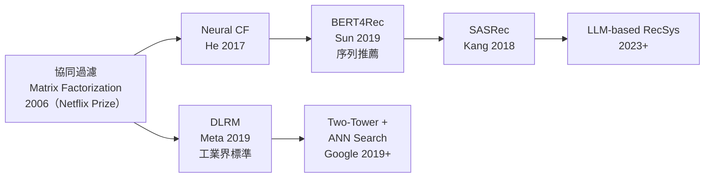
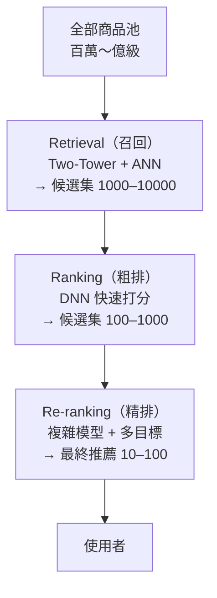
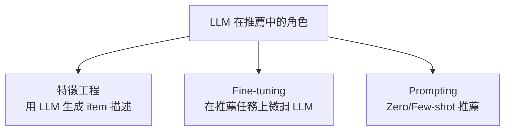

# KP-10：現代推薦系統（Modern Recommender Systems）

> **課程關聯：** 協同過濾與內容過濾基礎見 [[C3-W2 - Recommender Systems & PCA]]；雙塔模型涉及 [[C2-W1 - Neural Networks]] 中的神經網路知識。

---

## 1. 推薦系統演化路線



---

## 2. 序列推薦（Sequential Recommendation）

### 2.1 核心思想

**白話：** 使用者的行為有**時序性**——「買了鞋再買鞋帶」。傳統協同過濾忽視了順序，但序列模型把點擊/購買序列視為「語言」來建模。

> [!tip] 🎯 白話舉例：序列推薦像「讀心術」
> 傳統推薦 = 「喜歡 A 的人也喜歡 B」（只看偏好，不看順序）。
> 序列推薦 = 「你先看了手機殼、再看了保護貼、所以接下來可能想買充電器」。它把你的瀏覽歷史當成「一段故事」，用 Transformer 來「預測下一章」。

### 2.2 SASRec（Self-Attention Sequential Recommendation）

用 Transformer 的 Causal Self-Attention（單向，只看過去）建模使用者行為序列：

$$P(\text{下一個 item} \mid i_1, i_2, \ldots, i_t) = \text{Transformer}([e_{i_1}, e_{i_2}, \ldots, e_{i_t}])$$

**論文來源：**
> Kang, W.C. & McAuley, J. (2018). **Self-Attentive Sequential Recommendation.** *ICDM 2018.* [arxiv:1808.09781](https://arxiv.org/abs/1808.09781)

### 2.3 BERT4Rec（雙向序列推薦）

將 BERT 的 Masked LM 思想應用於推薦：隨機遮蔽序列中的 item，訓練模型預測被遮蔽的 item。

**論文來源：**
> Sun, F. et al. (2019). **BERT4Rec: Sequential Recommendation with Bidirectional Encoder Representations from Transformer.** *CIKM 2019.* [arxiv:1904.06690](https://arxiv.org/abs/1904.06690)

---

## 3. 工業規模推薦系統（Two-Tower + ANN）

### 3.1 完整工業架構



### 3.2 Two-Tower Model（課程延伸）

課程中的[[C3-W2 - Recommender Systems & PCA#5. Deep Learning for Content-Based Filtering|雙塔架構]]在工業中的實際部署：

- 離線**預計算**所有商品 embedding，存入向量資料庫（如 FAISS、ScaNN）
- 線上只需計算使用者 embedding，再用 **Approximate Nearest Neighbor（ANN）** 搜尋

> [!tip] 🎯 白話舉例：雙塔模型像「速配服務」
> 想像一個約會平台：
> - **左塔**（User Tower）= 把每個用戶轉成一個「個人檔案向量」
> - **右塔**（Item Tower）= 把每個商品轉成一個「商品檔案向量」（離線預算好）
> - **配對** = 線上只需算用戶向量，然後在商品向量庫中找最近的幾個（ANN 搜尋）
>
> 這讓從億級商品中篩出候選只需幾毫秒。

**Google ScaNN：**
> Guo, R. et al. (2020). **Accelerating Large-Scale Inference with Anisotropic Vector Quantization.** *ICML 2020.* [arxiv:1908.10396](https://arxiv.org/abs/1908.10396)

### 3.3 DLRM（Deep Learning Recommendation Model，Meta）

**核心創新：** 明確區分稠密特徵（用 MLP）和稀疏特徵（用 Embedding），再用 Dot-Product Interaction 組合。

**論文來源：**
> Naumov, M. et al. (2019). **Deep Learning Recommendation Model for Personalization and Recommendation Systems.** [arxiv:1906.00091](https://arxiv.org/abs/1906.00091)

---

## 4. LLM-based Recommender Systems（2023+）

### 4.1 三種使用 LLM 的範式



### 4.2 P5（Pretrain, Personalized Prompt, Predict Paradigm）

將推薦任務統一為 text-to-text 格式：

```
Input:  "User 42 rated [Toy Story] 5 stars. What movie to recommend next?"
Output: "The Lion King"
```

**論文來源：**
> Geng, S. et al. (2022). **Recommendation as Language Processing (RLP): A Unified Pretrain, Personalized Prompt & Predict Paradigm (P5).** *RecSys 2022.* [arxiv:2203.13366](https://arxiv.org/abs/2203.13366)

### 4.3 LLMRank（2023）

直接使用 ChatGPT 做 Zero-Shot 排序，比較 LLM 與傳統推薦模型的能力：

**發現：** LLM 在 Zero-Shot 下表現接近有監督的傳統模型，但有「位置偏差」（更傾向選擇列表中靠前/靠後的選項）。

> Hou, Y. et al. (2023). **Large Language Models are Zero-Shot Rankers for Recommender Systems.** *ECIR 2024.* [arxiv:2305.08845](https://arxiv.org/abs/2305.08845)

> [!tip] 🎯 白話舉例：LLM 推薦像「請了一個博學多聞的朋友當店員」
> 傳統推薦系統像專業店員，知道你的購買記錄但不懂你的「意圖」。
> LLM-based 推薦像請了一個博學多聞的朋友：你只需說「我想找一本適合在海邊看的輕鬆小說」，他就能結合常識和你的喜好來推薦。但他有時會有「位置偏差」（總是推薦列表中第一個或最後一個）。

---

## 5. 對比學習在推薦系統中的應用（2021+）

**問題：** 推薦資料高度稀疏（大多數使用者只有少量互動記錄），傳統協同過濾效果差。

**解決：** 將對比學習（[[KP-08 - 自監督與對比學習]]）引入推薦，利用資料增強（如隨機丟棄行為）生成正對。

### 5.1 SGL（Self-supervised Graph Learning）

**論文來源：**
> Wu, J. et al. (2021). **Self-supervised Graph Learning for Recommendation.** *SIGIR 2021.* [arxiv:2010.10783](https://arxiv.org/abs/2010.10783)

在使用者-商品互動圖上做 Graph Dropout 生成增強視圖，InfoNCE Loss 拉近同一節點的不同視圖。

> [!tip] 🎯 白話舉例：對比學習解決「資料稀疏」
> 大多數用戶只點了幾個商品（稀疏），傳統方法很難學好。
> 對比學習的解決方案：隨機刪掉部分互動記錄（增強），然後讓模型學會「即使缺少一些資料，也能認出是同一個用戶」——這就像是 SimCLR 裡的「同一張圖的不同增強」思想（見 [[KP-08 - 自監督與對比學習#2. SimCLR]]）。

---

## 6. 推薦系統的公平性與倫理（2020+）

**課程連結：** [[C3-W2 - Recommender Systems & PCA#5.3 Ethical Use of Recommender Systems]] 中提到的倫理問題，學術界已有具體研究。

### 6.1 Filter Bubble（信息繭房）

**現象：** 推薦系統持續推送相似內容，導致使用者視野越來越窄。

> [!tip] 🎯 白話舉例：信息繭房像「只吃同一家餐廳」
> 你點了一次宮保雞丁，推薦系統就一直給你推宮保雞丁、宮保雞丁…永遠不推其他菜。最後你的「視野」只剩宮保雞丁，這就是信息繭房。加入多樣性正則化就是強迫系統「偶爾推薦不同菜系」。

**量化研究：**
> Nguyen, T. et al. (2014). **Exploring the Filter Bubble: The Effect of Using Recommender Systems on Content Diversity.** *WWW 2014.*

**緩解：** 在推薦損失中加入多樣性正則項：

$$\mathcal{L} = \mathcal{L}_{\text{relevance}} + \lambda \cdot \text{Diversity}(R)$$

### 6.2 Popularity Bias（熱門偏差）

**現象：** 長尾商品（稀有但有受眾）被系統性地低估，頭部商品越來越佔據推薦位置。

**論文來源：**
> Abdollahpouri, H. et al. (2020). **Multistakeholder Recommendation with Provider Constraints.** *RecSys 2017*; **The Unfairness of Popularity Bias in Recommendation.** [arxiv:1907.13286](https://arxiv.org/abs/1907.13286)

---

## 7. 多目標排序（Multi-Objective Ranking）

實際推薦系統需要同時優化多個目標：

| 目標 | 說明 |
|------|------|
| CTR（點擊率）| 使用者是否點擊 |
| CVR（轉化率）| 使用者是否購買 |
| Dwell Time | 使用者停留時長 |
| Diversity | 推薦多樣性 |
| Fairness | 對各商品/使用者的公平性 |

**Pareto Front 優化：** 尋找各目標間的最優折衷點，不存在所有目標都最優的單一解。

---

## 8. 重點論文彙整

| 論文 | 年份 | arxiv | 貢獻 |
|------|------|-------|------|
| SASRec | 2018 | [1808.09781](https://arxiv.org/abs/1808.09781) | Self-Attention 序列推薦 |
| BERT4Rec | 2019 | [1904.06690](https://arxiv.org/abs/1904.06690) | 雙向 Transformer 推薦 |
| DLRM | 2019 | [1906.00091](https://arxiv.org/abs/1906.00091) | Meta 工業推薦標準架構 |
| SGL | 2021 | [2010.10783](https://arxiv.org/abs/2010.10783) | 圖對比學習 + 稀疏推薦 |
| P5 | 2022 | [2203.13366](https://arxiv.org/abs/2203.13366) | 推薦任務統一為語言生成 |
| LLMRank | 2023 | [2305.08845](https://arxiv.org/abs/2305.08845) | LLM Zero-Shot 排序能力 |

---

## 🔗 相關知識點

- [[KP-06 - Attention 機制與 Transformer]] — SASRec、BERT4Rec 的核心架構；GQA 可加速推薦模型推理
- [[KP-08 - 自監督與對比學習]] — 對比學習解決推薦稀疏問題；CLIP Embedding 用於跨模態推薦
- [[KP-03 - 損失函數]] — InfoNCE 用於對比推薦；Cross-Entropy 用於推薦排序
- [[KP-07 - 縮放法則與湧現能力]] — LLM-based 推薦依賴大模型的規模與湧現能力
- [[KP-09 - RLHF 與現代強化學習]] — RLHF 可用於推薦對齊（如多目標優化）

## 🔗 相關課程筆記

- [[C3-W2 - Recommender Systems & PCA]] — 協同過濾、內容過濾、雙塔模型基礎與倫理問題
- [[C3-W1 - Clustering & Anomaly Detection]] — ANN 搜尋與聚類的概念關聯
- [[C2-W1 - Neural Networks]] — Embedding 學習與神經網路基礎
