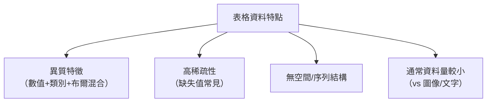
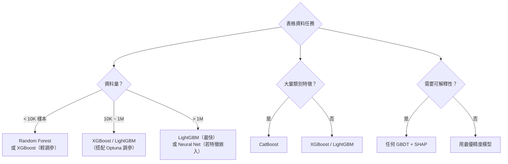

# KP-11：表格資料與現代決策樹（Tabular Data & Modern Tree Methods）

> **課程關聯：** 決策樹基礎、XGBoost 見 [[C2-W4 - Decision Trees]]；模型選擇與評估見 [[C2-W3 - Advice for Applying ML]]

---

## 1. 表格資料的特殊性

**白話解釋：** 不像圖像（像素有規律的空間結構）或文字（token 有順序結構），表格資料的每一列可能是完全異質的特徵（年齡、性別、收入…），沒有明確的「空間」或「順序」關係。

> [!tip] 🎯 白話舉例：表格資料像「雜亂的工具箱」
> 圖像資料像一幅畫（像素有空間位置關係），文字資料像一本書（字有前後順序）。
> 表格資料則像一個**雜亂的工具箱**：裡面有螺絲釘（數字）、標籤貼紙（類別）、空格子（缺失值），各種東西之間沒有明顯的空間或順序關係。這就是為什麼決策樹（擅長「一個一個檢查特徵」）比神經網路（擅長「發現結構性模式」）更適合這類資料。



---

## 2. 梯度提升樹的 2020+ 進展

### 2.1 LightGBM（Light Gradient Boosting Machine）

**核心創新：**
1. **Leaf-wise 生長**（vs XGBoost 的 Level-wise）：每次選擇 gain 最大的葉節點分裂，效率更高
2. **GOSS（Gradient-based One-Side Sampling）：** 保留大梯度樣本，隨機抽取小梯度樣本，加速訓練
3. **EFB（Exclusive Feature Bundling）：** 將互斥特徵合併，減少特徵維度

**論文來源：**
> Ke, G. et al. (2017). **LightGBM: A Highly Efficient Gradient Boosting Decision Tree.** *NeurIPS 2017.* [論文連結](https://papers.nips.cc/paper/2017/hash/6449f44a102fde848669bdd9eb6b76fa-Abstract.html)

**優點 vs XGBoost：** 訓練速度快 10× 以上，記憶體佔用低，在高維稀疏特徵上尤其突出。

> [!tip] 🎯 白話舉例：LightGBM vs XGBoost 的生長策略
> XGBoost 像蓋大樓：每次蓋完整一層（Level-wise）再蓋下一層，很均勻但慢。
> LightGBM 像蓋特色建築：哪邊最需要延伸就往哪邊蓋（Leaf-wise），更快效但可能「歪斜」（過擬合）——需要用深度限制來控制。

### 2.2 CatBoost（Categorical Boosting）

**核心創新：** 針對類別型特徵（Categorical Features）的專門處理：
- **Ordered Target Statistics（有序目標統計）：** 避免資料洩漏的類別編碼方式
- **Ordered Boosting：** 用隨機排列避免預測偏差

**論文來源：**
> Prokhorenkova, L. et al. (2018). **CatBoost: Unbiased Boosting with Categorical Features.** *NeurIPS 2018.* [arxiv:1706.09516](https://arxiv.org/abs/1706.09516)

**優點：** 不需要對類別特徵做 One-Hot Encoding，對高基數（high-cardinality）類別特徵尤其有效。

> [!tip] 🎯 白話舉例：CatBoost 的類別特徵處理
> 傳統方法處理類別特徵（如「城市」）是把每個城市變成一個單獨的 0/1 欄位（One-Hot），但如果有 10000 個城市就變成 10000 欄，非常浪費。
> CatBoost 的處理方式更聰明：它會用「過去的資料」來計算每個城市的「平均目標值」，技巧性地避免資料洩漏（data leakage）。

### 2.3 三大 GBDT 框架比較

| 框架 | 年份 | 特點 | 最適場景 |
|------|------|------|---------|
| XGBoost | 2016 | Level-wise，穩健 | 通用，Kaggle 金標準 |
| LightGBM | 2017 | Leaf-wise，極快 | 高維稀疏特徵，大規模資料 |
| CatBoost | 2018 | 類別特徵原生支持 | 多類別特徵，防資料洩漏 |

---

## 3. 深度學習能否取代決策樹？

**一個困擾研究界的問題：** 在表格資料上，深度學習是否比 GBDT 更好？

### 3.1 TabNet（2021）

**核心思想：** 用可微分的 Sparse Attention 機制模擬決策樹的特徵選擇，每步只選擇部分特徵。

$$\mathbf{M}[i] = \text{sparsemax}\left(P[i-1] \cdot h_i(a[i-1])\right)$$

- $\mathbf{M}[i]$：第 $i$ 步的稀疏特徵遮罩（只選幾個特徵）
- $P[i-1]$：特徵使用懲罰（已用過的特徵被懲罰）

**論文來源：**
> Arik, S.Ö. & Pfister, T. (2021). **TabNet: Attentive Interpretable Tabular Learning.** *AAAI 2021.* [arxiv:1908.07442](https://arxiv.org/abs/1908.07442)

**結果：** 在部分任務上接近 GBDT，但需要更多調參，且不一定更好。

### 3.2 為什麼深度學習在表格資料上常輸給 GBDT？（2022 重要研究）

**論文來源：**
> Grinsztajn, L., Oyallon, E. & Varoquaux, G. (2022). **Why Tree-Based Models Still Outperform Deep Learning on Tabular Data.** *NeurIPS 2022.* [arxiv:2207.08815](https://arxiv.org/abs/2207.08815)

**三大原因（來自系統實驗）：**

1. **不相關特徵的魯棒性：** Trees 天生會選擇特徵（忽略無用特徵），DL 模型受所有特徵干擾
2. **旋轉不變性問題：** DL 假設特徵的線性組合有意義，但表格特徵的「旋轉」通常無意義
3. **不規則決策邊界：** 表格資料的決策邊界常是非光滑的（Trees 更擅長）

**結論：** 即使在 2022 年，Random Forest 和 GBDTs 仍在中小型表格資料集上系統性地優於所有深度學習方法。

> [!tip] 🎯 白話舉例：為什麼決策樹在表格資料上更強？
> 想像你要判斷一個人是否會買房：
> - **決策樹** = 像有經驗的房仲介，一個個問：「收入 > 100萬？」「已婚？」「年齡 > 30？」——每次只看一個特徵，自然忽略無用特徵
> - **神經網路** = 像一個年輕分析師，把所有特徵混在一起算——在圖像/文字上很強（因為特徵有結構），但在雜亂的表格資料上容易被無用特徵干擾

---

## 4. 新一代深度學習表格方法（2022+）

### 4.1 FT-Transformer（Feature Tokenizer + Transformer）

**核心思想：** 將每個特徵（包括數值型）tokenize 成 embedding，再送入 Transformer：

$$x_j \to e_j = \text{Linear}(x_j) + b_j \in \mathbb{R}^d$$

所有特徵 embedding 拼接後送入標準 Transformer。

**論文來源：**
> Gorishniy, Y. et al. (2021). **Revisiting Deep Learning Models for Tabular Data.** *NeurIPS 2021.* [arxiv:2106.11959](https://arxiv.org/abs/2106.11959)

**結果：** FT-Transformer 是目前在表格資料上最強的深度學習方法之一，但仍不穩定地落後於 GBDT。

> [!tip] 🎯 白話舉例：FT-Transformer 的思路
> FT-Transformer 把表格的每一列當成一個「token」（就像 NLP 中的每個詞），然後用 Transformer 讓各列互相「對話」。這讓它能學到「收入高 + 年齡大」這種特徵之間的交互關係，但也更容易過擬合。

### 4.2 XGBoost 2.0（2023）

XGBoost 持續更新，2023 年加入了：
- GPU 原生支持（CUDA 優化）
- 多目標學習
- 更好的缺失值處理

**官方文檔：** [https://xgboost.readthedocs.io/](https://xgboost.readthedocs.io/)

---

## 5. 決策樹與 GBDT 的可解釋性

### 5.1 SHAP（SHapley Additive exPlanations）★

**核心思想（來自博弈論）：** 每個特徵對預測結果的貢獻量，等於它作為「玩家」加入各種「聯盟」後帶來的邊際貢獻的加權平均。

**論文來源：**
> Lundberg, S.M. & Lee, S.I. (2017). **A Unified Approach to Interpreting Model Predictions.** *NeurIPS 2017.* [arxiv:1705.07874](https://arxiv.org/abs/1705.07874)

**TreeSHAP（2020）：**
> Lundberg, S.M. et al. (2020). **From Local Explanations to Global Understanding with Explainable AI for Trees.** *Nature Machine Intelligence 2020.* [arxiv:1905.04610](https://arxiv.org/abs/1905.04610)

TreeSHAP 在 Tree 模型上的計算複雜度從指數降至多項式時間，是目前最廣泛使用的 XGBoost/LightGBM 可解釋性工具。

> [!tip] 🎯 白話舉例：SHAP 像「分帳」
> 想像一組朋友合作賺了 100 萬，SHAP 的問題是：「每個人分別貢獻了多少？」
> 它考慮**所有可能的組合**（如果 A 不在，剩下的人賺多少？B 不在呢？），然後計算每個人的「平均邊際貢獻」。
> 對於機器學習模型，「朋友」= 特徵，「100 萬」= 預測結果。SHAP 告訴你每個特徵對預測貢獻了多少。

```python
import shap
explainer = shap.TreeExplainer(xgb_model)
shap_values = explainer.shap_values(X_test)
shap.summary_plot(shap_values, X_test)
```

---

## 6. 模型選擇實踐建議（2020+ 最佳實踐）



---

## 7. 超參數調整（GBDT）

### 7.1 Optuna（超參數優化框架）

> Akiba, T. et al. (2019). **Optuna: A Next-generation Hyperparameter Optimization Framework.** *KDD 2019.* [arxiv:1907.10902](https://arxiv.org/abs/1907.10902)

```python
import optuna

def objective(trial):
    params = {
        'n_estimators': trial.suggest_int('n_estimators', 100, 1000),
        'learning_rate': trial.suggest_float('lr', 1e-3, 0.3, log=True),
        'max_depth': trial.suggest_int('max_depth', 3, 10),
        'subsample': trial.suggest_float('subsample', 0.5, 1.0),
    }
    model = XGBClassifier(**params)
    return cross_val_score(model, X, y, cv=5).mean()

study = optuna.create_study(direction='maximize')
study.optimize(objective, n_trials=100)
```

---

## 8. 重點論文彙整

| 論文 | 年份 | 連結 | 貢獻 |
|------|------|------|------|
| LightGBM | 2017 | NeurIPS | Leaf-wise，極速 GBDT |
| CatBoost | 2018 | [1706.09516](https://arxiv.org/abs/1706.09516) | 類別特徵原生，防洩漏 |
| TabNet | 2021 | [1908.07442](https://arxiv.org/abs/1908.07442) | 可解釋深度學習表格方法 |
| FT-Transformer | 2021 | [2106.11959](https://arxiv.org/abs/2106.11959) | 表格資料 Transformer |
| Why Trees Win | 2022 | [2207.08815](https://arxiv.org/abs/2207.08815) | 系統解釋 GBDT > DL 的原因 |
| TreeSHAP | 2020 | [1905.04610](https://arxiv.org/abs/1905.04610) | 高效 Tree 可解釋性 |
| Optuna | 2019 | [1907.10902](https://arxiv.org/abs/1907.10902) | 超參數優化框架 |

---

## 🔗 相關知識點

- [[KP-02 - 現代優化器]] — Gradient Boosting 本身是在函數空間中做梯度下降
- [[KP-03 - 損失函數]] — GBDT 的損失函數選擇（Cross-Entropy、Huber Loss 等）
- [[KP-06 - Attention 機制與 Transformer]] — FT-Transformer 將 Attention 應用於表格資料
- [[KP-04 - 正則化技術]] — L1/L2 正則化在 XGBoost 中的核心作用（剪枝）
- [[KP-01 - 超參數與學習率]] — Optuna/Hyperband 用於 GBDT 超參數搜尋

## 🔗 相關課程筆記

- [[C2-W4 - Decision Trees]] — 決策樹、信息增益、Random Forest、XGBoost 基礎
- [[C2-W3 - Advice for Applying ML]] — 模型選擇、Bias-Variance、評估指標
- [[C1-W2 - Regression with Multiple Variables]] — 特徵工程、特徵縮放的基礎概念
