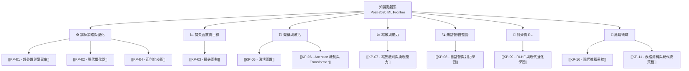

# 知識點總索引（Post-2020 學術前沿補充）

> **定位：** 本目錄收錄的筆記為 **2020 年後的學術研究進展**，補充 Andrew Ng ML 專業化課程（約 2014–2022 年基礎內容）未涵蓋或淺觸的前沿知識點。
> 所有知識點均標注嚴謹的學術文獻來源（主要為 arxiv 預印本及同行評審論文）。

---

## 🗺️ 知識點整體架構

---

## 📚 知識點文件索引

### ⚙️ 訓練策略與優化

| 文件 | 核心主題 | 關鍵論文（年份）|
|------|---------|----------------|
| [[KP-01 - 超參數與學習率]] | LR 排程、Cosine Annealing、Warmup、梯度裁剪、μP | Loshchilov 2017, Goyal 2017, Yang 2022 |
| [[KP-02 - 現代優化器]] | AdamW、Lion、SAM、Sophia、Schedule-Free、Muon、SPAM | Loshchilov 2019, Chen 2023, Foret 2021, Liu 2023, Defazio 2024, Jordan 2025, Huang 2025 |
| [[KP-04 - 正則化技術]] | LayerNorm、Pre-LN、RMSNorm、Mixup、CutMix、DropPath、**DyT** | Ba 2016, Xiong 2020, Zhang 2018, Yun 2019, **Zhu 2025** |

### 📉 損失函數與訓練目標

| 文件 | 核心主題 | 關鍵論文（年份）|
|------|---------|----------------|
| [[KP-03 - 損失函數]] | CE、Label Smoothing、Focal Loss、InfoNCE、KL Divergence | Müller 2020, Lin 2017, Chen 2020 |

### 🏗️ 架構與激活函數

| 文件 | 核心主題 | 關鍵論文（年份）|
|------|---------|----------------|
| [[KP-05 - 激活函數]] | GELU、SiLU/Swish、SwiGLU、Mish | Hendrycks 2016, Shazeer 2020 |
| [[KP-06 - Attention 機制與 Transformer]] | Self-Attention、MHA、ViT、RoPE、Flash Attention、GQA、**MLA**、**NSA** | Vaswani 2017, Dosovitskiy 2021, Dao 2022, Su 2024, **DeepSeek 2024/2025** |

### 📈 縮放法則與新興能力

| 文件 | 核心主題 | 關鍵論文（年份）|
|------|---------|----------------|
| [[KP-07 - 縮放法則與湧現能力]] | Kaplan 縮放法則、Chinchilla、湧現能力、CoT、Grokking、**Test-time Scaling** | Kaplan 2020, Hoffmann 2022, Wei 2022, Power 2022, **Muennighoff 2025, Geiping 2025** |

### 🔍 自監督與對比學習

| 文件 | 核心主題 | 關鍵論文（年份）|
|------|---------|----------------|
| [[KP-08 - 自監督與對比學習]] | SimCLR、MoCo、CLIP、DINO、MAE、DINOv2、**SigLIP 2** | Chen 2020, He 2020, Radford 2021, Caron 2021, He 2022, Oquab 2023, **Tschannen 2025** |

### 🤝 對齊與強化學習

| 文件 | 核心主題 | 關鍵論文（年份）|
|------|---------|----------------|
| [[KP-09 - RLHF 與現代強化學習]] | PPO、InstructGPT、Constitutional AI、DPO、**GRPO**、**DeepSeek-R1** | Schulman 2017, Ouyang 2022, Bai 2022, Rafailov 2023, **Shao 2024, DeepSeek 2025** |

### 🛒 應用領域

| 文件 | 核心主題 | 關鍵論文（年份）|
|------|---------|----------------|
| [[KP-10 - 現代推薦系統]] | 序列推薦、DLRM、LLM 推薦、對比 RecSys | Kang 2018, Naumov 2019, Geng 2022, Hou 2023 |
| [[KP-11 - 表格資料與現代決策樹]] | LightGBM、CatBoost、TabNet、FT-Transformer、SHAP、Optuna | Ke 2017, Prokhorenkova 2018, Grinsztajn 2022, Lundberg 2020 |

---

## 🔗 知識點與課程筆記的對應關係

### Course 1（監督學習）的延伸

| 課程筆記 | 延伸知識點 |
|---------|-----------|
| [[C1-W1 - Introduction to Machine Learning]] | [[KP-01 - 超參數與學習率]]（LR 排程）、[[KP-02 - 現代優化器]]（AdamW, Lion）|
| [[C1-W2 - Regression with Multiple Input Variables]] | [[KP-04 - 正則化技術]]（Mixup、RMSNorm）|
| [[C1-W3 - Classification]] | [[KP-03 - 損失函數]]（Label Smoothing, Focal Loss）、[[KP-04 - 正則化技術]]（L2 的 AdamW 解耦）|

### Course 2（進階學習算法）的延伸

| 課程筆記 | 延伸知識點 |
|---------|-----------|
| [[C2-W1 - Neural Networks]] | [[KP-06 - Attention 機制與 Transformer]]（Transformer 架構）|
| [[C2-W2 - Neural Network Training]] | [[KP-05 - 激活函數]]（GELU, SwiGLU）、[[KP-02 - 現代優化器]]（AdamW）|
| [[C2-W3 - Advice for Applying ML]] | [[KP-07 - 縮放法則與湧現能力]]（大模型 vs 小模型）、[[KP-04 - 正則化技術]]（Pre-LN, DropPath）|
| [[C2-W4 - Decision Trees]] | [[KP-11 - 表格資料與現代決策樹]]（LightGBM, CatBoost, SHAP）、[[KP-06 - Attention 機制與 Transformer]]（NLP 與 Transformer 演進）、[[KP-08 - 自監督與對比學習]]（預訓練語言模型）|

### Course 3（非監督學習）的延伸

| 課程筆記 | 延伸知識點 |
|---------|-----------|
| [[C3-W1 - Clustering & Anomaly Detection]] | [[KP-08 - 自監督與對比學習]]（SimCLR, MAE）|
| [[C3-W2 - Recommender Systems & PCA]] | [[KP-10 - 現代推薦系統]]（序列推薦, LLM 推薦）、[[KP-08 - 自監督與對比學習]]（Embedding 與對比學習）、[[KP-03 - 損失函數]]（InfoNCE Loss）|
| [[C3-W3 - Reinforcement Learning]] | [[KP-09 - RLHF 與現代強化學習]]（PPO, DPO, InstructGPT, GRPO, DeepSeek-R1）|

---

## 📎 重要 arxiv 論文快速索引

### 2020 年

| arxiv ID | 作者 | 標題摘要 |
|----------|------|---------|
| [2001.08361](https://arxiv.org/abs/2001.08361) | Kaplan et al. | Scaling Laws for Neural Language Models |
| [2002.05709](https://arxiv.org/abs/2002.05709) | Chen et al. | SimCLR 對比學習框架 |
| [2002.05202](https://arxiv.org/abs/2002.05202) | Shazeer | SwiGLU/GLU 激活函數變體 |
| [2002.04745](https://arxiv.org/abs/2002.04745) | Xiong et al. | Pre-LN Transformer 穩定訓練 |

### 2021 年

| arxiv ID | 作者 | 標題摘要 |
|----------|------|---------|
| [2010.11929](https://arxiv.org/abs/2010.11929) | Dosovitskiy et al. | Vision Transformer（ViT）|
| [2010.01412](https://arxiv.org/abs/2010.01412) | Foret et al. | SAM 尖銳感知最小化 |
| [2103.00020](https://arxiv.org/abs/2103.00020) | Radford et al. | CLIP 視覺語言預訓練 |
| [2104.14294](https://arxiv.org/abs/2104.14294) | Caron et al. | DINO 自蒸餾自監督 |
| [2104.09864](https://arxiv.org/abs/2104.09864) | Su et al. | RoPE 旋轉位置編碼 |
| [2106.01345](https://arxiv.org/abs/2106.01345) | Chen et al. | Decision Transformer |

### 2022 年

| arxiv ID | 作者 | 標題摘要 |
|----------|------|---------|
| [2111.06377](https://arxiv.org/abs/2111.06377) | He et al. | MAE 遮蔽自編碼器 |
| [2203.02155](https://arxiv.org/abs/2203.02155) | Ouyang et al. | InstructGPT / RLHF |
| [2203.15556](https://arxiv.org/abs/2203.15556) | Hoffmann et al. | Chinchilla 縮放法則 |
| [2201.02177](https://arxiv.org/abs/2201.02177) | Power et al. | Grokking 遲到的泛化 |
| [2205.14135](https://arxiv.org/abs/2205.14135) | Dao et al. | FlashAttention |
| [2206.07682](https://arxiv.org/abs/2206.07682) | Wei et al. | 大模型湧現能力 |
| [2207.08815](https://arxiv.org/abs/2207.08815) | Grinsztajn et al. | 為何 Trees 優於 DL（表格）|
| [2212.08073](https://arxiv.org/abs/2212.08073) | Bai et al. | Constitutional AI |

### 2023 年

| arxiv ID | 作者 | 標題摘要 |
|----------|------|---------|
| [2302.06675](https://arxiv.org/abs/2302.06675) | Chen et al. | Lion 優化器（程序搜尋發現）|
| [2305.18290](https://arxiv.org/abs/2305.18290) | Rafailov et al. | DPO 直接偏好優化 |
| [2305.13245](https://arxiv.org/abs/2305.13245) | Ainslie et al. | GQA 分組查詢注意力 |
| [2304.15004](https://arxiv.org/abs/2304.15004) | Schaeffer et al. | 湧現能力是否是假象？|
| [2304.07193](https://arxiv.org/abs/2304.07193) | Oquab et al. | DINOv2 |
| [2305.10601](https://arxiv.org/abs/2305.10601) | Liu et al. | Sophia 二階裁剪優化器 |

### 2024 年

| arxiv ID | 作者 | 標題摘要 |
|----------|------|---------|
| [2405.15682](https://arxiv.org/abs/2405.15682) | Defazio et al. | Schedule-Free AdamW |
| [2402.03300](https://arxiv.org/abs/2402.03300) | Shao et al. | GRPO（DeepSeekMath）|
| [2405.04434](https://arxiv.org/abs/2405.04434) | DeepSeek-AI | DeepSeek-V2（MLA）|

### 2025 年

| arxiv ID | 作者 | 標題摘要 |
|----------|------|---------|
| [2501.12948](https://arxiv.org/abs/2501.12948) | DeepSeek-AI | DeepSeek-R1 純 RL 推理 |
| [2501.19393](https://arxiv.org/abs/2501.19393) | Muennighoff et al. | s1 Test-Time Scaling |
| [2502.05171](https://arxiv.org/abs/2502.05171) | Geiping et al. | Latent Reasoning 潛在空間推理 |
| [2502.11089](https://arxiv.org/abs/2502.11089) | Yuan et al. | NSA 原生稀疏注意力 |
| [2502.14786](https://arxiv.org/abs/2502.14786) | Tschannen et al. | SigLIP 2 統一視覺語言編碼器 |
| [2503.10622](https://arxiv.org/abs/2503.10622) | Zhu et al. | DyT 取代 Normalization |

---

## 🔗 前往課程主索引

- [[ML Specialization - Master Index]] — 完整課程知識圖譜
- [[Course 1 - Index]] — 監督學習
- [[Course 2 - Index]] — 進階學習算法
- [[Course 3 - Index]] — 非監督學習、推薦系統、強化學習
