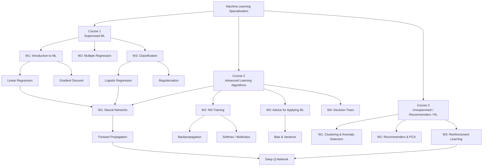

# Stanford ML Specialization（Andrew Ng）— 完整課程地圖

> **Coursera DeepLearning.AI** | 3 Courses | 10 Weeks Total

---

## 🗺️ 全課程知識圖譜

---

## 📚 Course 1 — Supervised Machine Learning: Regression and Classification

| 週次 | 筆記 | 主題 |
|------|------|------|
| Week 1 | [[C1-W1 - Introduction to Machine Learning]] | ML 定義、監督/無監督學習、線性回歸、成本函數、梯度下降 |
| Week 2 | [[C1-W2 - Regression with Multiple Input Variables]] | 多特徵回歸、向量化、Feature Scaling、多項式回歸 |
| Week 3 | [[C1-W3 - Classification]] | Logistic Regression、決策邊界、Logistic Loss、正則化 |

→ [[Course 1 - Index]]

---

## 🧠 Course 2 — Advanced Learning Algorithms

| 週次 | 筆記 | 主題 |
|------|------|------|
| Week 1 | [[C2-W1 - Neural Networks]] | 神經網路直覺、前向傳播、TensorFlow、矩陣乘法 |
| Week 2 | [[C2-W2 - Neural Network Training]] | ReLU/Softmax、Adam Optimizer、反向傳播 |
| Week 3 | [[C2-W3 - Advice for Applying ML]] | Train/CV/Test、Bias-Variance、Error Analysis、Transfer Learning、F1 Score |
| Week 4 | [[C2-W4 - Decision Trees]] | 信息增益、Entropy、Random Forest、XGBoost、Andrew Ng & Chris Manning on NLP |

→ [[Course 2 - Index]]

---

## 🔍 Course 3 — Unsupervised Learning, Recommenders, Reinforcement Learning

| 週次 | 筆記 | 主題 |
|------|------|------|
| Week 1 | [[C3-W1 - Clustering & Anomaly Detection]] | K-Means、高斯密度估計、異常偵測演算法 |
| Week 2 | [[C3-W2 - Recommender Systems & PCA]] | 協同過濾、內容過濾、雙塔網路 TF 實作、PCA 降維 |
| Week 3 | [[C3-W3 - Reinforcement Learning]] | MDP、Bellman 方程、Q-function、DQN、Andrew Ng & Chelsea Finn on AI/Robotics |

→ [[Course 3 - Index]]

---

## 🔑 跨課程重要概念索引

### 優化與訓練
- **梯度下降** → [[C1-W1 - Introduction to Machine Learning#6. Gradient Descent（梯度下降）]]
- **Adam Optimizer** → [[C2-W2 - Neural Network Training#4. Advanced Optimization（Adam Optimizer）]]
- **反向傳播** → [[C2-W2 - Neural Network Training#5. Backpropagation（反向傳播）]]

### 模型評估
- **Bias & Variance** → [[C2-W3 - Advice for Applying ML#3. Diagnosing Bias and Variance（診斷偏差與方差）]]
- **Precision & Recall** → [[C2-W3 - Advice for Applying ML#5. Skewed Datasets（不平衡資料集）]]
- **Cross Validation** → [[C2-W3 - Advice for Applying ML#2. Evaluating a Model（評估模型）]]

### 正則化
- **L2 / Ridge** → [[C1-W3 - Classification#7. Regularization（正則化）]]
- **正則化對 Bias/Variance 的影響** → [[C2-W3 - Advice for Applying ML#3.2 Regularization 對 Bias/Variance 的影響]]

### 分類模型
- **Logistic Regression** → [[C1-W3 - Classification]]
- **Softmax** → [[C2-W2 - Neural Network Training#3. Multiclass Classification（多類別分類）]]
- **Decision Trees + XGBoost** → [[C2-W4 - Decision Trees]]

### 無監督學習
- **K-Means** → [[C3-W1 - Clustering & Anomaly Detection#2. K-Means Intuition（K-Means 直覺）]]
- **PCA** → [[C3-W2 - Recommender Systems & PCA#6. PCA：Reducing the Number of Features（降維）]]
- **Anomaly Detection** → [[C3-W1 - Clustering & Anomaly Detection#7. What is Anomaly Detection?（什麼是異常偵測？）]]

### 推薦系統
- **Collaborative Filtering** → [[C3-W2 - Recommender Systems & PCA#2. Collaborative Filtering Algorithm（協同過濾演算法）]]
- **Content-Based Filtering** → [[C3-W2 - Recommender Systems & PCA#5. Deep Learning for Content-Based Filtering]]

---

## 📊 演算法比較表

| 演算法 | 類型 | 資料需求 | 主要用途 |
|--------|------|---------|---------|
| Linear Regression | 監督/回歸 | 帶標籤 | 連續值預測 |
| Logistic Regression | 監督/分類 | 帶標籤 | 二元分類 |
| Neural Network | 監督 | 帶標籤（大量）| 圖像、文字、複雜任務 |
| Decision Tree | 監督 | 帶標籤 | 表格資料分類/回歸 |
| XGBoost | 監督（集成）| 帶標籤 | 表格資料競賽 |
| K-Means | 無監督/聚類 | 無標籤 | 分群、市場分析 |
| Anomaly Detection | 無監督 | 主要正常樣本 | 詐欺、故障偵測 |
| Collaborative Filtering | 無監督/推薦 | 評分矩陣 | 推薦系統 |
| PCA | 無監督/降維 | 無標籤 | 視覺化、壓縮 |
| Deep Q-Network | 強化學習 | 環境互動 | 遊戲、機器人控制 |

---

## 📎 Post-2020 學術前沿補充

> 以下知識點筆記補充了課程未涵蓋的 2020 年後前沿研究，每篇均含嚴謹的學術文獻來源。
> **2025 更新：** 已新增 DeepSeek-R1、MLA/NSA、Test-time Scaling、DyT、SigLIP 2 等最新研究。

| 知識點 | 核心涵蓋 | 2024-2025 新增 |
|--------|---------|---------------|
| [[KP-01 - 超參數與學習率]] | Warmup、Cosine、WSD、μP | — |
| [[KP-02 - 現代優化器]] | AdamW、Lion、SAM | Sophia、Schedule-Free、Muon、SPAM |
| [[KP-03 - 損失函數]] | Label Smoothing、Focal、InfoNCE | — |
| [[KP-04 - 正則化技術]] | LayerNorm、RMSNorm、Mixup | **DyT**（取代 Normalization）|
| [[KP-05 - 激活函數]] | GELU、SwiGLU、Mish | — |
| [[KP-06 - Attention 機制與 Transformer]] | MHA、RoPE、Flash Attention、GQA | **MLA**、**NSA**、DeepSeek-V3 |
| [[KP-07 - 縮放法則與湧現能力]] | Kaplan、Chinchilla、CoT、Grokking | **Test-time Scaling**、s1、Latent Reasoning |
| [[KP-08 - 自監督與對比學習]] | SimCLR、CLIP、DINO、MAE | **SigLIP 2**（統一訓練配方）|
| [[KP-09 - RLHF 與現代強化學習]] | PPO、DPO、Constitutional AI | **GRPO**、**DeepSeek-R1** |
| [[KP-10 - 現代推薦系統]] | 序列推薦、DLRM、LLM 推薦 | — |
| [[KP-11 - 表格資料與現代決策樹]] | LightGBM、CatBoost、TabNet | — |

→ [[KP-Index - 知識點總索引]] — 完整知識點體系架構與課程對應關係
